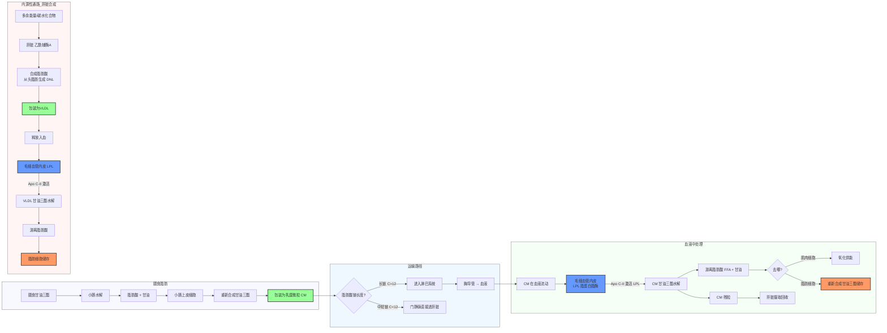

脂肪（主要是**甘油三酯（Triacylglycerol, TAG）**）的代谢是一个复杂而精密的系统，涉及能量存储、运输和利用。

**脂肪合成代谢整体流程图：**

---

### 一、 脂肪的合成代谢：从肠道到细胞

当脂肪在小肠被吸收并重新合成甘油三酯（TAG）后，它并不直接进入血液，而是开启了一段"隐秘"的旅程。

#### 1. 运输路径：乳糜微粒 (CM, Chylomicron) 的旅程
*   **路线：** 小肠细胞（合成CM）→ 肠绒毛中央乳糜管 → **淋巴系统** → 胸导管 → **左锁骨下静脉** → 血液。
*   **为什么走淋巴？** CM体积巨大（包含大量甘油三酯、胆固醇和Apo B-48），无法穿过微血管孔隙，但能进入淋巴毛细血管。

#### 2. 细胞如何"拿到"脂肪：LPL 酶的作用
CM进入血液后，并不能直接钻进细胞。它需要一把"钥匙"来释放内部的油脂。
*   **LPL（脂蛋白脂酶，Lipoprotein Lipase）：** 存在于毛细血管内皮细胞表面。
*   **激活机制：** CM和VLDL（极低密度脂蛋白，Very Low-Density Lipoprotein）表面都有一种蛋白质叫 **Apo C-II（载脂蛋白C-II）**，它是LPL的**必需激活剂**。当CM/VLDL经过带有LPL的组织时，Apo C-II 激活 LPL，LPL将颗粒里的甘油三酯水解为**游离脂肪酸 (FFA，Free Fatty Acid)** 和 **甘油**。
*   **接收：** 脂肪酸随后通过扩散或转运体进入附近的组织（肌肉或脂肪细胞）。

#### 3. 不同部位 LPL 的活性差异（竞争效应）
身体通过调节不同组织LPL的活性，来决定脂肪流向哪里：
*   **心脏和肌肉 LPL：** **亲和力（Km值）极高**。即便血液中CM/VLDL浓度很低，肌肉也能抢到脂肪来供能。在饥饿、运动时，肌肉LPL活性升高。
*   **脂肪组织 LPL：** **亲和力较低**。只有在餐后，血糖和胰岛素升高时，脂肪组织的LPL活性才被显著激发。
*   **调节机制：** 
    *   **胰岛素：** 显著上调脂肪组织的LPL活性（促进储存），但下调或不影响肌肉LPL[^4]。
    *   **运动/寒冷：** 提高骨骼肌和棕色脂肪的LPL活性。
*   **腹部脂肪的特殊性：** 研究表明，腹部脂肪组织的LPL对胰岛素 + 皮质醇的反应性更强，这可能解释了为什么腹部肥胖更容易发生（胰岛素抵抗型向心肥胖和压力型向心肥胖）。能抑制腹部脂肪LPL活性的激素有雌激素和睾酮。[^1][^2][^3]

#### 4. 合成代谢的两条主要通路
*   **外源性通路（Exogenous Pathway）：** 处理膳食脂肪。利用**CM（乳糜微粒）**将脂肪从肠道运往全身，剩余的"CM残粒"被肝脏回收。
*   **内源性通路（Endogenous Pathway）：** 
    *   **背景：** 当摄入糖分过多或能量过剩时，肝脏会将多余的乙酰辅酶A通过**从头脂肪生成（De Novo Lipogenesis，DNL）** 转化为脂肪酸。
    *   **DNL的调控：** 高碳水化合物饮食（特别是果糖）显著上调DNL关键酶（乙酰辅酶A羧化酶、脂肪酸合酶）的表达，增加肝脏脂肪酸合成[^5]。
    *   **运输：** 肝脏将这些脂肪酸与载脂蛋白 **Apo B-100（载脂蛋白B-100）** 包装成 **VLDL（极低密度脂蛋白，Very Low-Density Lipoprotein）** 释放入血，路径与CM类似，最终多余的能量储存在脂肪细胞中。

**现代饮食条件下的DNL意义：**
近年研究证实，当摄入添加果糖过多时，肝脏DNL通量显著增加，这是果糖诱导脂肪肝和血脂异常的重要机制[^6]。即使总热量不超，高果糖摄入也能增加肝脏脂肪合成。

---

### 二、 中短链脂肪酸（MCT/SCFA）的特殊性

并非所有脂肪都走淋巴。
1.  **短链脂肪酸（SCFA，Short-Chain Fatty Acids，C<6）：** 主要由肠道菌群发酵膳食纤维产生，直接入血提供能量。
2.  **中链脂肪酸（MCFA，Medium-Chain Fatty Acids，C6-C12）：** 如**椰子油**中富含。
    *   **特性：** 水溶性较好，**不需要**包装成乳糜微粒（CM，Chylomicron），也不需要LPL（脂蛋白脂酶）水解。
    *   **路径：** 通过**门静脉直接进入肝脏**。
    *   **代谢极其迅速：** 在肝脏中直接进行β-氧化产生能量（或酮体），不容易堆积成组织脂肪。因此常用于生酮饮食或运动员快速补能。

虽然中短链脂肪酸代谢不会走乳糜微粒路径，但大量摄入下，肝脏合成的脂肪酸仍可能通过内源性通路形成VLDL，导致脂肪积累。

---

### 三、 肝脏的任务：脂肪的"中央调度站"

肝脏不存储脂肪（正常情况下），它负责**制造与分发**。

#### 1. VLDL（极低密度脂蛋白，Very Low-Density Lipoprotein）的制造（发货）
*   **原料：** 内源性甘油三酯、胆固醇、磷脂、**Apo B-100**。
*   **功能：** 将肝脏合成的脂肪运出去。如果没有足够的磷脂或载脂蛋白（如缺乏蛋白质），脂肪就运不出去，形成**脂肪肝**。
*   **LDL（低密度脂蛋白，Low-Density Lipoprotein）的来源：** VLDL在血液中经过LPL作用后，逐渐失去甘油三酯，变成IDL（中密度脂蛋白），最终转化为**LDL（低密度脂蛋白）**，负责将胆固醇运送到外周组织。

#### 2. HDL（高密度脂蛋白，High-Density Lipoprotein）的制造（扫大街）
*   **原料：** 肝脏和肠道合成新生HDL，主要含 **Apo A-I（载脂蛋白A-I）**。
*   **功能：** **胆固醇逆转运**。它像扫街车一样，把外周组织多余的胆固醇收集起来，送回肝脏处理。
*   **重要性：** 高水平的HDL-C与心血管健康相关，因为它有助于清除动脉壁的胆固醇沉积。适量运动和单不饱和脂肪酸摄入有助于提高HDL水平。

#### 3. 脂肪肝是怎么回事？
脂肪肝的本质是**"进出失衡"**：
1.  **进多：** 吃太多糖（果糖尤甚），导致肝脏大量合成脂肪（DNL，从头脂肪生成）。
2.  **出少：** 
    *   载脂蛋白（Apo B-100）合成不足（营养不良或酒精损伤）。
    *   脂肪酸氧化功能受损（线粒体功能障碍）。
    *   胆碱缺乏（影响VLDL的组装和分泌，胆碱是VLDL磷脂的重要组成成分）。
3.  **结果：** 甘油三酯被迫堆积在肝细胞内，长期积累引发炎症和纤维化。

近年研究证实，**糖诱导的DNL增加**是非酒精性脂肪肝发病的核心机制之一，比膳食脂肪摄入对肝脏脂肪堆积贡献更大[^7]。

---

### 四、 脂肪细胞内的甘油三酯合成

游离脂肪酸进入脂肪细胞后，需要重新合成甘油三酯才能储存：

**合成步骤：**

1. **甘油骨架准备：** 
   - 途径一：LPL水解产生的甘油-3-磷酸直接利用
   - 途径二：葡萄糖进入脂肪细胞 → 糖酵解产生甘油-3-磷酸（脂肪细胞甘油激酶活性低，所以这条途径很重要）
2. **脂肪酸活化：** 游离脂肪酸 → 脂酰辅酶A，由乙酰辅酶A合成酶催化
3. **逐步酯化：** 脂酰辅酶A逐步连接到甘油-3-磷酸 → 磷脂酸 → 二酰甘油 → 三酰甘油（甘油三酯）
4. **脂滴包裹：** 合成的甘油三酯聚集形成脂滴，储存在脂肪细胞胞质中

**激素调控：**

- **胰岛素**是最强的促进脂肪合成的激素：
  - 上调脂肪组织LPL活性，增加游离脂肪酸供应
  - 促进葡萄糖进入脂肪细胞，提供甘油-3-磷酸骨架
  - 激活乙酰辅酶A羧化酶，促进脂肪酸合成
  - 抑制脂肪分解（抑制激素敏感性脂肪酶HSL）[^8]

所以，胰岛素不仅升高血糖，还直接促进脂肪储存，这就是为什么高碳水饮食过量容易发胖的分子机制。

---

### 五、 脂肪细胞的分类

并非所有的脂肪都是为了攒能量：

1.  **白色脂肪（WAT，White Adipose Tissue）：**
    *   **形态：** 一个巨大的油滴挤掉了细胞核。
    *   **功能：** 能量存储、分泌激素（如瘦素、脂联素）。多分布在皮下和内脏。
2.  **棕色脂肪（BAT，Brown Adipose Tissue）：**
    *   **形态：** 含有大量线粒体（含铁导致颜色深）和小油滴。
    *   **功能：** **产热**。含有 **UCP1（解偶联蛋白1，Uncoupling Protein 1）**，直接将脂肪氧化能量转化为热量，不生成ATP。婴儿较多，成人主要分布在颈部、锁骨上区域。
    *   近年研究证实：成人激活棕色脂肪可以增加能量消耗，对减重和糖代谢有益[^9]。
3.  **米色脂肪（Beige Fat）：**
    *   **特性：** 散落在白色脂肪中的"产热脂肪细胞"。
    *   **转化：** 在寒冷刺激或β3肾上腺素能受体激活下，白色脂肪可以"褐变"为米色脂肪，开始燃烧产热。
    *   运动也能诱导部分白色脂肪转化为米色脂肪。

---

### 参考文献

[^1]: Ottosson, M. et al.(2000) "Effects of cortisol on lipoprotein lipase activity in human adipose tissue." *American Journal of Physiology-Endocrinology and Metabolism*, 279(5), E1136-E1142.

[^2]: Björntorp, P (2001) "Do stress reactions cause abdominal obesity and comorbidities?" *Obesity Reviews*, 2(2), 73-86.

[^3]: Price, T. M. et al. (1998) "Estrogen regulation of adipose tissue lipoprotein lipase: Possible mechanism of body fat distribution." *Journal of Clinical Endocrinology & Metabolism*, 83(3), 870-874.

[^4]: Sadur CN, et al. (1982). Insulin stimulation of adipose tissue lipoprotein lipase. *Journal of Clinical Investigation*, 69(5):1119-1125.

[^5]: Samuel VT, et al. (2023). Fructose ingestion and de novo lipogenesis in liver: an updated perspective. *Nature Metabolism*, 5(3):323-334.

[^6]: Stanhope KL, et al. (2013). Consuming fructose-sweetened, not glucose-sweetened, beverages increases visceral adiposity and lipids and decreases insulin sensitivity in overweight/obese humans. *Journal of Clinical Investigation*, 123(5):2021-2033.

[^7]: Lambert JE, et al. (2014). De novo lipogenesis in the liver in healthy vs NAFLD humans: what we know and what we don't. *Nutrients*, 6(2):578-597.

[^8]: Duncan RE, et al. (2007). Regulation of lipolysis in adipocytes. *Annual Review of Nutrition*, 27:79-101.

[^9]: Cypess AM, et al. (2009). Identification and importance of brown adipose tissue in adult humans. *New England Journal of Medicine*, 360(15):1509-1517.
