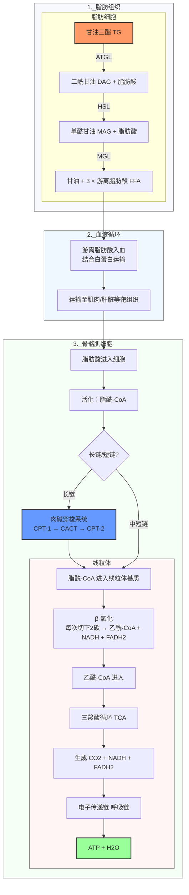
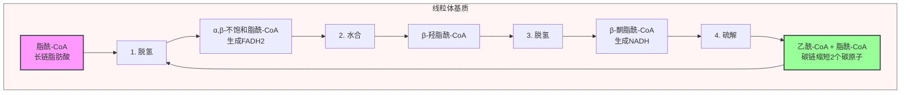
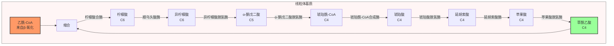

# 脂肪分解代谢：脂肪氧化分解的全链路解析

减脂的本质即为脂肪分解代谢：脂肪细胞储存的甘油三酯，经一步步分解氧化，最终变为二氧化碳和水，释放能量供给机体使用。完整流程如下图：

整个过程可分为四个阶段：
  1. **动员**：脂肪细胞内甘油三酯分解为游离脂肪酸
  2. **转运**：游离脂肪酸经血液循环运输到需要能量的组织
  3. **进入线粒体**：长链脂肪酸需要肉碱穿梭系统转运进入线粒体
  4. **氧化供能**：β-氧化切割 → 三羧酸循环 → 呼吸链产生ATP，终产物为二氧化碳和水

---

## 一、动员：脂肪细胞内储存甘油三酯的水解激活

**核心反应**：甘油三酯（TG，Triacylglycerol）→ 游离脂肪酸（FFA，Free Fatty Acid）+ 甘油

- **ATGL（脂肪甘油三酯脂酶，Adipose Triglyceride Lipase）**：将TG水解为二酰甘油（DAG，Diacylglycerol）+ 一分子脂肪酸
- **HSL（激素敏感性脂肪酶，Hormone-Sensitive Lipase）**：将DAG水解为单酰甘油（MAG，Monoacylglycerol）+ 一分子脂肪酸（也可作用于其他脂类）
- **MGL（单酰甘油脂肪酶，Monoacylglycerol Lipase）**：将MAG水解为甘油 + 一分子脂肪酸

上述脂解酶活性受激素信号调控，核心调节轴为**胰岛素 vs 儿茶酚胺**：

- **胰岛素：强效抑制脂解**
  进餐后胰岛素水平升高，可通过以下机制抑制脂解：
  - 抑制ATGL/HSL活性（通过降低cAMP/PKA信号通路，环磷酸腺苷/蛋白激酶A）
  - 促进脂肪合成与再酯化（将游离脂肪酸重新组装为TG储存）
  因此，持续高频高胰岛素状态会抑制脂肪动员，减少脂肪分解。
- **儿茶酚胺（肾上腺素/去甲肾上腺素）：促进脂解**
  通过β肾上腺素受体 → Gs → 腺苷酸环化酶激活 → cAMP升高 → PKA激活 → 促进HSL等脂解酶活化，并促进脂滴表面结构蛋白磷酸化，便于脂解酶接触底物。

其他常见影响因素：

- **运动、寒冷、咖啡因**：均可提升交感神经活性 → 增加儿茶酚胺水平 → 促进脂解（效应存在个体差异）
- **皮质醇**：长期高水平作用机制复杂，可增加内脏脂肪储存倾向，但急性暴露亦可提升脂解；总体而言，慢性压力合并睡眠障碍与腹部/内脏脂肪堆积相关
- **性激素、遗传、炎症**：共同决定脂肪组织分布与脂解敏感性，影响不同部位脂肪动员效率差异

---

## 二、转运：游离脂肪酸从脂肪细胞到靶组织

- 动员产生的**游离脂肪酸（FFA，Free Fatty Acid）**进入血液后，绝大多数与白蛋白结合运输。
- **甘油**无法在脂肪细胞内有效利用（脂肪细胞缺乏足够甘油激酶活性），经血液转运至**肝脏**：
  - 用于糖异生（转化为葡萄糖）或重新合成TG。

---

## 三、进入线粒体：长链脂肪酸需要肉碱穿梭系统

在组织细胞胞质中，脂肪酸首先被活化为**脂酰辅酶A（脂酰-CoA）**，该过程消耗ATP（三磷酸腺苷），后续转运步骤取决于脂肪酸链长度：

- **长链脂肪酸**（碳原子数 > 12）无法直接透过线粒体膜，需要通过**左旋肉碱和肉碱酰基转移酶系统（CPT-1/CPT-2，Carnitine Palmitoyltransferase I/II）**进入线粒体。
- **丙二酰辅酶A（malonyl-CoA，malonyl-Coenzyme A）**可特异性抑制CPT-1：
  - 能量富足/脂肪合成状态下，malonyl-CoA浓度升高 → 抑制脂肪酸进入线粒体，避免"边合成边氧化"的能量浪费
  - 能量缺口/运动状态下，malonyl-CoA浓度降低 → CPT-1活性解除，脂肪酸进入线粒体氧化增加

---

## 四、脂肪酸氧化：不同场所的氧化途径

脂肪酸进入线粒体后，需要经过多步氧化才能彻底分解为二氧化碳和水。哺乳动物体内存在多条脂肪酸氧化途径，分别处理不同类型的脂肪酸：

| 氧化途径 | 发生位置 | 底物 | 生理功能 |
|----------|----------|------|----------|
| **线粒体β-氧化** | 线粒体基质 | 直链中长链脂肪酸 (C8-C18) | 主要供能途径，产生乙酰-CoA进入三羧酸循环 |
| **过氧化物酶体β-氧化** | 过氧化物酶体 | 极长链脂肪酸 (>C22) | 初步缩短碳链，产物转运到线粒体继续氧化 |
| **α-氧化** | 过氧化物酶体/内质网 | 支链脂肪酸 | 氧化去除甲基分支，便于后续β-氧化 |
| **ω-氧化** | 肝细胞微粒体 | 超长链脂肪酸 | 在ω端氧化生成二羧酸，便于进一步分解 |

### 线粒体β-氧化（核心途径）

**β-氧化（β-Oxidation）** 是脂肪酸分解供能的核心途径，因氧化反应发生在脂肪酸碳链的β碳原子上而得名。活化的脂酰-CoA进入线粒体基质后，通过四步循环逐步切割：

**β-氧化四步循环**：

**核心特点**：

- **每次缩短2碳**：每一轮循环从脂肪酸羧基端切下一个**二碳单位**（乙酰-CoA）
- **产生还原当量**：每轮产生1分子FADH₂和1分子NADH，进入电子传递链产生ATP
- **能量产出**：一个16碳棕榈酸经过7轮β-氧化，产生8分子乙酰-CoA，最终净生成106分子ATP
- **循环进行**：碳链不断缩短，直到全部转化为乙酰-CoA

乙酰-CoA进入**三羧酸循环（TCA，Tricarboxylic Acid Cycle）**继续氧化，经**电子传递链（呼吸链）**氧化磷酸化产生大量ATP，最终产物为**二氧化碳（经呼吸排出）和水**（经体液排出）。

### 其他氧化途径

**过氧化物酶体β-氧化**：
- 底物：极长链脂肪酸（碳原子数 > 22），无法直接进入线粒体
- 功能：将极长链脂肪酸逐步缩短为中等长度，再转运到线粒体继续进行β-氧化
- 特点：产生过氧化氢（H₂O₂），需要过氧化氢酶分解

**α-氧化**：
- 底物：支链脂肪酸（如膳食中的植烷酸）
- 机制：在α碳原子上氧化，去除一个羧基，缩短一个碳原子，去除分支后便于β-氧化继续进行
- 临床意义：α-氧化途径缺陷会导致植烷酸积累，引发Refsum病

**ω-氧化**：
- 发生在肝细胞内质网（微粒体）
- 机制：在脂肪酸碳链的ω端（羧基对端）氧化生成羟基，再氧化为羧基，形成二羧酸
- 生理意义：主要处理超长链脂肪酸，是辅助途径，正常生理条件下贡献较小

### 酮体生成

补充：当碳水化合物供给不足、肝脏乙酰-CoA堆积时，肝脏会将多余的乙酰-CoA合成**酮体**（乙酰乙酸、β-羟丁酸、丙酮），释放进入血液运输到脑和肌肉供能。此过程并不为减脂所必需，脂肪氧化并不必须生成酮体。

---

脂肪分解代谢的核心本质为：通过饮食和运动创造能量缺口，促进脂肪动员和氧化。

现有研究证实，脂肪氧化分解为全身性过程，不存在"局部减脂"。无法选择性仅动员某一特定部位脂肪，但不同部位脂肪组织由于LPL（脂蛋白脂酶，Lipoprotein Lipase）表达与激素敏感性差异，脂肪储存速率存在差异。

脂肪分解速率提升，本质并非单一酶活性的非生理性上调，而是使机体更长时间处于"脂肪动员增加、脂肪酸氧化增加"状态：脂肪细胞释放TG水解产物，靶组织氧化利用脂肪酸，而非再次酯化储存。脂肪分解代谢可分为四个关键限速步骤，各步骤调控机制如下：

1. 脂肪细胞内甘油三酯水解：ATGL/HSL/MGL
2. 游离脂肪酸释放后经血液循环转运：白蛋白运输、组织摄取（如CD36，脂肪酸转位酶）
3. 脂肪酸转运进入线粒体：CPT-1 + 肉碱穿梭系统（长链脂肪酸的限速步骤）→ 线粒体数量与体积决定氧化能力上限
4. 线粒体基质内脂肪酸氧化：β-氧化、三羧酸循环、电子传递链（受训练状态、氧供、能量需求调控）

临床与研究观察发现，常见卡点为：脂肪酸动员后，由于胰岛素水平偏高、活动量不足、肌肉线粒体氧化能力不足，游离脂肪酸未被完全氧化，多数被重新酯化回脂肪细胞或在肝脏重新打包储存，净脂肪分解效应降低。

---

## 一、HSL（激素敏感性脂肪酶）活性调控机制

HSL是脂肪细胞内脂解过程的关键调节酶，主要负责DAG水解，其活性核心调控机制为：**cAMP/PKA介导的磷酸化 vs 胰岛素通路介导的去磷酸化**，此外酶向脂滴表面转位影响底物可及性。

### A. 促进HSL活性（增加脂解）的主要因素

- **儿茶酚胺（肾上腺素/去甲肾上腺素）**：β肾上腺素受体激活 → Gs蛋白 → 腺苷酸环化酶激活 → cAMP浓度升高 → PKA激活
  PKA激活可产生以下效应：
  - 磷酸化HSL，提升酶活性并促进其转位至脂滴表面
  - 磷酸化脂滴包被蛋白（perilipin），解除脂滴结构屏蔽，增加脂解酶对底物的可及性
- **ACTH、其他升糖信号**：可通过相似的cAMP途径影响脂肪组织脂解，生理条件下儿茶酚胺占主导地位
- **运动**：通过交感神经兴奋提升儿茶酚胺水平；同时肌肉组织对脂肪酸氧化需求增加，降低释放后脂肪酸再酯化比例，增加净氧化
- **咖啡因**：可增强脂解信号（部分机制通过腺苷受体拮抗、磷酸二酯酶抑制），但个体差异大且长期使用产生耐受

### B. 抑制HSL活性（减少脂解）的主要因素

- **胰岛素：最强的生理性抑制因子**
  胰岛素通过PI3K/Akt（磷脂酰肌醇3-激酶/蛋白激酶B）通路激活PDE（磷酸二酯酶，Phosphodiesterase）→ cAMP浓度下降 → PKA活性下降；同时促进去磷酸化，使HSL活性降低，并推动游离脂肪酸再酯化储存。
- **α2肾上腺素受体激活**：Gi蛋白通路 → cAMP浓度下降 → 抑制脂解
  这一机制可以解释不同脂肪部位脂解难易差异：α2受体密度高、β受体密度低的区域脂肪更难动员。
- **高葡萄糖/高胰岛素环境、频繁进食**：维持胰岛素持续性抑制，脂解活性降低
- **慢性炎症/脂肪细胞胰岛素抵抗**：调控机制复杂化；部分情况下基础脂解水平升高，但并不改善整体代谢健康，常伴随肝脏脂质负担增加

### C. 双开关调控模型

HSL活性调控可理解为两道独立开关：
- 信号开关：cAMP/PKA通路（儿茶酚胺开启，胰岛素/α2受体关闭）
- 底物可及性开关：脂滴包被蛋白磷酸化后增加脂解酶接触底物机会

---

## 二、脂肪酸进入线粒体：关键酶与调控因素

长链脂肪酸氧化必须依赖**肉碱穿梭系统（carnitine shuttle）**，**CPT-1（肉碱棕榈酰转移酶I，位于线粒体外膜）**是该途径的限速位点。

### 步骤与关键蛋白

1. 脂肪酸在细胞胞质侧活化为脂酰-CoA（消耗ATP）
2. **CPT-1**：催化脂酰-CoA + 肉碱 → 脂酰肉碱（获得穿膜能力）
3. **CACT（肉碱-脂酰肉碱转位酶，Carnitine-Acylcarnitine Translocase）**：将脂酰肉碱转运进入线粒体基质
4. **CPT-2（肉碱棕榈酰转移酶II）**：脂酰肉碱 → 脂酰-CoA（恢复β-氧化底物形式）+ 肉碱释放回收

### 调控脂肪酸进入线粒体的核心机制：丙二酰-CoA抑制CPT-1

- **丙二酰-CoA浓度升高**：CPT-1活性被抑制，脂肪酸无法进入线粒体 → 脂肪氧化速率下降
- 丙二酰-CoA由**ACC（乙酰-CoA羧化酶，Acetyl-CoA Carboxylase）**催化生成，ACC在能量富足/胰岛素高水平状态下活性更高
- **AMPK（腺苷酸活化蛋白激酶，AMP-activated Protein Kinase）** 磷酸化抑制ACC活性 → 丙二酰-CoA浓度下降 → CPT-1抑制解除 → 脂肪酸进入线粒体增加

因此，脂肪酸线粒体转运的调控逻辑为：
- 胰岛素/能量富足 → ACC激活 → 丙二酰-CoA升高 → CPT-1抑制
- 运动/能量缺口 → AMPK激活 → ACC抑制 → 丙二酰-CoA降低 → CPT-1开放

补充两点临床相关观察：

- 内源性肉碱供应充足情况下，额外补充左旋肉碱不增加脂肪酸氧化通量，对减脂无显著益处
- **底物竞争（Randle cycle，葡萄糖-脂肪酸循环）**：碳水化合物供给充足时，糖酵解旺盛，丙酮酸脱氢酶激活，整体代谢偏向葡萄糖氧化，脂肪氧化比例相对下降（并非完全阻断脂肪氧化）

---

## 三、β-氧化增强机制与影响因素

β-氧化发生在线粒体基质，该途径速率决定于**底物供给**和**线粒体氧化能力**两个核心因素。

### A. β-氧化高效进行的条件

- 脂肪酸持续进入线粒体（CPT-1途径开放）
- **NAD+ 和 FAD** 持续再生（否则β-氧化产物NADH/FADH2堆积会反馈抑制酶活性）
- 电子传递链持续运转（最终依赖氧供、线粒体功能、ADP供给）
- 三羧酸循环可容纳乙酰-CoA进入（若草酰乙酸供给不足，乙酰-CoA偏向酮体生成）

### B. 影响β-氧化速率的主要因素

- **训练适应（最重要且稳定）**
  规律有氧运动增加线粒体数量，上调脂肪酸转运/氧化相关酶表达（包括CPT-1、β-氧化酶系），同时提高毛细血管密度与氧利用能力。
- **能量需求/ADP水平**
  组织对ATP需求越高，氧化磷酸化速率越快，NADH氧化再生为NAD+越快，β-氧化不易因还原当量堆积受阻。
  这一机制解释了为何单纯提升脂解并不等于提升净燃脂：能量需求不足时，NADH堆积，脂肪酸易发生再酯化储存。
- **氧供与心肺能力**
  脂肪酸氧化完整进程最终需要氧气作为电子受体；供氧不足时（强度超过心肺能力）代谢偏向糖酵解，脂肪氧化比例下降。
- **营养状态**
  低碳水化合物/饥饿状态整体代谢偏向脂肪氧化；高碳水化合物状态偏向葡萄糖氧化（此为比例改变，并非完全阻断脂肪氧化）
- **线粒体功能损伤因素**
  长期睡眠不足、慢性炎症、毒性物质暴露、严重能量过剩导致代谢紊乱，均可降低单位强度下脂肪氧化能力

### 对应实践策略

- 增加NEAT（非运动活动产热）：每日增加步行、站立、碎片化活动，可显著提升总能量消耗与脂肪酸氧化通量
- 保证充足睡眠：睡眠不足升高食欲、降低胰岛素敏感性，增加脂肪酸再酯化概率
- 限制酒精摄入：酒精代谢优先占用氧化通路，挤占脂肪氧化窗口，且酒精本身能量密度高，有效能量利用效率低，减慢脂肪分解代谢速率

---

## 四、三羧酸循环（TCA）调控因素

**三羧酸循环详细流程图（线粒体基质内）**：

**三羧酸循环完整八步反应：**

| 步骤 | 反应物 | 产物 | 关键酶 | 还原当量/高能键生成 |
|------|--------|------|--------|----------|
| 1 | 乙酰-CoA + 草酰乙酸 | 柠檬酸 | 柠檬酸合酶 | - |
| 2 | 柠檬酸 | 异柠檬酸 | 顺乌头酸酶 | - |
| 3 | 异柠檬酸 | α-酮戊二酸 | 异柠檬酸脱氢酶 | 1 NADH + 1 CO₂ |
| 4 | α-酮戊二酸 | 琥珀酰-CoA | α-酮戊二酸脱氢酶复合体 | 1 NADH + 1 CO₂ |
| 5 | 琥珀酰-CoA | 琥珀酸 | 琥珀酰-CoA合成酶 | 1 GTP（可转化为ATP） |
| 6 | 琥珀酸 | 延胡索酸 | 琥珀酸脱氢酶 | 1 FADH₂ |
| 7 | 延胡索酸 | 苹果酸 | 延胡索酸酶 | - |
| 8 | 苹果酸 | 草酰乙酸 | 苹果酸脱氢酶 | 1 NADH |

每一轮循环氧化1分子乙酰-CoA（2个碳原子），最终生成：**10 ATP + 2 CO₂**。

三羧酸循环通量并非简单"越快越好"，其速率主要由**能量需求与氧化还原状态**驱动，并与电子传递链活性强耦合：电子传递链不运转，NAD+无法再生，三羧酸循环无法持续进行。

### A. 三羧酸循环通量的三个调控位点

- **ADP/ATP比值（能量需求）**：ADP浓度升高代表能量需求增加，促进氧化磷酸化，间接加快NADH氧化再生为NAD+，维持三羧酸循环持续运转
- **NADH/NAD+比值（还原当量堆积）**：NADH堆积抑制多个关键脱氢酶活性，降低循环通量
- **钙离子（Ca2+）**：运动时肌肉细胞钙离子浓度升高，可激活三羧酸循环关键酶，提升循环通量

### B. 底物供给限制：草酰乙酸与回补反应

- 乙酰-CoA进入三羧酸循环必须与**草酰乙酸（OAA）**结合生成柠檬酸才能进入循环
- 碳水化合物供给不足时，草酰乙酸供应相对不足，乙酰-CoA偏向酮体生成（肝脏中尤为显著）
- 因此传统说法"脂肪在糖的火焰中燃烧"具有生理学依据：充足碳水化合物供给保证草酰乙酸供应，有利于乙酰-CoA持续进入三羧酸循环氧化（此结论不代表减脂必须高碳水饮食）

### C. 提升三羧酸循环效率的实践途径

- 提升线粒体总量与呼吸链能力（训练适应）→ 加快NAD+再生 → 循环通量提升
- 提升心肺功能与氧供 → 电子传递链通畅 → 循环通量提升
- 保证充足微量营养素供应：B族维生素、铁等参与能量代谢酶促反应作为辅酶，缺乏会限制通量，但超量补充不会进一步提升速率
- 避免长期持续能量过剩与慢性炎症：此类病理状态损伤线粒体效率与胰岛素敏感性，间接降低脂肪氧化代谢表现

> 酒精对三羧酸循环的影响：酒精代谢优先进行，乙醛脱氢酶催化产生大量NADH，导致NADH堆积抑制三羧酸循环，脂肪酸氧化也受抑制，最终乙酰-CoA偏向酮体生成，同时ATP生成减少，引发头痛乏力等宿醉症状。因此醉酒次日补充水分、电解质、适量碳水化合物可帮助恢复循环通量，改善症状。

---

### 总结：减脂中脂肪分解代谢的关键卡点

| 步骤 | 限速酶/关键蛋白 | 主要调节因素 | 优化策略 |
|------|---------------|--------------|----------|
| 脂肪动员 | ATGL/HSL | 胰岛素↓，儿茶酚胺↑ | 能量缺口，规律运动，减少高频高胰岛素 |
| 脂肪酸转运 | 白蛋白/CD36 | 血流量↑ | 运动增加局部血流 |
| 进入线粒体 | CPT-1 | 丙二酰-CoA↓，AMPK↑ | 能量缺口，规律运动 |
| β-氧化/TCA/呼吸链 | 线粒体容量 | 训练适应 | 规律有氧/力量训练提升线粒体含量 |

**核心逻辑**：减脂目标追求**净脂肪氧化**，并非单纯提升脂解：脂肪酸动员后必须进入线粒体氧化分解，才能完成净分解。临床实践中多数关注仅集中于第一步"脂解"，忽略后续"线粒体氧化"环节，导致脂肪酸动员后再酯化储存，净脂肪分解效果有限。

---

### 参考文献

[^1]: Lafontan M, et al. (2008). Lipolysis and lipid mobilization in human adipose tissue. *Progress in Lipid Research*, 47(5):281-301.

[^2]: Zechner R, et al. (2012). TAG lipases and lipolysis in adipose tissue and whole body energy homeostasis. *Cell Metabolism*, 15(3):344-355.

[^3]: Ramsay JE, et al. (2009). Regulation of adipose tissue lipolysis during fasting and exercise. *Sports Medicine*, 39(9):747-760.

[^4]: McGarry JD, et al. (1997). The glucose-fatty acid cycle revisited: the glucose-fatty acid cycle after 40 years. *Journal of Biological Chemistry*, 272(41):25437-25443.

[^5]: Horowitz JF. (2003). Fatty acid mobilization and utilization during exercise in humans. *Sports Medicine*, 33(5):331-346.

[^6]: Goodpaster BH, et al. (2002). Effects of exercise on insulin action: association with muscle fat content. *Journal of Applied Physiology*, 93(3):1013-1019.
