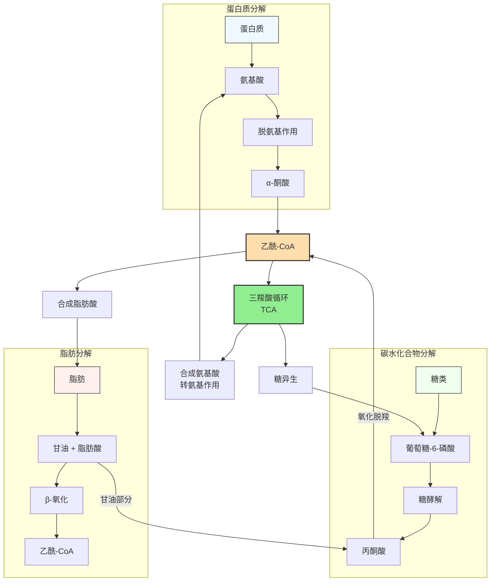

这里的核心是通过**三羧酸循环（TCA Cycle）**这一“代谢枢纽”来实现。以下是它们相互转化的详细过程：

---

### 1. 整体转化

三大营养物质（碳水化合物、蛋白质、脂肪）通过共同的代谢枢纽三羧酸循环实现互相转化，整体路径如下图：

*   **糖转脂（容易）：**
    *   当摄入糖分超过能量消耗时，葡萄糖通过糖酵解产生**丙酮酸**，进入线粒体生成**乙酰辅酶A（Acetyl-CoA）**。
    *   乙酰辅酶A是合成脂肪酸的原料；同时糖代谢产生的**磷酸二羟丙酮**可转化为**甘油**。
    *   脂肪酸与甘油结合生成脂肪。这就是“吃糖也会长胖”的原理。
*   **脂转糖（微弱/受限）：**
    *   **甘油**部分可以经由糖异生途径转变为葡萄糖。
    *   **脂肪酸**分解产生的乙酰辅酶A在动物体内**不能**直接转化为丙酮酸，因此脂肪酸无法净转化为糖（但在植物和微生物中可通过乙醛酸循环实现）。
*   **糖转氨基酸（非必需）：**
    *   糖代谢的中间产物（如丙酮酸、α-酮戊二酸、草酰乙酸）可以通过**转氨基作用**生成对应的**非必需氨基酸**（如丙氨酸、谷氨酸、天冬氨酸）。
    *   注：人体无法通过糖合成“必需氨基酸”。
*   **氨基酸转糖（糖异生）：**
    *   当血糖不足（如饥饿或剧烈运动）时，蛋白质分解成氨基酸。
    *   **生糖氨基酸**脱去氨基后生成的酮酸，可以进入糖异生途径合成葡萄糖。这是维持血糖稳定的重要保障。
*   **氨基酸转脂：**
    *   氨基酸脱氨基后生成的乙酰辅酶A或乙酰乙酸，可以作为合成脂肪酸或胆固醇的原料。这也是为什么长期高蛋白饮食（超过额定需求）仍可能导致脂肪堆积。
*   **脂转氨基酸（极难/基本不）：**
    *   脂肪中的甘油部分可以转变为酮酸，进而合成非必需氨基酸，但这一路径在体内代谢中所占比例极小。脂肪酸部分则几乎不能转化为氨基酸。

---

### 总结：相互转化的核心——三羧酸循环

#### A. 核心枢纽：乙酰辅酶A (Acetyl-CoA)
这是“碳、蛋、脂”三条路的汇合点：
*   **糖入：** 葡萄糖分解成丙酮酸，再变成乙酰辅酶A。
*   **脂入：** 脂肪酸经过 β-氧化，直接剪切成大量的乙酰辅酶A（β-氧化详细介绍参见脂肪分解代谢专文）。
*   **蛋入：** 生酮氨基酸脱氨后也可以变成乙酰辅酶A。

---

#### B. 糖与脂的“单向桥梁”

糖类和蛋白质可以较大量地转化为脂肪， 脂肪酸**不能**净转化为葡萄糖或氨基酸（仅甘油部分可以）
*   **糖 → 脂（顺畅）：** 乙酰辅酶A是合成脂肪酸的原料。只要吃多了糖，乙酰辅酶A堆积，就会合成脂肪。
*   **脂 → 糖（受限）：** 
    *   **脂肪酸**分解产生的乙酰辅酶A在人体内**无法**逆向变回丙酮酸（因为生化反应不可逆）。
    *   **甘油**是可以变回葡萄糖的，但甘油只占脂肪质量的极小部分。所以，“运动降脂”是消耗掉脂肪，而不是把脂肪变成糖。

#### C. 糖与蛋白的“紧急救援”
*   **蛋 → 糖（糖异生）：** 当你绝食或剧烈运动血糖不足时，肌肉蛋白分解成氨基酸。这些氨基酸变成**丙酮酸或三羧酸循环的中间产物**，最终强行合成葡萄糖供大脑使用。
*   **糖 → 蛋（受限）：** 糖代谢的中间产物（如α-酮戊二酸）可以加上氨基变成氨基酸，但只能合成**非必需氨基酸**。身体里的“必需氨基酸”必须靠吃。

### 3. 三大转化的逻辑总结表

| 转化方向    | 是否可行     | 关键中间物              | 备注                               |
| :---------- | :----------- | :---------------------- | :--------------------------------- |
| **糖 → 脂** | **是**       | 乙酰辅酶A、磷酸二羟丙酮 | 极易发生，肥胖的主因               |
| **脂 → 糖** | **极受限**   | 甘油                    | 脂肪酸不能转糖，只能靠甘油部分转化 |
| **糖 → 蛋** | **部分可行** | 丙酮酸、TCA循环中间产物 | 只能转化出“非必需氨基酸”           |
| **蛋 → 糖** | **是**       | 丙酮酸、草酰乙酸        | 长期饥饿时，身体会“拆东墙补西墙”   |
| **脂 → 蛋** | **极微弱**   | 三羧酸循环中间产物      | 极少通过此路径                     |
| **蛋 → 脂** | **是**       | 乙酰辅酶A               | 蛋白质吃多了也会变成脂肪存储       |

---

### 参考文献

[^1]: Nelson DL, Cox MM. (2021). Lehninger Principles of Biochemistry. 8th edition. W.H. Freeman and Company.

[^2]: Ferrannini E, et al. (2019). Interrelationships between carbohydrate, lipid, and protein metabolism in the regulation of energy balance. *Cell Metabolism*, 29(3):538-551.

[^3]: Chechenov AA, et al. (2021). Metabolic cross-talk between macronutrients: a systems biology perspective. *Nature Metabolism*, 3(10):1291-1303.

