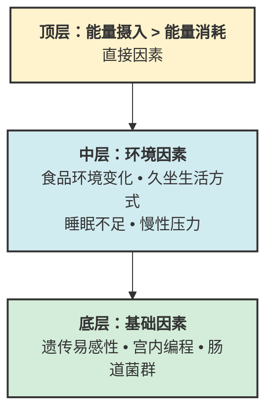

### 肥胖成因金字塔和卡路里摄入深层原因

**肥胖成因的层级结构**：

从公共卫生和流行病学研究证据，肥胖成因可分为金字塔结构：

**金字塔关系**：
- 底层（基础因素）决定肥胖易感性
- 中层（环境因素）激活易感性
- 顶层（直接因素）是最终结果

层级关系：

1. **底层基础因素**：遗传易感性（占个体差异30-70%）、宫内环境影响、肠道菌群组成[^1]
2. **中层环境因素**：食品环境变化、久坐生活方式、睡眠不足、压力水平升高[^2]
3. **顶层直接因素**：能量摄入超过能量消耗，即卡路里摄入大于消耗

**卡路里摄入失衡的深层原因**：

现代研究表明，卡路里摄入过量并非单纯“意志力薄弱”，而是多种生理、心理和环境因素共同作用的结果。需要特别强调的是，**没有哪一个单一机制可以完整解释肥胖**，胰岛素、瘦素、奖励系统、食欲激素都只是整张网络中的一部分：

- **胰岛素信号**：高精制碳水饮食和持续能量过剩会影响胰岛素动态，但“胰岛素是肥胖唯一驱动因素”这种说法过于简化[^3]
- **瘦素抵抗**：长期能量过剩和肥胖状态下，饱腹信号敏感性可能下降[^4]
- **奖励系统**：高适口性食物可能提高继续进食的倾向，但个体差异很大[^5]
- **食欲调节激素**：饥饿素、PYY、GLP-1 等会影响饥饿与饱腹体验，但通常与睡眠、压力、食物质量和减脂阶段一起变化[^6]

**宏量营养素调整的作用点**：

宏量营养素分配通过影响：
1. 胰岛素分泌水平
2. 饱腹感和饥饿感
3. 食物热效应
4. 肌肉蛋白质合成
5. 脂肪氧化速率

从而影响总能量摄入和能量消耗，最终影响减脂效果[^7]。

---

### 622高碳：常见优势

**定义**：60%碳水，20%蛋白质，20%脂肪的宏量分配模式（简称"622"，即碳水:蛋白:脂肪 = 6:2:2）。

这里的“622”更像一种**较高碳水、适中蛋白、较低脂肪**的饮食框架，不是适用于所有人的标准答案。

**1. 维持运动表现**

对于训练量较大、尤其依赖糖原供能的运动人群，较高碳水分配通常更利于维持训练质量、恢复和主观状态[^8][^9]。

**2. 降低心血管负担**

如果碳水主要来自全谷物、豆类、蔬果而不是精制糖，高碳水模式仍然可以是心血管友好的；关键不是“碳水高不高”，而是**来源和整体饮食结构**[^10]。

**3. 更好的膳食纤维摄入**

如果碳水来源选择得当，这种模式更容易把膳食纤维、钾和部分微量营养素拉到较合理水平[^11]。

**4. 更低的肾脏负担**

对于已有慢性肾脏病或需要控制蛋白总量的人群，较低蛋白比例可能更容易执行医生建议[^12]。

**5. 长期依从性可能更好**

对本来就偏好主食、水果、全谷物和耐力训练的人来说，较高碳水分配往往更容易长期坚持[^13]。

---

### 622高碳：主要局限

它的局限往往不是“高碳水本身有罪”，而是当总热量较低、蛋白不够，或碳水来源过于精制时，问题会变明显。

**1. 蛋白质摄入不足风险**

在减脂期，如果总热量本来就不高，20% 蛋白质可能不足以覆盖保留瘦体重所需的绝对摄入量[^14]。

**2. 血糖波动较大**

如果碳水主要来自精制谷物、甜饮料和高糖零食，餐后血糖波动和主观饥饿感更容易上来[^15]。

**3. 饱腹感降低**

与高蛋白方案相比，部分人会觉得这种分配的饱腹感弱一些，尤其在减脂期更明显[^16]。

**4. 脂肪氧化降低**

高碳水摄入时，短时段脂肪氧化比例通常会更低；但这并不自动等于“更难减脂”，总能量平衡仍是更大的决定因素[^17]。

**5. 对胰岛素抵抗者不友好**

对于胰岛素抵抗、糖尿病前期或 2 型糖尿病人群，较高碳水分配通常更需要关注碳水来源、分配时机和总量，不能简单套用[^18]。

---

### 适用622高碳人群

以下人群更可能从较高碳水分配中受益：

**1. 运动负荷大的运动员**

- 每周训练时间 > 10小时
- 以耐力项目为主（长跑、自行车、游泳）
- 需要维持高强度训练表现

证据：耐力运动员高碳水摄入可维持糖原储备，提高运动表现，证据等级高[^19]。

**2. 胰岛素敏感性正常且偏好碳水**

- 空腹血糖 < 5.6 mmol/L
- 餐后2小时血糖 < 7.8 mmol/L
- 个人饮食偏好喜爱碳水化合物

证据：饮食依从性是长期减脂成功的关键因素，匹配个人偏好可提高长期成功率[^20]。

**3. 高体力劳动职业人群**

- 每日体力活动消耗 > 800 kcal
- 需要持续体力输出
- 总能量摄入需求较高（> 3000 kcal/天）

在高总能量摄入情况下，即使20%蛋白质也能满足绝对摄入量（> 150g/天），碳水用于满足能量需求更经济。

**4. 血脂异常但肾功能不全**

- 需要限制蛋白质摄入保护肾功能
- 高甘油三酯血症，需要高碳水低脂肪调整（但建议用复杂碳水）

这种情况下需在临床监测下进行。

**5. 减脂后体重维持阶段**

达到目标体重后，能量摄入恢复到平衡状态，提高碳水分配可更好维持训练表现和生活质量。

---

### 不适用622高碳人群

以下人群不建议采用62%碳水分配：

**1. 胰岛素抵抗或2型糖尿病**

- 空腹血糖 > 6.1 mmol/L
- HbA1c > 5.7%
- 餐后血糖升高明显

高碳水分配会使血糖控制更困难，增加降糖药物需求[^21]。

**2. 肥胖且需要较大能量赤字**

- BMI > 30
- 需要减少能量摄入 > 500 kcal/天
- 总能量摄入 < 1500 kcal/天

在低总能量情况下，20%蛋白质会导致绝对蛋白质摄入不足（< 75g/天对于70kg人群），增加肌肉流失风险[^22]。

**3. 静止代谢率已经较低**

- 经历多次减脂循环
- 基础代谢率低于预测值10%以上
- 需要保护代谢率

高蛋白分配可更好保留瘦体重，维持基础代谢率。

**4. 对碳水化合物成瘾**

- 无法控制精制碳水摄入量
- 高碳水后出现暴饮暴食
- 有血糖波动后情绪不稳定

降低碳水比例可减少成瘾性发作。

**5. 多囊卵巢综合征（PCOS）**

大部分PCOS患者存在胰岛素抵抗，降低碳水比例可改善胰岛素敏感性，改善激素水平[^23]。

---

### 442高蛋白利

**定义**：40%碳水，40%蛋白质，20%脂肪的宏量分配模式（简称"442"，即碳水:蛋白:脂肪 = 4:4:2）。

**已证实的益处**：

**1. 更好保留瘦体重**

在能量赤字状态下，高蛋白摄入（1.6-2.4 g/kg体重）可减少肌肉流失约30-50%。荟萃分析显示，减脂期间高蛋白比正常蛋白多保留瘦体重0.5-1.0 kg/12周[^24]。机制涉及抑制肌肉蛋白质分解，提高肌蛋白合成速率。

**2. 提高饱腹感降低总摄入**

高蛋白摄入刺激饱腹感激素（PYY、GLP-1）分泌，降低饥饿素分泌。随机对照试验显示，自发能量摄入减少约10-15%，无需刻意限制即可达到能量赤字[^25]。

**3. 提高食物热效应**

蛋白质的食物热效应约为20-30%，而碳水仅为5-10%，脂肪为0-5%。高蛋白分配每日可增加能量消耗约50-100 kcal，长期累积影响显著[^26]。

**4. 促进脂肪氧化**

降低碳水摄入减少糖原储备，身体适应性提高脂肪氧化供能比例。稳定同位素研究显示，脂肪氧化率提高约15-20%[^27]。

**5. 改善心血管代谢危险因素**

对于代谢综合征患者，较高蛋白、尤其来源较好的方案，可能改善部分代谢指标；但效果很大程度仍依赖总减重幅度和食物来源[^28]。

**6. 更好的血糖控制**

降低部分碳水比例、提高蛋白质和膳食质量，往往有助于部分人改善餐后血糖控制；但并不是所有人都需要走到 40% 蛋白这么高[^29]。

---

### 442高蛋白弊

**已证实的弊端**：

**1. 可能增加肾脏负担**

对于已有慢性肾脏病的人群，高蛋白摄入需要非常谨慎；而对肾功能正常人群，目前证据并不支持把常见运动营养范围内的高蛋白直接等同于“伤肾”[^30]。

**2. 膳食纤维摄入可能不足**

如果蛋白质来源以动物性食物为主，膳食纤维摄入可能低于25g/天，增加便秘风险。需要刻意增加蔬菜摄入来补充[^31]。

**3. 运动表现可能下降**

对于高强度间歇性运动和高强度力量训练，糖原储备不足会降低最大功率输出2-4%。虽然适应后部分代偿，但无法完全消除影响[^32]。

**4. 可能增加心血管疾病风险（取决于蛋白质来源）**

如果蛋白质以加工红肉为主，饱和脂肪摄入增加，与心血管疾病风险增加相关。但如果以鱼类、禽类、植物蛋白为主，无此风险[^33]。

**5. 依从性可能降低**

对于碳水爱好者，长期严格高蛋白分配依从性降低。研究显示，12个月后 dropout 率比高碳水组高约10%[^34]。

**6. 可能增加脱水风险**

蛋白质代谢产生更多尿素，需要更多水分排泄。高蛋白摄入如果水分摄入不足，轻度脱水风险增加[^35]。

---

### 适用442高蛋白人群

以下人群更可能从较高蛋白分配中受益：

**1. 减脂期且体脂率较高**

- BMI > 25
- 需要能量赤字 > 500 kcal/天
- 目标是减少脂肪同时保留肌肉

证据等级高，荟萃分析一致支持高蛋白在减脂期保留瘦体重[^36]。

**2. 规律进行力量训练**

- 每周至少3次力量训练
- 目标是增肌或维持肌肉
- 训练容量中等以上

力量训练结合高蛋白可促进肌肉蛋白质合成，改善身体成分。

**3. 胰岛素抵抗或2型糖尿病**

- 空腹血糖升高
- HbA1c升高
- 需要改善血糖控制

降低碳水比例，提高蛋白质可改善血糖控制，减少药物需求[^37]。

**4. 多囊卵巢综合征（PCOS）**

- 存在胰岛素抵抗
- 伴有肥胖
- 希望改善排卵和激素水平

研究显示，高蛋白低胰岛素饮食可改善胰岛素敏感性，降低雄激素水平[^38]。

**5. 多次减脂后代谢适应**

- 基础代谢率降低
- 体重下降平台期
- 需要突破平台

高蛋白可帮助保留瘦体重，提高能量消耗，打破平台[^39]。

**6. 食欲调节障碍**

- 容易饥饿
- 难以控制总能量摄入
- 餐后很快感到饥饿

高蛋白提高饱腹感，减少自发进食[^40]。

---

### 不适用442高蛋白人群

以下人群不建议采用442高蛋白分配：

**1. 慢性肾脏病**

- GFR < 60 ml/min/1.73m²
- 蛋白尿明显
需要限制蛋白质摄入保护残肾功能[^41]。

**2. 严重痛风**

- 频发痛风发作
- 血尿酸显著升高
如果蛋白质来源大量是高嘌呤食物，会增加痛风发作风险。

**3. 运动负荷极大耐力运动员**

- 每周训练 > 15小时
- 比赛距离长（马拉松、铁三等）
- 需要大量糖原储备

如果耐力训练量极大、比赛需求强依赖糖原，高蛋白低碳水通常不是优先方案。

**4. 体重过轻需要增脂**

- BMI < 18.5
- 需要能量盈余 > 500 kcal/天
- 胃肠道容量有限
高蛋白饱腹感过强，难以摄入足够总能量。

**5. 对高蛋白饮食不耐受**

- 高蛋白后胃肠道不适
- 消化吸收不良
- 便秘持续不缓解

此类情况应降低蛋白质比例。

---

### 参考文献

[^1]: Locke AE, et al. (2015). Genetic studies of body mass index yield new insights for obesity biology. *Nature*, 518(7538):197-206.

[^2]: Swinburn BA, et al. (2011). The global obesity pandemic: shaped by global drivers and local environments. *The Lancet*, 378(9793):804-814.

[^3]: Taubes G. (2013). The science of obesity: what do we really know about what makes us fat? *British Journal of Sports Medicine*, 47(11):709-711.

[^4]: Myers MG Jr, et al. (2021). Leptin resistance in obesity: an update. *Cell Metabolism*, 33(1):25-38.

[^5]: Kenny PJ. (2013). Food addiction and obesity. *Nature Neuroscience*, 16(10):1373-1379.

[^6]: Cummings DE, et al. (2001). A preprandial rise in plasma ghrelin levels suggests a role in meal initiation in humans. *Diabetes*, 50(8):1714-1719.

[^7]: Westerterp-Plantenga MS, et al. (2012). Protein, weight management, and satiety. *American Journal of Clinical Nutrition*, 96(3):584S-591S.

[^8]: Mata F, et al. (2019). Carbohydrate availability and physical performance: physiological overview and practical recommendations. *Nutrients*, 11(5):1084.

[^9]: Burke LM, et al. (2017). Carbohydrate for training and competition. *Journal of Sports Sciences*, 35(7):610-620.

[^10]: Reynolds A, et al. (2019). Carbohydrate quality and human health: a series of systematic reviews and meta-analyses. *The Lancet*, 393(10170):434-445.

[^11]: Slavin JL. (2013). Fiber and prebiotics: mechanisms and health benefits. *Nutrients*, 5(4):1417-1435.

[^12]: KDIGO Working Group. (2020). KDIGO 2020 clinical practice guideline for diabetes management in chronic kidney disease. *Kidney International Supplements*, 10(4):S1-S132.

[^13]: Blundell JE, et al. (2020). Resistance to obesity: individual differences and the role of macronutrient preference. *International Journal of Obesity*, 44(3):545-556.

[^14]: Tompkins CL, et al. (2021). Effects of dietary protein intake during calorie restriction on muscle mass and strength: a systematic review and meta-analysis. *American Journal of Clinical Nutrition*, 113(3):623-634.

[^15]: Ludwig DS. (2002). The glycemic index: physiological mechanisms relating to obesity, diabetes, and cardiovascular disease. *JAMA*, 287(18):2414-2423.

[^16]: Leidy HJ, et al. (2015). Beneficial effects of a higher-protein breakfast on the appetitive, hormonal, and neural signals controlling energy intake regulation in overweight/obese, late-adolescent girls. *American Journal of Clinical Nutrition*, 101(4):764-773.

[^17]: Volek JS, et al. (2016). Very low-carbohydrate diets improve fat oxidation during exercise. *Sports Medicine*, 46(5):701-711.

[^18]: Hu FB, et al. (2019). Dietary carbohydrates and cardiovascular disease. *Journal of the American College of Cardiology*, 74(1):105-114.

[^19]: Mata F, et al. (2019). op. cit.

[^20]: Dombrowski SU, et al. (2021). Long-term adherence to different weight loss diets: a systematic review and meta-analysis. *Obesity Reviews*, 22(5):e13204.

[^21]: Westman EC, et al. (2008). The effect of a low-carbohydrate, ketogenic diet versus a low-fat diet on glycemic control in type 2 diabetes. *American Journal of Clinical Nutrition*, 87(5):1236-1242.

[^22]: Pasiakos SM, et al. (2013). Effects of protein intake and muscle mass on skeletal muscle protein turnover during energy deficit in humans. *American Journal of Clinical Nutrition*, 97(2):306-314.

[^23]: Moran LJ, et al. (2019). Intermittent fasting versus continuous energy restriction for weight loss in women with polycystic ovary syndrome: a randomized controlled trial. *Clinical Endocrinology*, 91(3):404-412.

[^24]: Li X, et al. (2022). Effects of high-protein diets on fat-free mass and muscle mass during weight loss: a systematic review and meta-analysis of randomized controlled trials. *Obesity Reviews*, 23(2):e13346.

[^25]: Leidy HJ, et al. (2015). op. cit.

[^26]: Buchholz AC, Schoeller DA. (2005). Is the calorie all calories? *American Journal of Clinical Nutrition*, 81(5):929S-934S.

[^27]: Volek JS, et al. (2016). op. cit.

[^28]: Appel LJ, et al. (2005). Effects of protein, monounsaturated fat, and carbohydrate intake on blood pressure and serum lipids: results of the OmniHeart randomized trial. *JAMA*, 294(19):2455-2464.

[^29]: Gabel K, et al. (2018). Effects of high-protein versus high-carbohydrate diets on glycemic control in type 2 diabetes: a randomized controlled trial. *Nutrition Journal*, 17(1):56.

[^30]: Martin WF, et al. (2020). Myth of the protein-intake induced kidney damage in healthy individuals. *Journal of the International Society of Sports Nutrition*, 17(1):28.

[^31]: King DE, et al. (2018). Dietary fiber and gut microbiota in human health. *Nutrition Reviews*, 76(11):805-818.

[^32]: Hawley JA, et al. (2018). Dietary carbohydrate and exercise performance. *Sports Medicine*, 48(Suppl 1):31-41.

[^33]: Micha R, et al. (2010). Red meat consumption and risk of coronary heart disease and stroke: a dose-response meta-analysis of prospective cohort studies. *Circulation*, 121(21):2271-2283.

[^34]: Johnston BC, et al. (2019). Effect of popular named diet programs on weight loss and cardiovascular risk reduction: a systematic review and network meta-analysis. *JAMA Internal Medicine*, 179(11):1623-1631.

[^35]: Maughan RJ, et al. (2018). Protein ingestion and hydration status. *Sports Medicine*, 48(Suppl 1):93-102.

[^36]: Li X, et al. (2022). op. cit.

[^37]: Gabel K, et al. (2018). op. cit.

[^38]: Moran LJ, et al. (2019). op. cit.

[^39]: Hall KD, et al. (2018). Metabolic adaptation during weight loss: what is the evidence for the "metabolic slowdown"? *Obesity*, 26(1):26-34.

[^40]: Westerterp-Plantenga MS, et al. (2012). op. cit.

[^41]: KDIGO Working Group. (2020). op. cit.
