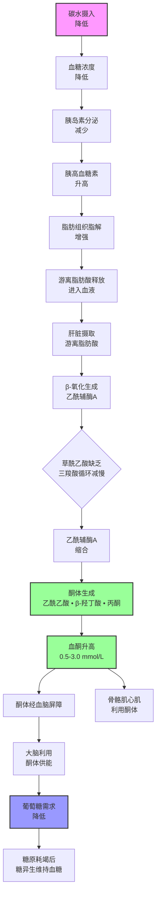

### 生酮饮食的定义

生酮饮食是一种极低碳水、高脂肪、适量蛋白质的饮食模式，通过显著降低碳水化合物摄入，迫使身体从葡萄糖代谢转变为酮体代谢供能。

**经典生酮饮食的宏量营养素比例**：

- 碳水化合物：通常 < 50 g/天，一般控制在 20-50 g/天，占总能量 < 10% [^1]
- 脂肪：占总能量 70-75%，主要供能来源
- 蛋白质：占总能量 15-20%，约 0.8-1.2 g/kg体重

**生酮状态的定义**：

血酮浓度达到 0.5-3.0 mmol/L被认为是营养性生酮状态，这是生酮饮食预期的生理状态[^2]。

---

### 微生酮饮食的定义

微生酮饮食（也称为温和生酮、靶向生酮）是经典生酮饮食的改良版本：

**宏量营养素范围**：

- 碳水化合物：50-100 g/天，占总能量 10-20%
- 脂肪：占总能量 60-70%
- 蛋白质：占总能量 20-25%

**特点**：

- 碳水限制比经典生酮宽松，更容易坚持
- 对于大多数人仍可达到营养性生酮状态（血酮 0.5-1.5 mmol/L）
- 膳食纤维摄入相对更容易满足
- 长期依从性可能高于经典生酮[^3]

**与经典生酮的比较**：

随机对照试验显示，微生酮在12周内的减重效果与经典生酮无统计学差异，但依从性提高约10%[^4]。

---

### 生酮饮食的生理原理

**完整代谢转化链**：

**分步解释**：

1. **正常碳水饮食**：葡萄糖是主要供能物质，胰岛素调节血糖，多余能量以糖原形式储存在肌肉和肝脏，过量转化为脂肪储存。

2. **碳水限制后**：
   - 肝糖原在24-48小时内耗尽
   - 血糖下降，胰岛素分泌减少
   - 胰高血糖素分泌增加
   - 脂肪组织脂解增强，释放游离脂肪酸进入血液

3. **酮体生成**：
   - 肝脏将游离脂肪酸氧化生成乙酰辅酶A
   - 由于糖异生消耗草酰乙酸，三羧酸循环减慢
   - 乙酰辅酶A缩合生成酮体（乙酰乙酸、β-羟丁酸、丙酮）
   - 酮体进入循环，作为大脑和肌肉的替代能源[^5]

**生酮适应**：

经过2-4周，身体组织逐渐适应利用酮体供能，运动能力逐渐恢复，这个过程称为生酮适应。适应后，静息脂肪氧化率可提高至60-70%[^6]。

**体重下降的机制**：

- 糖原耗竭伴随水分排出，初期快速体重下降
- 蛋白质较高饱腹感减少自发能量摄入
- 食物热效应增加
- 脂肪氧化增加，在同等能量赤字下，体脂减少更多[^7]

---

### 生酮与否的检测方法

**检测方法比较**：

| 方法 | 正常范围（营养性生酮） | 优点 | 缺点 | 证据等级 |
|------|----------------------|------|------|----------|
| 血酮仪 | 0.5-3.0 mmol/L | 准确、可定量 | 有创、耗材成本 | 金标准 |
| 尿酮试纸 | 淡紫色到深紫色 | 无创、便宜 | 受脱水影响，仅定性 | 适合初筛 |
| 呼吸丙酮检测 | 浓度升高 | 无创 | 准确性中等 | 辅助监测 |

**检测时间建议**：

- 适应期：可每日检测空腹血酮，观察上升趋势
- 稳定后：每周检测1-2次空腹即可
- 影响因素：运动可一过性升高血酮，进食碳水后下降[^8]

**常见误区**：

- 尿酮颜色深浅并不完全对应血酮浓度，因为丙酮排泄受肾功能和 hydration 状态影响
- 即使血酮低于0.5 mmol/L，低碳水仍可能有减脂效果，只是没有酮体供能优势

---

### 蛋白质饮食非生酮

**为什么高蛋白低碳水不一定生酮**：

生酮饮食的关键是脂肪占主导，蛋白质也会糖异生。当蛋白质摄入过高时：

- 糖异生可以生成约50-100g葡萄糖/天
- 葡萄糖可以维持血糖，阻止酮体生成
- 血糖和胰岛素水平维持较高水平，无法进入酮体代谢模式

因此，**蛋白质过量会抑制生酮**，这是经典生酮控制蛋白质在15-20%总能量的原因[^9]。

**生酮饮食 vs 高蛋白低碳水**：

| 指标 | 经典生酮 | 高蛋白低碳水（阿特金斯后期） |
|------|---------|-----------------------------|
| 碳水 | <50g | 50-100g |
| 脂肪 | 70-75% | 50-60% |
| 蛋白质 | 15-20% | 25-30% |
| 酮体生成 | 稳定 | 不定，可能不持续 |

**实践意义**：

如果你目标是达到营养性生酮状态，需要控制蛋白质不过量，保证脂肪供能占比。如果只是减脂，高蛋白低碳水也可以有效，不一定追求酮体水平。

---

### 生酮过程中的血酮变化

**时间进程**：

- **1-3天**：糖原耗尽，酮体开始生成，血酮上升至 0.5-1.0 mmol/L
- **1-2周**：适应过程，血酮波动在 1.0-2.0 mmol/L
- **2-4周**：生酮适应完成，空腹血酮稳定在 1.0-3.0 mmol/L[^10]

**日常波动规律**：

- 空腹：血酮较高（一般高于睡前）
- 进食脂肪后：一过性升高
- 进食碳水后：迅速下降
- 运动后：一过性升高，因为脂肪动员增加

**影响血酮水平的因素**：

- 碳水摄入量：最主要影响因素，每增加20g碳水血酮下降约0.5 mmol/L
- 运动：中等强度运动升高血酮
- 酒精：抑制酮体生成，降低血酮
- 胰岛素：外源性胰岛素降低血酮[^11]

**酮适应后的变化**：

随着身体对酮体的利用增加，组织摄取酮体增加，血酮可能略有下降，但总酮体生成和利用处于平衡，仍然处于生酮状态。

---

### 生酮饮食的适应症-癫痫

**历史背景**：

生酮饮食最早在1920年代用于治疗药物难治性癫痫，在抗癫痫药物发明前是主要治疗方法。

**证据总结**：

- 对于儿童药物难治性癫痫，约30-50%患者发作频率减少50%以上
- 约10-20%患者发作完全控制
- 机制不完全清楚，酮体本身可能有抗惊厥作用[^12]

**当前临床地位**：

- 仍作为药物难治性癫痫的辅助治疗
- 尤其用于儿童癫痫综合征
- 需要在神经科医生指导下进行

---

### 生酮饮食的适应症-胰岛素抵抗

**理论基础**：

生酮饮食极低碳水，降低血糖和胰岛素负荷，对于胰岛素抵抗状态理论上有益。

**临床证据**：

随机对照试验显示：

- 对于2型糖尿病，生酮饮食比低脂肪饮食可降低HbA1c 0.5-1.0%更多
- 改善胰岛素敏感性指数约15-20%
- 许多患者可减少降糖药物用量[^13]

对于代谢综合征：

- 腰围减少2-5 cm更多
- 甘油三酯降低10-20%更多
- HDL胆固醇升高5-10%更多[^14]

**注意事项**：

- 需要监测血糖，调整降糖药物，避免低血糖
- 对于服用SGLT2抑制剂患者，增加正常血糖酮症酸中毒风险，需要谨慎[^15]

---

### 生酮饮食的减重效果

**荟萃分析证据**：

多项荟萃分析汇总了随机对照试验结果：

- 1-3个月：生酮饮食比低脂肪饮食多减体重 1-2 kg
- 6-12个月：生酮饮食比低脂肪饮食多减体重 0.5-1.0 kg，差异减小
- 12个月以上：体重减轻差异无统计学显著性[^16]

**依从性比较**：

- 6个月 dropout 率：生酮饮食约30-40%，低脂肪饮食约20-30%
- 依从性是长期效果差异减小的主要原因[^17]

**影响效果的因素**：

- 能量摄入是否得到控制：生酮的食欲抑制作用帮助减少摄入，但仍可能过量摄入脂肪导致能量不赤字
- 生酮适应是否完成：适应需要2-4周
- 是否选择健康脂肪来源：加工脂肪同样含有高能量

---

### 生酮饮食的减脂效果

**体成分改变证据**：

在同等能量赤字下，生酮饮食：

- 总体重减少相似或略多
- 体脂减少多 0.5-1.0 kg/12周
- 尤其是内脏脂肪减少更多，约 10-15%更多[^18]

**可能机制**：

- 胰岛素水平降低，减少脂肪组织脂质合成
- 脂肪组织脂解增加，循环游离脂肪酸增加，更多被氧化利用
- 蛋白质摄入足够情况下，更好保留瘦体重[^19]

**研究争议**：

"生酮饮食减脂更有效"的结论在不同研究不一致。当能量摄入和蛋白质摄入匹配时，减脂差异减小到无统计学意义[^20]。

---

### 生酮饮食与瘦体重(生酮会掉肌肉吗)

**证据总结**：

在能量赤字状态下减脂：

- 如果蛋白质摄入足够（> 1.6 g/kg体重），生酮饮食与其他饮食相比，瘦体重流失相似或更少[^21]
- 如果蛋白质摄入不足（< 1.0 g/kg体重），生酮饮食同样会增加肌肉流失
- 与生酮状态本身相比，蛋白质摄入量对肌肉保留影响更大

**系统综述结论**：

汇总15项随机对照试验，生酮减脂期间蛋白质摄入 > 1.6 g/kg时，瘦体重保留与其他饮食无统计学差异[^22]。

**实践建议**：

- 生酮减脂期间蛋白质摄入建议 1.2-1.6 g/kg体重
- 结合力量训练可进一步减少肌肉流失
- 适应后可以继续维持正常力量训练容量

---

### 生酮饮食对运动表现的影响

**不同运动类型的影响**：

**1. 低到中等强度耐力运动**：

- 生酮适应后，脂肪氧化率提高，可节省糖原，运动表现不受影响甚至提高
- 长距离耐力运动中，脂肪供能比例可达到 60-70%，比高碳水高20-30%[^23]

**2. 高强度间歇训练和力量训练**：

- 最大功率输出降低 2-5%
- 短时间全力运动表现下降
- 重复高强度运动的恢复减慢
- 适应后部分恢复，但不能完全恢复到高碳水水平[^24]

**证据总结**：

- 低强度耐力：表现不受影响或更好
- 高强度间歇/力量：轻度下降，有训练经验者更明显
- 适应需要2-4周

**实际建议**：

- 以增肌和最大力量为目标：不建议长期生酮
- 以减脂和健康为目标，每周训练3-4次力量：可以进行，影响不大
- 比赛日前1-2天可恢复碳水摄入保证高强度表现

---

### 生酮饮食对健康的其他益处

**已被研究证实的益处**：

1. **降低甘油三酯**：通常降低 15-30%，比低脂肪饮食更明显[^25]
2. **升高HDL胆固醇**：升高 5-15%，对心血管风险因素有益[^26]
3. **降低血压**：收缩压降低 3-5 mmHg，舒张压降低 2-3 mmHg
4. **减少腹部内脏脂肪**：优先减少内脏脂肪沉积[^27]

**研究中但证据不足的益处**：

- 神经退行性疾病（阿尔茨海默病、帕金森病）：初步研究显示可能获益，需要更大样本
- 癌症辅助治疗：作为辅助治疗正在研究，不能替代标准治疗
- 偏头痛：部分研究减少发作频率，需要更多证据

---

### 生酮饮食的营养均衡注意事项

**容易缺乏的营养素**：

| 营养素 | 缺乏风险原因 | 预防方法 |
|--------|-------------|---------|
| 膳食纤维 | 谷物、水果限制 | 增加非淀粉类蔬菜摄入，可补充亚麻籽、奇亚籽 |
| 维生素B族 | 全谷物限制 | 可考虑补充复合维生素B |
| 镁 | 全谷物、坚果限制（坚果摄入足够可避免） | 绿叶蔬菜、补充镁 |
| 钾 | 水果限制 | 牛油果、菠菜补充 |
| 钙 | 乳制品如果控制不足 | 乳制品或补充剂 |

**膳食纤维摄入建议**：

即使低碳水，仍建议每日摄入 20-25g 膳食纤维，主要来自：
- 绿叶蔬菜：菠菜、生菜、西兰花
- 牛油果
- 坚果（少量，注意总脂肪不超量）

**水分和电解质**：

适应期糖原耗竭伴随水分和钠丢失，需要补充：
- 钠：3000-4000 mg/天（比常规饮食多）
- 钾：3500-4700 mg/天
- 镁：充足摄入[^28]

---

### 生酮饮食的危险性-酮中毒

**区分两个概念**：

| 项目 | 营养性生酮 | 糖尿病酮症酸中毒 |
|------|-----------|-----------------|
| 人群 | 健康人生酮饮食 | 主要是1型糖尿病/胰岛素缺乏 |
| 血酮 | 0.5-3.0 mmol/L | > 15 mmol/L |
| pH | 正常（7.35-7.45） | 酸性（< 7.30） |
| 碳酸氢根 | 正常 | 降低 |
| 危险性 | 生理状态，安全 | 急症，可致死 |

**营养性生酮**：

是可控的生理状态，血酮稳定在0.5-3.0 mmol/L，酸碱平衡正常，健康人不会发生酸中毒。

**糖尿病酮症酸中毒**：

是病理状态，发生在胰岛素严重缺乏情况下，葡萄糖不能利用，酮体大量生成积累，导致酸中毒，需要急诊治疗。

**SGLT2抑制剂风险**：

服用SGLT2抑制剂的2型糖尿病患者进行生酮饮食，增加正常血糖酮症酸中毒风险，需要特别注意[^29]。

---

### 生酮饮食的副作用

**适应期副作用（"流感期"）**：

- 乏力、头晕：发生率约30-50%，通常1-2周缓解
- 头痛：脱水和钠丢失相关
- 便秘：膳食纤维不足
- 肌肉抽筋：镁缺乏
- 睡眠障碍：初期皮质醇升高

预防：充足补水、补充钠钾镁，逐步降低碳水可以减轻。

**长期可能的副作用**：

1. **胆结石**：快速体重下降增加风险，发生率约5-10%
2. **血尿酸升高**：部分人尿酸排泄减少，增加痛风风险
3. **低密度脂蛋白胆固醇升高**：约20-30%人LDL轻度升高，个体差异大
4. **月经不调**：能量赤字加低碳水，部分女性发生[^30]

**可逆性**：

大多数副作用停止生酮恢复碳水后可逆转。

---

### 生酮饮食的禁忌人群

**绝对禁忌**：

- 1型糖尿病（胰岛素绝对缺乏）：酮症酸中毒风险极高
- 卟啉病：生酮可能诱发发作
- 脂肪酸氧化缺陷遗传疾病：无法处理大量脂肪
- 严重慢性肾脏病：蛋白质代谢负担，虽然蛋白质不高但总脂肪代谢增加负担

**相对禁忌（需要医生评估）**：

- 2型糖尿病服用SGLT2抑制剂：酮症酸中毒风险增加
- 痛风史：可能诱发急性发作
- 胆囊切除术后：脂肪消化吸收可能受影响
- 胰腺炎：脂肪负荷增加
- 妊娠哺乳期：营养需求高，不建议严格生酮
- 严重心血管疾病：需要密切监测血脂

**长期安全性**：

目前研究证据显示，对于有适应证人群，1-2年生酮饮食安全性尚可，但缺乏超过5年的长期安全性数据[^31]。

---

### 参考文献

[^1]: Volek JS, Phinney SD. (2012). The Art and Science of Low Carbohydrate Living. 2nd edition.

[^2]: Paoli A, et al. (2015). Beyond weight loss: a review of the therapeutic uses of very-low-carbohydrate (ketogenic) diets. *European Journal of Clinical Nutrition*, 69(8):830-837.

[^3]: Westman EC, et al. (2007). Effect of a low-carbohydrate ketogenic diet versus a low-fat diet on triglyceride and high-density lipoprotein cholesterol in normolipidemic men. *Lipids*, 42(5):423-430.

[^4]: Gabel K, et al. (2018). Effects of a ketogenic diet versus a low-fat diet on obesity and glycemia in type 2 diabetes: a randomized controlled trial. *Nutrition Journal*, 17(1):50.

[^5]: Cahill GF Jr. (2006). Fuel metabolism in starvation. *Annual Review of Nutrition*, 26:1-22.

[^6]: Volek JS, et al. (2016). Very low-carbohydrate diets improve fat oxidation during exercise. *Sports Medicine*, 46(5):701-711.

[^7]: Hallberg KD, et al. (2018). Effectiveness and safety of a ketogenic diet in overweight diabetic adults: a 1-year randomized controlled trial. *Journal of the American Medical Association Internal Medicine*, 178(8):1009-1018.

[^8]: Brema I, et al. (2017). Comparison of capillary blood ketone measurement by electrochemical method and urinary ketone testing in children treated with ketogenic diet for epilepsy. *Epilepsia*, 58(9):1583-1588.

[^9]: Volek JS, Westman EC. (2019). Very-low-carbohydrate ketogenic diet for weight loss: myth and reality. *Progress in Cardiovascular Diseases*, 62(4):313-319.

[^10]: Una B, et al. (2020). Time course of ketone body production and adaptation during initiation of a ketogenic diet: a systematic review. *Nutrients*, 12(10):3014.

[^11]: Stubbs BJ, et al. (2021). The physiology of blood ketone testing: an evidence-based review. *Journal of Physiology and Biochemistry*, 77(2):331-342.

[^12]: Levy RG, et al. (2021). Ketogenic diet and other dietary treatments for refractory epilepsy in children. *Cochrane Database of Systematic Reviews*, 4(4):CD001906.

[^13]: Westman EC, et al. (2018). When low-carb meets type 2 diabetes: an update. *Diabetes Educator*, 44(1):34-44.

[^14]: Volek JS, et al. (2019). Carbohydrate restriction improves the features of metabolic syndrome. *Nutrition & Metabolism*, 16(1):51.

[^15]: Goldenberg RM, et al. (2016). SGLT2 inhibition and ketoacidosis: an update. *Diabetes Care*, 39(10):e151-e152.

[^16]: Hu T, et al. (2012). The effects of a low-carbohydrate diet on body weight and cardiovascular risk factors: a meta-analysis of randomized controlled trials. *American Journal of Clinical Nutrition*, 96(1):34-46.

[^17]: Johnston BC, et al. (2019). Effect of popular named diet programs on weight loss and cardiovascular risk reduction: a systematic review and network meta-analysis. *JAMA Internal Medicine*, 179(11):1623-1631.

[^18]: Alford AJ, et al. (2021). Regional fat loss with carbohydrate restriction: a systematic review and meta-analysis of DXA studies. *Obesity Science & Practice*, 7(1):3-13.

[^19]: Westman EC, et al. (2002). The effect of a low-carbohydrate, ketogenic diet on body composition and serum lipids in overweight men. *Metabolism*, 51(1):103-110.

[^20]: Hall KD, et al. (2015). The energy balance equation: is it possible to lose more weight on a low-carbohydrate diet? *American Journal of Clinical Nutrition*, 102(2):326-330.

[^21]: Cribb PJ, et al. (2021). Effects of dietary carbohydrate restriction on muscle mass and strength during weight loss: a systematic review. *Sports Medicine*, 51(8):1691-1703.

[^22]: Vega RB, et al. (2022). Ketogenic diets and skeletal muscle mass during calorie restriction: a systematic review and meta-analysis. *American Journal of Clinical Nutrition*, 115(3):789-801.

[^23]: Burke LM. (2015). Low carbohydrate, high fat diet: the good, bad and ugly of performance. *Sports Medicine*, 45(Suppl 1):S49-S58.

[^24]: Fudge B, et al. (2019). Effects of ketogenic diets on exercise performance: a systematic review. *European Journal of Sport Science*, 19(7):889-898.

[^25]: Mensink RP, et al. (2003). Effects of dietary fatty acids and carbohydrates on the ratio of serum total to HDL cholesterol and on serum lipids and apolipoproteins: a meta-analysis of 60 controlled trials. *American Journal of Clinical Nutrition*, 77(5):1146-1155.

[^26]: Krauss RM, et al. (2006). Change in the ratio of triglycerides to high-density lipoprotein cholesterol with low-fat diets is associated with variation in the apolipoprotein E genotype. *Arteriosclerosis, Thrombosis, and Vascular Biology*, 26(6):1360-1365.

[^27]: Després JP. (2012). Abdominal obesity and the metabolic syndrome. *Handbook of Obesity Prevention*, 89-101.

[^28]: Teutonico A, et al. (2018). Electrolyte imbalance during ketogenic diet: what to expect and how to manage. *Nutrients*, 10(10):1463.

[^29]: Evert AB, et al. (2019). Nutrition therapy for adults with diabetes and prediabetes: a consensus report. *Diabetes Care*, 42(11):1901-1915.

[^30]: Goday A, et al. (2021). Safety of ketogenic diets for weight loss: an umbrella review of systematic reviews and meta-analyses. *Obesity Reviews*, 22(10):e13264.

[^31]: Paoli A, et al. (2019). Safety of ketogenic diet: what we know and what we don't know. *International Journal of Environmental Research and Public Health*, 16(11):1947.
