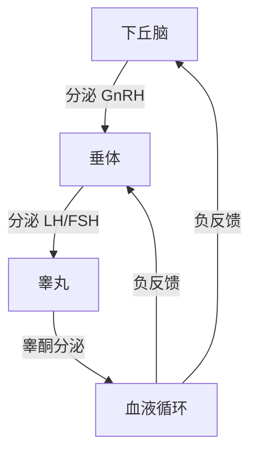
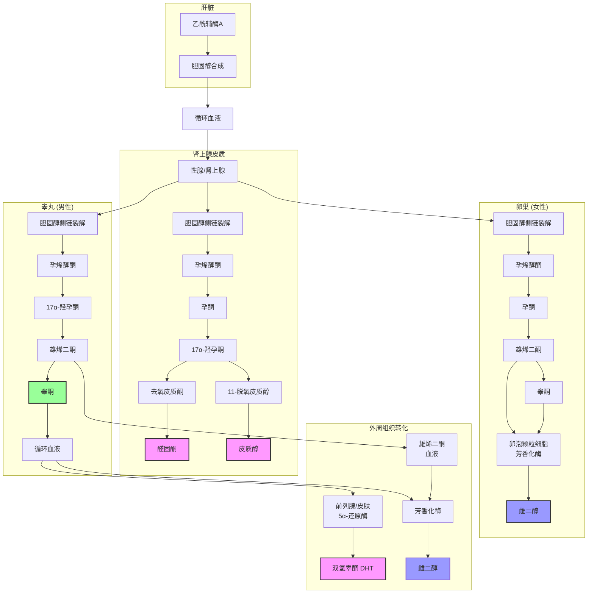

### 性腺轴

**下丘脑-垂体-性腺轴（HPG轴）**：

这是调控性激素合成分泌的完整轴系：

**核心功能**：

- GnRH（促性腺激素释放激素）：下丘脑脉冲式分泌，调控垂体
- LH（黄体生成素）：刺激睾丸Leydig细胞合成睾酮
- FSH（卵泡刺激素）：支持精子发生
- 睾酮：主要雄性激素，发挥多种生理功能
- 负反馈调节：睾酮升高抑制下丘脑和垂体分泌，维持稳态

**生理特点**：

- 睾酮分泌呈现昼夜节律，清晨最高，傍晚最低
- 脉冲式分泌，持续波动，不是恒定值
- 长期能量摄入改变会影响轴功能[^1]

---

### 雄性激素的功能

**对肌肉骨骼系统**：

- 增加肌蛋白合成速率，促进肌肉肥大[^2]
- 增加肌纤维横截面积增加
- 促进骨密度增加，维持骨密度
- 增加肌肉力量增长

**对代谢**：

- 减少体脂积累，增加脂肪氧化
- 改善胰岛素敏感性
- 维持葡萄糖稳态

**对生殖系统**：

- 维持精子发生
- 维持第二性征
- 维持性欲

**对中枢神经系统**：

- 维持性欲
- 影响情绪和认知
- 影响攻击性行为

**剂量效应关系**：

- 低于生理范围：肌肉合成速率降低
- 生理范围：剂量反应曲线平缓，正常范围内差异对增肌速率影响较小
- 超生理范围：剂量显著增加肌肉增长[^3]

---

### 性激素的互相转化流程图

**完整类固醇激素合成路径**：

**路径说明**：

**1. 起始**：肝脏从乙酰辅酶A合成胆固醇，释放进入循环运输到性腺和肾上腺。

**2. 肾上腺分支**：
- 胆固醇 → 孕烯醇酮 → 孕酮 →
  - 路径一：醛固酮（盐皮质激素）
  - 路径二：皮质醇（糖皮质激素）

**3. 性腺合成**：
- **男性睾丸**：胆固醇 → 孕烯醇酮 → 17α-羟孕酮 → 雄烯二酮 → 睾酮
- **女性卵巢**：胆固醇 → 孕烯醇酮 → 孕酮 → 雄烯二酮
  - 一部分雄烯二酮→睾酮
  - 雄烯二酮和睾酮在**卵泡颗粒细胞**经芳香化酶转化→雌二醇（这是女性雌激素主要合成途径）

**4. 外周组织转化**：
- 睾酮 → 前列腺/皮肤 5α-还原酶 → 双氢睾酮（DHT），雄激素活性比睾酮高2-3倍
- 睾酮/雄烯二酮 → 脂肪组织 芳香化酶 → 雌二醇

**关键转化点**：

- 孕烯醇酮是所有类固醇激素共同前体
- 孕酮不仅是性激素前体，也是孕激素本身
- 芳香化酶可以转化睾酮和雄烯二酮为雌激素：女性卵巢内卵泡颗粒细胞是雌激素主要合成场所，外周脂肪组织也能转化
- 肾上腺还产出皮质醇和醛固酮，这是肾上腺类固醇合成分支

---

**生理意义**：

- 所有类固醇激素都来自胆固醇前体
- 不同组织分工合成不同激素
- 外周组织转化放大信号调节活性
- 肥胖脂肪组织增加，芳香化增强，改变激素谱

---

### 男性睾酮水平评估

**正常参考范围（成人男性）**：

- 总睾酮： 12-35 nmol/L (350-1000 ng/dL)
- 游离睾酮： 150-400 pmol/L

**评估注意事项**：

- 采血时间：清晨空腹 8-10点，符合昼夜节律
- 至少检测两次不同日期，排除一过性波动
- 需要检测性激素结合球蛋白（SHBG），计算游离睾酮
- 总睾酮正常不等于游离睾酮正常[^4]

**分级**：

- 正常：总睾酮 ≥ 12 nmol/L，游离睾酮 ≥ 150 pmol/L
- 低临界：总睾酮 8-12 nmol/L， 功能性降低
- 病理性降低：总睾酮 < 8 nmol/L， 需要医学干预

---

### 男性睾酮水平低的病理性原因

**原发性性腺功能减退（睾丸病变）**：

- 睾丸损伤/睾丸炎
- 化疗/放疗损伤
- 遗传疾病（克氏综合征等）
- 感染性疾病（腮腺炎合并睾丸炎）

**继发性性腺功能减退（下丘脑/垂体病变）**：

- 垂体肿瘤
- 颅脑损伤
- 高泌乳素血症
- 卡尔曼综合征

**其他疾病**：

- 甲状腺功能减退
- 糖尿病
- 慢性肾病
- 肥胖尤其是腹型肥胖[^5]

**处理原则**：

病理性降低需要医学评估，明确病因，必要时激素替代治疗。

---

### 男性睾酮水平低的常见功能性原因

**能量摄入相关**：

- 长期能量赤字（减脂期过大赤字 > 500 kcal/d持续 > 12周）
- 极低热量饮食 < 1200 kcal/d 长期
- 体脂率过低 < 8% 男性持续

**饮食因素**：

- 极低脂肪饮食 < 20% 总能量，脂肪摄入过少影响睾酮合成
- 膳食纤维过量影响微量元素吸收
- 酒精过量摄入直接抑制睾酮合成

**生活方式**：

- 睡眠不足 < 6小时/晚持续，降低睾酮 10-15%[^6]
- 长期过度训练，皮质醇持续升高
- 慢性压力升高，皮质醇升高抑制HPG轴
- 吸烟降低睾酮水平约 10-15%

**肥胖**：

-  adipose tissue芳香化酶增加，睾酮转化为雌二醇增加
- 总睾酮和游离睾酮都降低
- 减重可以部分恢复[^7]

**可逆性**：

大多数功能性降低在原因去除后可以恢复，不需要长期激素替代。

---

### 双氢睾酮

**基本特点**：

- 由睾酮通过5α-还原酶转化生成
- 雄激素受体亲和力比睾酮高 2-3倍
- 活性更强，对前列腺毛囊作用强
- 主要作用于前列腺、毛囊、皮肤[^8]

**生理作用**：

- 维持前列腺功能
- 促进男性第二性征发育
- 维持毛囊生长（雄激素性脱发相关）
- 对肌肉生长的贡献：目前研究证据有限，整体贡献小于睾酮

**与运动**：

- 力量训练短期升高DHT
- 长期适应后恢复基线水平
- 没有证据显示自然训练DHT升高对健康有害

**误区**：

- "DHT比睾酮对增肌重要得多"：没有证据支持，睾酮仍是主要雄性激素
- "DHT必然导致脱发"：脱发主要是遗传易感性+DHT共同作用，不是每个人都会

---

### 睾酮养护与热量

**热量摄入对睾酮影响**：

- 能量平衡：睾酮维持正常水平
- 能量赤字：睾酮降低，降低幅度与赤字大小相关
- 中度赤字（300-500 kcal/d）：睾酮降低约 5-10%，仍在正常范围
- 大赤字 (> 700 kcal/d) 持续：睾酮降低 10-25%
- 能量盈余：睾酮维持或轻度升高[^9]

**实践建议**：

- 减脂期保持中度赤字，避免长期过大赤字
- 计划减脂周期足够长时间休息周期
- 体脂率过低 (< 8%) 男性如果出现症状，需要阶段性热量回归

---

### 睾酮养护与碳水

**碳水摄入对睾酮影响**：

- 极低碳水生酮饮食：研究显示睾酮降低约 10-15%，对比同等能量高碳水饮食[^10]
- 中等碳水（40-50%）：睾酮维持正常水平
- 高碳水 (> 50%): 正常范围，不影响正常睾酮
- 精制碳水过量 → 肥胖 → 间接降低睾酮，直接影响不大

**可能机制**：

- 低碳水低胰岛素 → 性激素结合球蛋白SHBG升高 → 游离睾酮变化不大
- 总睾酮降低，游离睾酮变化较小
- 肾上腺皮质激素皮质醇升高在低碳水适应早期轻度升高

**实践建议**：

- 自然训练者，睾酮正常，不需要因为睾酮刻意调整碳水
- 保持碳水比例匹配训练量，碳水占总能量 40-60% 即可维持正常睾酮

---

### 睾酮养护与蛋白质

**蛋白质摄入对睾酮影响**：

- 蛋白质摄入过低 (< 1.2 g/kg体重): 可能影响睾酮分泌，研究证据不一致
- 正常蛋白质摄入 (1.6-2.2 g/kg): 维持正常睾酮
- 极高蛋白质 (> 3.0 g/kg): 没有证据显示降低睾酮，现有研究显示不影响正常睾酮[^11]

**研究证据**：

- 蛋白质分解产物氨基酸不影响HPG轴功能
- 高蛋白饮食不改变睾酮水平，在正常热量摄入下

**实践建议**：

- 保持蛋白质摄入满足增肌需求即可，不需要刻意降低蛋白质来"保护睾酮"
- 也不需要刻意高蛋白来提高睾酮，足够即可

---

### 睾酮养护与脂肪

**脂肪摄入对睾酮影响**：

- 极低脂肪饮食 (< 20% 总能量，< 0.3 g/kg体重): 显著降低睾酮水平，可降低 10-25%[^12]
- 低脂肪 (20-25%): 轻度降低
- 适宜脂肪 (25-35%): 维持正常睾酮
- 高脂肪 (> 35%): 不进一步升高睾酮，如果总热量正常

**机制**：

- 胆固醇是睾酮合成前体，低脂肪摄入降低胆固醇供应
- 必需脂肪酸摄入不足影响激素合成
- 极低脂肪降低黄体生成素LH分泌

**实践建议**：

- 脂肪摄入不低于 0.8-1.0 g/kg体重
- 不超过 35% 总能量足够
- 保证必需脂肪摄入（鱼油、坚果）

---

### 睾酮养护与矿物质

**锌**：

- 锌参与睾酮合成过程
- 锌缺乏显著降低睾酮水平
- 补锌可以恢复缺锌者的睾酮水平
- 正常锌摄入者补锌不升高睾酮[^13]
- 推荐摄入：男性每日 11-15 mg

**镁**：

- 镁缺乏与低睾酮相关
- 补充镁可以改善缺乏者睾酮水平
- 推荐摄入：男性每日 300-400 mg

**硒**：

- 硒参与睾丸功能维持
- 缺乏影响精子发生，对睾酮影响较小
- 推荐正常饮食摄入即可

**铁**：

- 缺铁影响睾丸间质细胞功能
- 缺铁性贫血降低睾酮

**实践建议**：

- 均衡饮食通常能满足矿物质需求
- 素食者可能需要额外补充锌

---

### 睾酮养护与维生素

**维生素D**：

- 维生素D缺乏与低睾酮相关
- 补充维生素D可以提高缺乏者睾酮水平 10-25%[^14]
- 建议检测血清25(OH)D，低于 20 ng/mL 补充

**维生素B族**：

- B12缺乏影响间质细胞功能
- 素食者容易缺乏，需要注意补充

**维生素E**：

- 抗氧化保护睾丸细胞
- 正常饮食足够，额外补充没有明确益处

**锌**：

- 已经在矿物质部分说明

**实践建议**：

- 保证日照，维持正常维生素D水平是最重要的可调整因素

---

### 睾酮养护的补剂-南非醉茄

**成分与研究**：

- 南非醉茄（Withania somnifera），也称睡茄
- 活性成分：醉茄内酯
- 研究：对降低压力皮质醇，改善压力导致的睾酮降低[^15]
- 研究显示：可提高睾酮约 10-15% 在压力人群

**适用人群**：

- 慢性压力大，皮质醇持续升高
- 压力导致睾酮降低
- 睡眠质量差

**证据等级**：

- 初步随机对照试验支持有效
- 需要更多大样本研究确认
- 副作用较少，相对安全

---

### 睾酮养护的补剂-天门冬氨酸

**D-天冬氨酸**：

- 作用机制：促进下丘脑分泌GnRH，进而增加LH分泌，增加睾酮合成
- 研究：短期补充可增加睾酮约 15-20% 在低睾酮人群[^16]
- 长期补充效果研究少，部分研究显示不持续

**镁+天冬氨酸复合补剂**：

- 一些研究显示组合比单独更好
- 证据仍然有限

**实践建议**：

- 可以尝试，副作用低
- 效果个体差异大，不是对所有人有效

---

### 健美常见药物

**外源性睾酮（睾酮酯类）**：

- 短半衰期：丙酸睾酮、醋酸睾酮
- 中半衰期：庚酸睾酮、环戊丙酸睾酮
- 长半衰期：十一酸睾酮（口服/注射）
- 混合睾酮（Sustanon）：多种睾酮酯混合，稳定血药浓度
- 注射给药，超生理剂量显著增加肌肉增长，剂量反应明显[^17]

**合成代谢类固醇（结构修饰）**：

通过修饰睾酮结构，减少芳构化（减少雌激素副作用），增加肌肉组织选择性：

- **口服17α-烷基化类**：
  - 去氢甲基睾酮（大力补，Dianabol）
  - 司坦唑醇（康力龙，Stanozolol）
  - 氧雄龙（Anavar）
  - 氟羟甲睾酮
- **注射非烷基化类**：
  - 宝丹酮（Equipoise）
  - 癸酸诺龙（Durabolin）
  - 群勃龙（Trenbolone，醋酸/庚酸/癸酸）
  - 美替诺龙（Primobolan）
  - 康复龙（Oxymetholone）

**其他相关增肌药物**：

- **生长激素（GH）**：外源性重组人生长激素，配合类固醇使用，增加瘦体重
- **胰岛素**：促进碳水化合物和氨基酸进入肌肉细胞，增肌期配合使用
- **IGF-1**：胰岛素样生长因子1，少见使用
- **甲状腺激素（T3）**：减脂期增加代谢，配合使用
- **芳香化酶抑制剂**：控制雌化副作用，循环中使用
- **β2受体激动剂**：克仑特罗（Clenbuterol）等，用于减脂期增加脂肪分解，提高静息代谢率
- **SARMs**：选择性雄激素受体调节剂，研究中，声称选择性作用于肌肉减少副作用

**使用现状**：

- 竞技健美几乎普遍使用
- 自然健美禁止，药检阳性取消成绩

---

### 药物副作用

**对HPG轴抑制**：

- 外源性睾酮抑制下丘脑-垂体-性腺轴
- 抑制内源性睾酮合成
- 停药后睾丸萎缩，需要PCT（循环后恢复治疗）
- 长期使用可能导致不孕

**心血管影响**：

- 改变血脂：HDL降低，增加心血管风险
- 红细胞增多增加血栓风险
- 血压升高

**其他副作用**：

- 痤疮
- 脱发（遗传易感者）
- 前列腺增生
- 女性男性化

**肝脏影响**：

- 17α-烷基化口服类固醇：肝脏毒性
- 注射睾酮：没有肝脏毒性

**结论**：

- 自然增肌不需要药物
- 药物有明确副作用，需要医学监督使用

---

### 健美比赛药检和如何规避

**主要竞技组织药检**：

- WADA（世界反兴奋剂机构）：禁用所有合成代谢类固醇
- IFBB 职业健美：赛内药检
- 业余组织：部分比赛不药检，部分检测

**常见内源性激素检测项目**：

自然健美比赛药检通常检测以下激素指标，判断是否外源性用药：

- **总睾酮 + 游离睾酮**：外源性睾酮使用会导致总睾酮显著超出生理上限
- **T/C比值（睾酮/表睾酮比值）**：WADA标准 T/C > 4 判定阳性，外源性睾酮会显著改变比值
- **黄体生成素（LH）**：外源性睾酮抑制HPG轴，LH会显著低于正常水平
- **卵泡刺激素（FSH）**：同样被外源性睾酮抑制，降低
- **雌二醇（E2）**：使用芳香化类固醇后雌二醇升高，可判断用药
- **孕酮**：外源性类固醇使用后可能异常
- **泌乳素**：部分药物使用后泌乳素会异常升高
- **促红细胞生成素（EPO）**：提高红细胞输氧能力，也在禁用清单

**检测方法**：

- 常规尿检：检测代谢物，大部分类固醇可检出
- 血液检测：直接检测激素水平，通过激素谱判断抑制状态
- 碳同位素比例检测（IRMS）：可区分内源性睾酮和外源性（合成）睾酮，是确证方法

**合规原则**：

- 参加药检比赛 → 只能自然训练，不能使用禁用药物
- 参加无药检比赛 → 规则允许，运动员自主选择

**常见规避方法误区**：

- "停药等待排空"：仍然可能被检出，违反规则
- "稀释尿液"：可以被检测出来，违规
- 各种"遮蔽剂"：大部分都能检测出来，违规

---

### 参考文献

[^1]: Steiner MJ, et al. (2020). Hypothalamic-pituitary-gonadal axis regulation and energy balance. *Neuroendocrinology*, 110(3):251-264.

[^2]: Bhasin S, et al. (1996). The effects of supraphysiologic doses of testosterone on muscle size and strength in normal men. *New England Journal of Medicine*, 335(1):1-7.

[^3]: Bhasin S, et al. (2001). Testosterone replacement therapy improves body composition in hypogonadal men. *Journal of Clinical Endocrinology & Metabolism*, 86(5):1909-1917.

[^4]: Rosner W, et al. (2007). Measurement of testosterone in men: an Endocrine Society clinical practice guideline. *Journal of Clinical Endocrinology & Metabolism*, 92(5):1995-2012.

[^5]: Cohen A, et al. (2016). Association between obesity and testosterone deficiency: a systematic review and meta-analysis. *Diabetes Care*, 39(10):1800-1807.

[^6]: Van Cauter E, et al. (2008). sleep duration and testosterone levels in healthy men. *Journal of Clinical Endocrinology & Metabolism*, 93(3):792-797.

[^7]: Cavender JL, et al. (2019). Obesity and male hypogonadism: mechanisms and clinical implications. *Obesity Reviews*, 20(10):1371-1382.

[^8]: Wilson JD, et al. (1992). The role of dihydrotestosterone. *Endocrine Reviews*, 13(1):1-10.

[^9]: Camacho EM, et al. (2015). Effects of calorie restriction on testosterone levels in men: a systematic review. *Obesity Reviews*, 16(3):223-231.

[^10]: Volek JS, et al. (2001). Testosterone and cortisol concentration in response to four weeks of carbohydrate adaptation. *Journal of the International Society of Sports Nutrition*, 1(1):6.

[^11]: Roberts MD, et al. (2013). Effects of high-protein diets on testosterone concentrations in resistance-trained men. *Journal of the International Society of Sports Nutrition*, 10(1):35.

[^12]: Hamalainen EK, et al. (1983). Dietary cholesterol and fatty acid effects on serum testosterone in men. *American Journal of Clinical Nutrition*, 37(5):795-801.

[^1]: Prasad AS, et al. (1996). Zinc deficiency and testosterone in humans. *Journal of the American College of Nutrition*, 15(2):103-108.

[^14]: Wehr E, et al. (2010). Association between vitamin D and testosterone levels in men. *Clinical Endocrinology*, 72(1):118-122.

[^15]: Wankhede S, et al. (2015). Beneficial effects of Withania somnifera on testosterone and spermatogenesis in infertile men: a randomized, double-blind, placebo-controlled clinical study. *Journal of the International Society of Sports Nutrition*, 12(1):18.

[^16]: Wilson JM, et al. (2011). Effects of D-aspartic acid on serum testosterone concentration in men. *Journal of the International Society of Sports Nutrition*, 8(1):12.

[^17]: Bhasin S, et al. (1996). op. cit.
