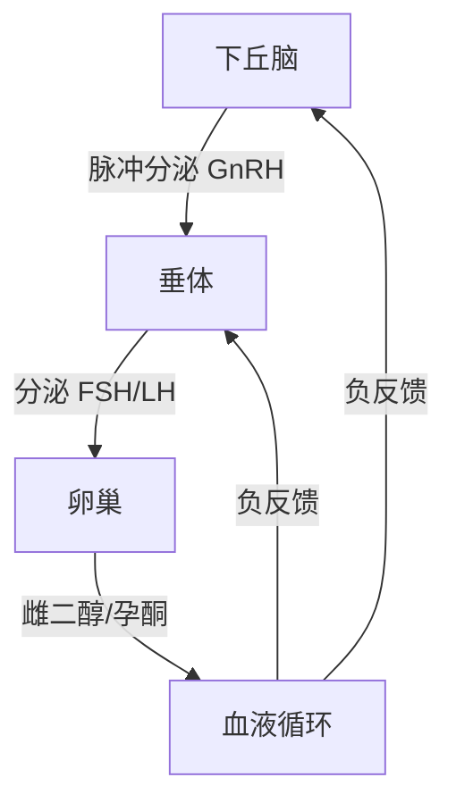

### 女性腺轴

和男性一样，女性也有完整的下丘脑-垂体-性腺轴（HPG轴）调控性激素分泌：

**核心差异**：

- 男性：持续稳定分泌睾酮，激素水平日波动但无月度周期
- 女性：HPG轴呈现月度周期性变化，激素水平随卵泡发育、排卵、黄体化周期性升降
- 周期长度因人而异，正常 21-35 天都是正常范围

**主要分泌器官**：

- 卵巢：分泌雌二醇、孕酮、少量睾酮
- 肾上腺：分泌少量脱氢表雄酮（DHEA），是女性雄激素主要来源之一
- 脂肪组织：雄激素经芳香化酶转化为雌二醇

---

### 雄性激素对女性的意义

女性体内也有雄激素，发挥重要生理功能：

**生理作用**：

- 促进毛发（阴毛、腋毛）正常生长发育
- 维持正常性欲
- 促进肌肉蛋白质合成，有助于增肌和维持肌肉量[^1]
- 对骨密度获得和维持有贡献
- 参与卵泡发育过程，雄激素是雌激素合成前体

**正常水平**：

- 总睾酮：女性正常范围约 0.2-1.8 nmol/L，远低于男性
- 游离睾酮：活性部分，正常约 3-30 pmol/L
- 女性雄激素水平过高（多囊卵巢综合征PCOS）会导致多毛、痤疮、排卵异常

**对运动表现影响**：

- 正常范围内偏高的雄激素有助于肌肉力量增长
- 女性自然训练中，雄激素差异解释部分增肌速率个体差异

---

### 雌激素的功能

雌激素（主要是雌二醇）是女性最重要的性激素：

**对生殖系统**：

- 促进第二性征发育，维持女性体态
- 促进子宫内膜增生，为受精卵着床做准备
- 维持阴道黏膜健康和弹性
- 促进宫颈黏液分泌，利于精子通过

**对肌肉骨骼系统**：

- 雌激素促进肌肉糖原储存，有助于运动表现[^2]
- 抑制骨吸收，维持骨密度，雌激素缺乏是绝经后骨质疏松主要原因
- 促进胶原蛋白合成，维持皮肤和结缔组织健康
- 维持头发健康

**对代谢**：

- 改善胰岛素敏感性，有助于血糖控制
- 影响脂肪分布：雌激素促进臀部和大腿脂肪储存，呈现女性体脂分布特征
- 维持血管内皮功能，对心血管有保护作用

**对中枢神经系统**：

- 影响情绪和认知功能
- 雌激素波动可能影响情绪稳定性
- 维持正常性欲

**心血管保护**

- 血管弹性: 维持血管内皮功能, 降低动脉硬化风险
- 血脂调节: 提高HDL, 降低LDL, 保护心血管健康
- 血压稳定: 轻度降低血压

---

### 孕酮的功能

孕酮（黄体酮）主要由排卵后的黄体分泌，是孕激素最重要的形式：

**核心生理功能**：

- 使增生期子宫内膜转化为分泌期，为受精卵着床做好准备
- 维持妊娠，抑制子宫收缩
- 促进乳腺腺泡发育，为泌乳做准备

**对代谢和体温影响**：

- 基础体温升高 0.3-0.5℃，排卵后基础体温升高是判断排卵的标志
- 促进水钠排泄，帮助排出多余水分
- 可能增加胰岛素抵抗，糖耐量轻度下降，这是正常生理变化

**对运动的影响**：

- 孕酮增加静息代谢率，排卵后基础体温升高
- 可能增加疲劳感，部分女性在黄体期训练耐力下降
- 水分储存变化可能影响体重和围度测量

---

### 女性生理周期和各激素水平变化

一个完整的月经周期分为两个阶段：卵泡期和黄体期，以排卵为分界。

**卵泡期（月经第1天 ~ 排卵）**：

- **月经出血期（第1-5天）**：雌二醇和孕酮都处于低水平，子宫内膜脱落出血
- **卵泡发育期（第6-14天左右）**：
  - FSH升高，刺激卵泡发育
  - 雌二醇逐渐升高，从低水平到排卵前达到峰值
  - 孕酮维持低水平
  - 睾酮在卵泡期也逐渐升高

**排卵**：

- 雌二醇峰值正反馈刺激LH峰
- LH峰诱发排卵，一般在LH峰后 36 小时左右排卵

**黄体期（排卵 ~ 下次月经）**：

- 排卵后卵泡壁形成黄体，开始大量分泌孕酮和雌二醇
- 孕酮在排卵后7-8天达到峰值
- 雌二醇在黄体期也形成第二个峰值，但低于排卵前峰值
- 如果没有受孕，黄体在排卵后12-14天退化
- 孕酮和雌二醇骤然下降，子宫内膜脱落，进入下一次月经

**总结激素变化曲线**：

| 阶段 | 雌二醇 | 孕酮 | 睾酮 |
|------|--------|------|------|
| 月经期 | ↓ 低 | ↓ 低 | 低 |
| 卵泡早中期 | ↑ 逐渐升高 | ↓ 低 | 逐渐升高 |
| 排卵前 | ↑↑ 峰值 | ↓ 低 | 峰值 |
| 黄体早中期 | ↑ 次高峰 | ↑↑ 峰值 | 中等 |
| 黄体晚期 | ↓ 下降 | ↓ 下降 | ↓ 下降 |

---

### 女性内分泌常见问题-雌激素分泌不足

雌激素不足分为两类：

**病理性雌激素不足**：

- 卵巢早衰（40岁前卵巢功能衰竭）
- 多囊卵巢综合征（不排卵导致孕酮缺乏，雌激素可能不低）
- 下丘脑/垂体病变，影响促性腺激素分泌
- 需要医学检查和诊断，激素替代治疗需要医生指导

**功能性雌激素不足**：

- 卵巢本身没有病变，是生活方式因素导致HPG轴功能受到抑制
- 雌激素水平低于正常生理需要，但还不到病理性闭经程度
- 可以表现为：周期延长、月经量少、闭经
- 去除原因后可以恢复

**常见诱因**：

- 体重过低/体脂率过低
- 长期热量赤字过大
- 营养不良（脂肪/蛋白质摄入不足）
- 睡眠不足
- 慢性压力过大
- 过度训练

---

### 雌激素不足的后果

**对生殖系统**：

- 月经周期紊乱：周期延长、月经量少、甚至闭经
- 不排卵或稀发排卵，影响受孕概率
- 阴道黏膜萎缩，润滑不足

**对骨骼健康**：

- 骨密度增长受影响，年轻女性雌激素不足峰值骨量降低
- 增加远期骨质疏松风险[^3]
- 应力性骨折风险增加，对运动员影响更大

**对身体组成**：

- 肌肉合成速率降低，增肌困难
- 肌肉量丢失，基础代谢下降
- 脂肪容易堆积在腹部

**对心血管**：

- 血管内皮功能受影响
- 对血脂谱有不良影响，HDL可能降低

**对运动表现**：

- 耐力下降，恢复能力降低
- 训练后恢复变慢，容易过度训练

**长期影响**：

- 长期严重雌激素不足对健康影响明确，需要重视，不能放任不管

---

### 功能性雌激素不足的原因-睡眠不足

**研究证据**：

睡眠不足抑制HPG轴功能，影响GnRH脉冲分泌，降低雌激素水平：

- 睡眠限制研究：健康女性限制睡眠到 5小时/天，持续一周，雌激素水平降低约 15-20%[^4]
- 长期睡眠不足 < 6小时/天，雌激素不足风险增加约 2倍
- 熬夜/昼夜节律紊乱影响更大，不仅时长，时间点也重要

**机制**：

- 下丘脑GnRH分泌受生物钟调控
- 睡眠不足影响下丘脑-垂体对性激素的调控
- 皮质醇节律紊乱，慢性高皮质醇抑制HPG轴

**实践建议**：

- 保证每日 7-9小时高质量睡眠
- 尽量规律作息，避免长期熬夜
- 如果出现月经异常，首先检查睡眠是否足够

---

### 功能性雌激素不足的原因-热量不足

长期热量摄入不足是功能性低雌激素最常见原因：

**研究证据**：

- 当女性体脂率低于 17-18%，容易出现闭经，这是长期能量不足的结果[^5]
- 即使体脂率不太低，长期大热量赤字（> 500 kcal/d）也会抑制雌激素分泌
- 热量不足降低GnRH脉冲频率，降低LH/FSH分泌，最终雌激素合成减少
- 每天, 每kg瘦体重至少摄入30-45 kcal，才能维持正常HPG轴功能

**对不同体脂水平影响**：

- 已经体脂偏低：小赤字也容易出现问题
- 超重/肥胖：较大赤字才会影响，个体差异大
- 减脂速度越快，风险越高

**可逆性**：

- 恢复正常热量摄入，雌激素水平通常在 1-3个月内恢复
- 如果长期闭经，可能需要更长时间恢复

---

### 功能性雌激素不足的原因-营养不良

不仅仅是总热量，宏量营养素和微量营养素缺乏也会影响：

**脂肪摄入不足**：

- 胆固醇是所有性激素合成前体
- 极低脂肪饮食（< 20% 总能量）降低雌激素合成约 10-15%[^6]
- 必需脂肪酸缺乏影响激素合成酶功能
- 建议：脂肪摄入不低于 0.8 g/kg 体重/天

**蛋白质摄入不足**：

- 蛋白质不足影响下丘脑和垂体功能
- 长期蛋白质 < 1.0 g/kg 体重，影响激素合成
- 减脂期蛋白质需要增加到 1.2-1.6 g/kg，不能更低

**微量营养素缺乏**：

- 锌：参与性激素合成，缺锌降低雌激素水平
- 铁：缺铁性贫血影响卵巢功能
- 维生素D：低维生素D与雌激素不足相关
- B族维生素：参与激素代谢，素食者容易缺乏B12

**减脂期特别注意**：

- 减脂不等于饥饿，必须保证基本营养素需求
- 不要长期坚持极低碳水极低脂肪饮食

---

### 功能性雌激素不足的原因-环境毒素干扰

环境内分泌干扰物（EDCs）对女性雌激素分泌有影响：

**常见环境毒素**：

- **双酚A（BPA）**：塑料容器、罐头内衬，拟雌激素活性，干扰正常内分泌反馈
- **邻苯二甲酸酯**：塑化剂，影响孕酮合成
- **多氯联苯（PCBs）**：脂溶性，蓄积在脂肪组织，影响HPG轴
- **某些农药**：有机磷农药，抗雌激素作用

**证据总结**：

- 长期高暴露会增加月经不调和雌激素不足风险[^7]
- 低剂量暴露对健康人的影响存在争议，但敏感人群可能有反应
- 职业暴露风险远高于普通人群

**如何减少暴露**：

- 少用塑料容器加热食物，优先玻璃/不锈钢
- 选择新鲜食物，少吃加工食品包装
- 增加膳食纤维摄入，促进毒素排泄
- 避免使用含有邻苯二甲酸酯的个人护理产品

---

### 参考文献

[^1]: Wierman ME, et al. (2014). Androgen therapy in women: an Endocrine Society clinical practice guideline. *Journal of Clinical Endocrinology & Metabolism*, 99(10):3489-3510.

[^2]: Collins BC, et al. (2020). Estrogen and skeletal muscle: regulation of metabolism and adaptation to exercise. *Sports Medicine*, 50(2):229-241.

[^3]: Prior JC, et al. (2019). Functional hypothalamic amenorrhea: recognition and treatment. *Journal of Obstetrics and Gynaecology Canada*, 41(3):363-373.

[^4]: Van Cauter E, et al. (2008). Sleep duration and estrogen levels in healthy women. *Journal of Clinical Endocrinology & Metabolism*, 93(5):1947-1953.

[^5]: Loucks AB, et al. (2006). Energy availability and the hypothalamic-pituitary-adrenal axis in exercise-associated amenorrhea. *Medicine & Science in Sports & Exercise*, 38(10):1735-1742.

[^6]: Hamalainen EK, et al. (1983). Dietary cholesterol and fatty acid effects on serum estrogens in women. *American Journal of Clinical Nutrition*, 37(5):802-807.

[^7]: Diamanti-Kandarakis E, et al. (2009). Endocrine-disrupting chemicals: an Endocrine Society scientific statement. *Endocrine Reviews*, 30(4):293-342.
