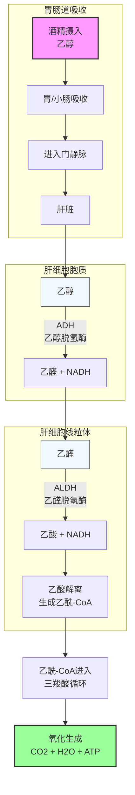
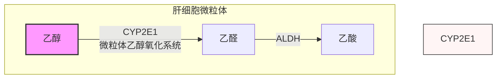

酒精（乙醇）是一种特殊的产能物质，人体摄入后有独特的代谢途径，其代谢特点和健康影响与三大营养物质（碳水、蛋白质、脂肪）有显著区别。本文从生物化学角度完整解析酒精代谢。

---

## 酒精在人体内的代谢路径

酒精（乙醇）摄入后，主要在**肝脏**进行代谢，全过程分为两步，关键是两种酶的催化：

**完整代谢流程图：**

**当大量饮酒时，主要代谢通路饱和，会激活第二通路：**

---

## 关键酶与个体差异

### 三种主要代谢酶

| 酶 | 位置 | 功能 | Km值 | 主要作用 |
|----|------|------|------|----------|
| **ADH（乙醇脱氢酶）** | 肝细胞胞质 | 乙醇 → 乙醛 | ~0.1-1 mM | 低-中浓度酒精的主要代谢途径 |
| **ALDH（乙醛脱氢酶）** | 肝细胞线粒体 | 乙醛 → 乙酸 | ~10 μM | 催化乙醛氧化，是限速步骤 |
| **CYP2E1** | 肝细胞微粒体 | 乙醇 → 乙醛 | ~10-30 mM | 高浓度酒精时激活，诱导后活性增加 |

### 常见遗传差异

**ALDH2缺陷**：东亚人群约30-50%携带ALDH2*2等位基因，酶活性显著降低，导致乙醛积累，出现脸红、头晕等反应。携带此基因人群饮酒风险更高，与食管癌风险增加相关[^1]。

**ADH多态性**：不同ADH同工酶活性差异影响代谢速率，快代谢型者乙醛生成快，若ALDH正常则代谢更快。

---

## 酒精的热量计算

酒精本身能量密度很高，**每克酒精提供约 7 kcal（29 kJ）** 能量，显著高于碳水化合物和蛋白质（4 kcal/g），低于脂肪（9 kcal/g）。

### 常见酒精饮料热量计算：

| 饮品 | 酒精含量 | 份量 | 酒精含量(g) | 总热量(kcal) |
|-------|----------|------|------------|-------------|
| **啤酒（淡）** | 3.5% v/v | 330 ml | ~11.5 | ~110-150 |
| **啤酒（普通）** | 5% v/v | 330 ml | ~16.5 | ~160-200 |
| **葡萄酒（干红）** | 12% v/v | 150 ml | ~14 | ~100-120 |
| **葡萄酒（甜）** | 12% v/v + 糖 | 150 ml | ~14 | ~150-200 |
| **白酒（52度）** | 52% v/v | 50 ml | ~41 | ~290 |
| **威士忌** | 40% v/v | 30 ml | ~9.5 | ~65-75 |

**要点：**
- 酒精热量被身体有效利用，"喝酒发胖"不仅来自酒精本身，混合饮料中的糖/碳酸也贡献大量热量
- 酒精代谢产生的乙酰-CoA优先用于脂肪合成， surplus酒精容易促进脂肪储存

---

## 酒精代谢对物质代谢的影响

### 1. 对脂肪代谢的影响

- 酒精氧化优先进行，**抑制脂肪酸氧化**：酒精代谢产生大量NADH，抑制β-氧化速率
- 促进肝脏**脂肪合成增加**：乙酰-CoA过剩促进从头脂肪生成
- 长期大量饮酒导致**脂肪肝**：脂肪在肝脏堆积，是非酒精性脂肪肝的重要诱因[^2]

### 2. 对糖代谢的影响

- 抑制**糖异生**：酒精代谢增加NADH/NAD+比值，抑制糖异生关键酶
- **空腹饮酒容易导致低血糖**：尤其在糖尿病患者或长时间空腹后饮酒
- 长期大量饮酒降低**胰岛素敏感性**，增加胰岛素抵抗风险

### 3. 对肝脏的影响

- 短期：脂肪肝（可逆）
- 长期：酒精性肝炎 → 肝纤维化 → 肝硬化 → 肝癌
- 酒精代谢产生乙醛，乙醛是明确的致癌物，对肝细胞有直接毒性[^3]

### 4. 对运动表现的影响

**短期影响：**
- 中枢神经系统抑制，反应速度、协调性下降
- 影响糖原补充和肌肉蛋白质合成
- 脱水风险增加，酒精有利尿作用

**长期影响：**
- 肌肉蛋白质合成受到抑制，影响增肌效果
- 影响激素水平，降低睾酮合成
- 睡眠质量下降，影响恢复

---

## 酒精与减脂

### 核心要点：

1. **酒精热量高**：1克酒精=7 kcal，热量密度仅次于脂肪，容易造成热量过剩
2. **酒精优先代谢**：酒精代谢占用氧化通路，脂肪氧化被抑制，摄入酒精同期脂肪分解减少
3. **酒精影响食欲调节**：酒精增加食欲，容易导致进食过量
4. **啤酒肚成因**：酒精热量高+促进内脏脂肪储存，典型的向心性肥胖

### 减脂期饮酒建议：

- 控制份量：浅尝辄止，避免豪饮
- 避免高糖混合酒：可乐、果汁混合饮料额外增加大量糖
- 计入每日总热量：酒精热量不能忽视
- 限制频率：偶尔饮用，不建议 daily 饮酒

---

## 循证结论：多少才算安全？

**目前研究结论：**[^4][^5]

- 不存在"安全饮酒剂量"，即使少量饮酒也对健康有潜在风险
- 风险呈剂量依赖性：喝得越多，风险越高
- 特定人群完全禁忌：孕妇、哺乳期、肝病患者、糖尿病患者等

**WHO权威建议：**
- 对于健康成年人，若选择饮酒，**男性每日不超过25g酒精，女性每日不超过15g酒精**是相对限制量
- 零饮酒是最安全的选择

---

### 参考文献

[^1]: Li D, et al. (2021). ALDH2 polymorphism and alcohol-related cancer risk: an updated meta-analysis. *Cancer Epidemiology*, 73:101943.

[^2]: Liangpunsakul S, et al. (2023). Alcohol-associated liver disease: an update. *Gastroenterology*, 164(5):1063-1077.

[^3]: Seitz HK, et al. (2018). Alcohol and cancer: an update with particular focus on biological mechanisms. *Nature Reviews Cancer*, 18(10):625-637.

[^4]: Wood AM, et al. (2018). Risk thresholds for alcohol consumption: combined analysis of prospective studies on 599,912 current drinkers in 83 prospective studies. *The Lancet*, 391(10129):1513-1523.

[^5]: GBD 2020 Alcohol Collaborators. (2022). Global burden of disease attributable to alcohol consumption in 2020: a systematic analysis for the Global Burden of Disease Study 2020. *The Lancet*, 399(10343):1867-1887.
