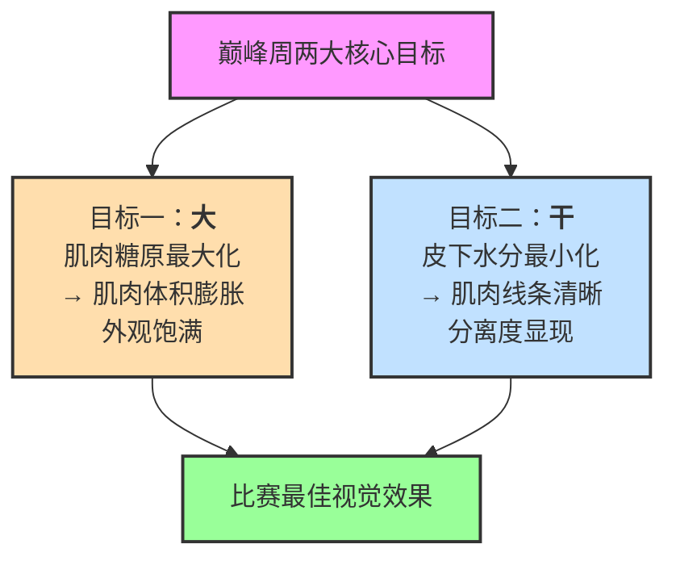

**巅峰周（Peak Week）** 指健美比赛前最后7-10天，备赛的最后调整阶段。所有调整围绕两个核心目标：

圈中流传着无数"经验做法"，很多相互矛盾。本文基于近年高质量系统性综述和随机对照研究，按两大目标分开总结循证结论，给出可执行方案。

---

## 目标一：最大化肌肉饱满（"大"）

核心策略：**完全填满肌肉糖原储备**，糖原结合水让肌肉细胞体积增大，肉眼可见更饱满。

### 碳水化合物加载

| 项目 | 循证建议[^1][^2]
|------|----------
| **开始时间** | 赛前 **2-3天** 开始，不需要提前一周
| **摄入量** | **4-7 g/kg 体重/天**，根据体型和赛前糖原消耗调整
| **碳水来源** | 选择低纤维、高GI碳水为主，避免大量膳食纤维导致胃肠胀气
| **脂肪摄入** | 同期降低脂肪摄入到 **10-15%** 总能量，给碳水腾空间

### 原理
- 肌肉糖原储量正常约 **400-500g**（70kg体重），完全填充后肌肉重量增加约 **1.5-2kg**（糖原结合水），肉眼可见体积增大
- 提前2-3天足够填满糖原储备，提前一周开始反而容易堆积过多水分
- 低纤维减少肠道气体和粪便体积，避免腹部膨胀影响裁判视觉评分

### 常见误区
- ❌ "先糖原耗尽（depletion）再填充"：没有证据支持这一步能增加最终糖原储存，反而可能影响肌肉饱满度[^1]
- ❌ "必须完全断脂肪"：不需要完全断掉，只要大幅减少即可
- ✅ **不需要完全恐惧脂肪**：近年研究证实，**肌内脂肪（intramuscular fat）** 本身会让肌肉在台上看起来更饱满，完全断掉脂肪反而可能让肌肉看起来干瘪[^5]
- ✅ 个体差异大：小体重选手用偏低值，大体重高训练量用偏高值

### 训练调整（为了"大"）

| 阶段 | 推荐做法[^1][^4]
|------|----------
| 赛前一周 | **大幅降低训练容量**，保留少量低容量高强度刺激
| 赛前 2-3天 | 只做轻度活动，或少量sets低容量动作，保持肌肉充血感
| 赛前一天 | 休息为主，可做轻微充血训练，不建议长时间训练

**原理**：
- 赛前一周不需要高容量训练，过度训练导致疲劳，肌肉看起来干瘪
- 轻度充血训练可以让肌肉上台前看起来更饱满，但不要练到疲劳

---

## 目标二：最小化皮下水分（"干"）

核心策略：**调整钠和水分摄入**，促进水分排出，减少皮下储存，让肌肉线条和分离度更清晰。

### 水分调整

**方案A（推荐，温和调整）**：[^1][^3]
- 赛前 **3-5天**：恒定中等水分摄入（~3-4 L/天），不刻意增减
- 赛前 **12-24小时**：适度减少到 ~1-2 L，不建议完全断水

**方案B（传统水加载）：**
- 赛前 3-4 天：刻意大量饮水（~6-8 L/天）
- 赛前 1-2 天：突然断水
- **证据评价**：研究证据不足，且风险较大（脱水严重影响状态，反而让肌肉干瘪），不推荐常规使用

### 原理
- 大量饮水后突然断水，会导致醛固酮分泌增加，促进水分排出，理论上减少皮下水分
- 但实际中个体差异极大，过度脱水会让肌肉体积缩水，得不偿失
- 温和逐步调整比极端断水更安全，更容易控住状态

### 钠（盐）摄入调整

| 阶段 | 推荐做法[^1]
|------|----------
| 赛前 **4-7天** | 逐渐减少钠摄入到 **低水平**（~1500-2000 mg/天）
| 比赛当天 | 上台前 **少量** 补钠，避免完全缺钠导致乏力抽筋

### 原理
- 高钠摄入促进水分在皮下储存，低钠摄入促进水分排出
- 提前几天开始逐渐减少，让身体适应，比最后时刻突然断钠更平稳
- 完全断钠会导致低钠血症，乏力、抽筋，甚至影响神经肌肉功能

### 脂肪摄入调整

- 赛前 **3-7天**：减少脂肪摄入到 **10-20% 总能量**
- 目的：腾出卡路里空间给碳水，保证糖原充分填充
- 不需要完全断脂肪，极低脂肪饮食容易影响激素分泌和饱腹感

### 其他常见排水方法：循证评估

坊间还流传一些排水方法，以下是现有证据评估：

| 做法 | 原理传说 | 证据等级 | 循证结论 |
|------|----------|----------|----------|
| 完全断水 | 快速排皮下水分 | 低/有害 | 过度脱水导致肌肉干瘪、电解质紊乱，不推荐 |
| 水加载+完全断水 | 刺激醛固酮分泌排水 | 低/风险 | 缺乏高质量研究，个体差异太大，不推荐常规使用 |
| 盐加载+断盐 | 刺激排水，突然断盐排水 | 中等 | 提前逐渐减钠更合理，不推荐极端盐加载再断盐 |
| 赛前大剂量维生素C | 维生素C利尿促进排水 | 低/微弱 | 维生素C确实有轻度利尿作用，但效果极弱，超大剂量没有明确好处，常规剂量足够 |
| 赛前提高蛋白质摄入 | 蛋白质代谢增加尿素生成，渗透性利尿 | 中等生理基础 | 高蛋白确实增加水分排泄，但若已经低碳低热量备赛，不建议额外再大幅提高蛋白，容易肌肉分解 |
| 头低脚高位睡眠（垫高脚） | 促进下肢水分回流，减少皮下水肿 | 缺乏研究 | 生理逻辑上有一定合理性，但没有研究证据支持，可尝试，风险低 |
| 赛前大量碳水冲击（carbs spike） | 快速填满糖原 | 中等 | 对于糖原填充完毕，最后冲击没有额外好处 |
| 桑拿/蒸澡快速脱水 | 出汗排水 | 低/风险 | 快速脱水容易流失电解质，肌肉缩水，不推荐 |

**简要原理说明：**

- **维生素C**：大剂量维生素C确实有轻度利尿作用（抑制抗利尿激素），但这种利尿作用非常微弱，对巅峰周皮下水分影响可以忽略不计。日常饮食满足维生素C需求即可，超大剂量（> 1-2g/天）没有证据显示额外益处。

- **高蛋白质**：蛋白质代谢产生尿素，尿素需要更多水分从肾脏排出，因此高蛋白饮食确实增加水排出。但备赛末期已经热量赤字+低碳水，如果蛋白质过高，可能增加肌肉分解风险，因此不推荐刻意进一步提高蛋白质，保持备赛推荐量（1.6-2.2g/kg）即可。

- **头低脚高位睡眠**：理论上垫高下肢可以促进静脉回流，减少下肢组织间隙水分储存，可能帮助腿部线条更清晰。这种做法风险很低，可以尝试，但缺乏研究证据证实效果。

---

## 完整示例：七天巅峰周计划（以70kg选手为例）

| 天数 | 目标导向 | 碳水 (g/kg) | 脂肪 | 钠 | 训练 |
|------|----------|------------|------|------|------|
| 赛前7天 | 降容量 | 2-3 g/kg | 20-25% | 正常 (~3000-4000 mg) | 正常训练容量 × 50% |
| 赛前6天 | 降容量 | 2-3 g/kg | 20-25% | 正常 | 休息/轻度活动 |
| 赛前5天 | 开始减钠+增碳 | 3-4 g/kg | 15-20% | 降至 ~3000 mg | 轻量训练 |
| 赛前4天 | 增碳+减钠 | 4-5 g/kg | 15-20% | 降至 ~2500 mg | 轻度活动 |
| 赛前3天 | 满糖原+减钠 | 5-6 g/kg | 10-15% | 降至 ~2000 mg | 休息 |
| 赛前2天 | 满糖原+排水 | 5-7 g/kg | 10-15% | ~1500-2000 mg | 轻度充血训练 |
| 赛前1天/比赛日 | 维持+准备上台 | 4-5 g/kg 分多次 | 低 | 少量补钠 500-1000 mg | 休息/上台前轻度充血 |

**说明：**
- 这只是通用模板，需要根据你自身情况调整
- 如果你的体脂已经压得很低，碳水可以更高
- 如果容易储水，钠可以更早开始减少

---

## 比赛当天小贴士

1. **上台前补糖**：赛前1-2小时补充 50-100g 碳水，维持肌肉饱满
2. **不要吃过量纤维**：选择白米、白面包等低纤维碳水，避免胃肠胀气
3. **钠补充**：少量补充盐分，避免抽筋和乏力
4. **充血**：上台前做 1-2 组轻重量动作，保持肌肉充血外观
5. **水分**：口渴抿一口即可，不要大量喝

---

## 总结：循证巅峰周核心原则

1. **温和调整优于极端**：极端脱水断盐更容易翻车，温和调整更稳定
2. **分清优先级**："大"（糖原填充）优先级高于"干"（水分排出），没有肌肉体积，线条再清晰也没有意义
3. **个体差异极大**：需要多次比赛试验，找到适合自己的方案
4. **平时训练到位比巅峰周更重要**：巅峰周只是"画龙点睛"，肌肉量和体脂水平是赛前几个月训练饮食决定的

顶级选手的巅峰状态，90%来自赛前几个月的系统训练和备赛，最后一周调整只能改变外观细节，不可能"逆袭"。

---

### 参考文献

[^1]: Grgic J, et al. (2021). Peak week recommendations for bodybuilders: an evidence based approach. *Journal of the International Society of Sports Nutrition*, 18(1):33. (开放获取全文)

[^2]: Soderdahl DB, et al. (2008). Carbohydrate loading and performance: a meta-analysis. *International Journal of Sport Nutrition and Exercise Metabolism*, 18(3):298-315.

[^3]: Walsh RM, et al. (2019). Water loading and sodium manipulation prior to bodybuilding competition: a case study. *Journal of the International Society of Sports Nutrition*, 16(Suppl 1):P18.

[^4]: Hackett FP, et al. (2013). Pre-competition tapering strategies used by elite bodybuilders: a survey. *Journal of Strength and Conditioning Research*, 27(8):2168-2177.

[^5]: Lenzi JL, et al. (2021). Bodybuilding competition preparation: a systematic review. *Sports Medicine*, 51(12):2543-2559.
