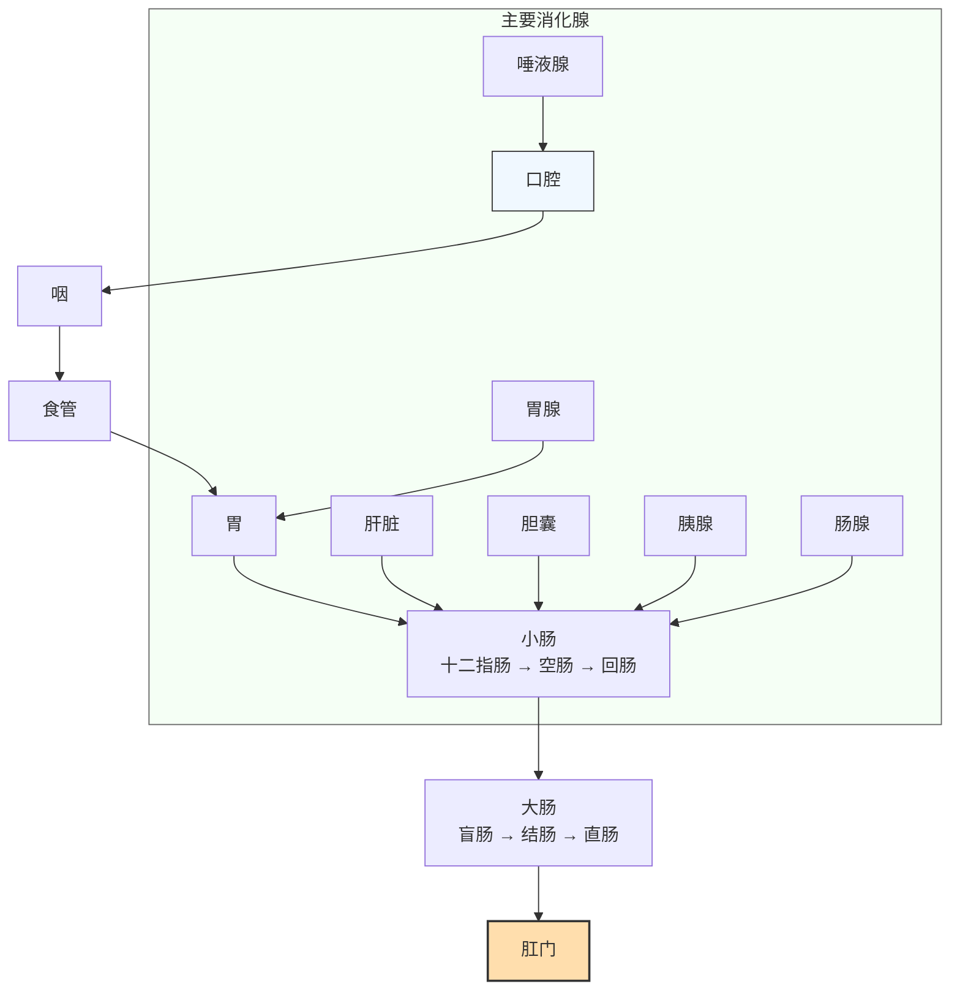

消化系统是人体获取能量和营养素的第一道门户，其结构和功能直接影响我们的运动表现、身体组成和整体健康。本文从解剖结构到生理功能系统整理，结合运动营养学视角理解消化系统。

---

## 基本定义

### 消化（Digestion）
消化是将食物中的**大分子营养素**（蛋白质、碳水化合物、脂肪）分解为能够被吸收的**小分子**（氨基酸、单糖、脂肪酸）的过程。

- **机械消化**：通过肌肉收缩磨碎食物，增加表面积（咀嚼、胃蠕动、小肠分节运动）
- **化学消化**：通过酶的催化作用，断裂化学键，将大分子分解为小分子

### 吸收（Absorption）
吸收是消化后的小分子营养素、维生素、矿物质和水通过**小肠黏膜上皮细胞**进入血液和淋巴的过程。

只有被吸收的营养素才能被身体利用，未被吸收的部分最终作为粪便排出体外。

---

## 消化系统整体组成

消化系统由**消化道（alimentary canal）**和**消化腺（digestive glands）**两大部分组成：

整个消化道长度约**7-9米**，从口腔到肛门，食物全程通过大约需要**24-72小时**，具体取决于膳食纤维含量和个体蠕动速度。

---

## 各段消化道的结构与功能

### 1. 口腔（Oral Cavity）

**主要功能：**
- **机械消化**：咀嚼（mastication）将大块食物磨碎，增加与消化酶接触面积
- **化学消化**：唾液淀粉酶开始分解淀粉（α-1,4糖苷键）
- **润滑**：唾液湿润食物，便于吞咽
- **初步杀菌**：唾液中含有溶菌酶和免疫球蛋白

**关键要点：**
- 咀嚼充分非常重要：磨碎不充分会增加胃肠消化负担，降低整体吸收效率
- 碳水消化从口腔就开始了，这就是为什么细嚼慢咽能让淀粉更早开始分解

### 2. 咽与食管（Pharynx & Esophagus）

**主要功能：**
- 吞咽反射：将食物从口腔推送入胃
- 食管蠕动：原发性蠕动+继发性蠕动，推动食物下行
- 贲门：防止胃内容物反流回食管

**常见问题：**
- 胃食管反流病（GERD）：贲门括约肌功能不全，胃酸反流损伤食管黏膜
- 影响因素：饱食、脂肪饮食、巧克力、咖啡因、吸烟都可能降低贲门括约肌压力

### 3. 胃（Stomach）

**主要功能：**
- **储存食物**：进食后舒张，容纳1-2L食物，缓慢排空
- **机械消化**：胃蠕动搅拌食物，与胃液混合形成**食糜（chyme）**
- **化学消化**：
  - 盐酸（HCl）：使蛋白质变性，激活胃蛋白酶原
  - 胃蛋白酶：将蛋白质分解为多肽
  - 内因子：帮助维生素B12吸收
- **排空调节**：碳水排空最快（1-2小时），蛋白质中等（2-3小时），脂肪最慢（3-5小时）

**运动营养相关性：**
- 运动前进食需要考虑排空时间，避免饱食运动引起不适
- 耐力运动中，胃排空速率是影响碳水吸收的重要因素

### 4. 小肠（Small Intestine）

**是消化和吸收的**主要场所**，全长约**3-5米**，分为三段：

| 分段 | 长度 | 主要功能 |
|------|------|----------|
| **十二指肠** | ~25 cm | 接收胃液、胰液、胆汁，完成大部分化学消化 |
| **空肠** | ~2/5 剩余 | 主要吸收部位，富含绒毛 |
| **回肠** | ~3/5 剩余 | 吸收维生素B12、胆盐，剩余营养吸收 |

**结构适应功能：**
- 环形褶皱 + 绒毛 + 微绒毛 → 表面积增加约600倍 → 达到**200-400 m²**，相当于一个网球场
- 巨大的表面积保证了高效吸收

### 5. 大肠（Large Intestine）

**主要功能：**
- 吸收水分和电解质，将食糜浓缩为粪便
- 储存粪便，最终排出
- 肠道菌群发酵未消化的碳水化合物（膳食纤维、抗性淀粉），产生短链脂肪酸（SCFA）
- 短链脂肪酸可为人体提供额外能量，对肠道健康有重要作用

**肠道菌群的现代研究：**
- 菌群发酵膳食纤维产生的短链脂肪酸（丁酸）是结肠上皮细胞的主要能量来源
- 短链脂肪酸还参与炎症调节、胰岛素敏感性改善等生理过程[^1]

---

## 消化腺及其功能

消化腺分泌消化液，含有消化酶和其他辅助物质，是化学消化的关键。

### 1. 唾液腺（Salivary Glands）

- **分泌量**：每天约1-1.5 L
- **主要成分**：水、黏液、唾液淀粉酶、溶菌酶
- **功能**：如前述，开始淀粉消化，清洁口腔

### 2. 胃腺（Gastric Glands）

- **壁细胞**：分泌盐酸和内因子
- **主细胞**：分泌胃蛋白酶原（需要盐酸激活）
- **黏液细胞**：分泌碱性黏液，保护胃黏膜免受盐酸腐蚀

### 3. 胰腺（Pancreas）

**最重要的消化腺，分泌胰液，每天约1-2 L：**

| 消化酶 | 作用对象 | 产物 |
|--------|----------|------|
| **胰淀粉酶** | 淀粉、糖原 | 麦芽糖、寡糖 |
| **胰脂肪酶** | 甘油三酯 | 单酰甘油 + 游离脂肪酸 |
| **胰蛋白酶** | 蛋白质、多肽 | 小分子多肽 |
| **糜蛋白酶** | 蛋白质、多肽 | 小分子多肽 |
| **羧肽酶** | 多肽羧基端 | 氨基酸 |

胰液中还含有大量碳酸氢盐，中和胃酸，为小肠消化酶提供最佳pH环境（pH 7-8）。

### 4. 肝脏（Liver）

**消化系统中最大的器官，功能多样：**

- 分泌**胆汁**：每天约0.5-1 L，胆汁酸盐乳化脂肪，增加脂肪酶作用面积
- 代谢营养素：吸收的营养素经门静脉进入肝脏，进行加工储存（糖原合成、脂肪酸合成等）
- 解毒：代谢废物和外源毒素经肝脏处理后排出
- 合成血浆蛋白：白蛋白、凝血因子等

### 5. 胆囊（Gallbladder）

- 储存和浓缩胆汁：肝脏持续分泌胆汁，胆囊在进食间期储存浓缩
- 进食后收缩排出胆汁进入十二指肠
- 胆汁中的胆盐可以被重吸收回肝脏（肠肝循环），重复利用

### 6. 小肠腺（Intestinal Glands）

- 分泌肠液，含有多种肽酶、双糖酶等
- 完成最后一步消化：在刷状缘完成寡肽、双糖的最终水解

---

## 消化与吸收的基本原理

### 机械消化的神经体液调节

- **头期**：食物色香味、咀嚼 → 迷走神经兴奋 → 唾液、胃液、胰液分泌增加 → 为消化做好准备
- **胃期**：食物进入胃 → 扩张刺激 + 化学刺激 → 进一步促进胃液分泌
- **肠期**：食物进入十二指肠 → 激素调节（促胰液素、缩胆囊素） → 胰液、胆汁分泌

### 吸收的主要机制

小分子营养物质吸收主要通过四种机制：

1. **主动转运**：需要消耗ATP，逆浓度梯度，如葡萄糖、氨基酸、钙
2. **易化扩散**：依靠转运蛋白，顺浓度梯度，不需要能量，如果糖
3. **简单扩散**：脂溶性物质直接透过细胞膜，如短链脂肪酸
4. **胞吞**：大分子物质，极少数情况下使用

### 主要营养素的吸收部位

| 营养素 | 主要吸收部位 | 机制 |
|--------|--------------|------|
| 碳水化合物（葡萄糖） | 十二指肠、空肠 | SGLT1主动转运 |
| 蛋白质（氨基酸） | 十二指肠、空肠 | 多种主动转运体 |
| 脂肪（脂肪酸） | 十二指肠、空肠 | 扩散 → 乳糜微粒 → 淋巴 |
| 铁 | 十二指肠 | 主动转运 |
| 钙 | 十二指肠 | 主动转运（维生素D依赖） |
| 维生素B12 | 回肠 | 内因子帮助吸收 |
| 水、电解质 | 整个小肠、大肠 | 渗透+主动转运 |

---

## 消化系统与运动营养：实践意义

理解消化系统解剖生理，对运动饮食安排有重要指导意义：

### 1. 训练前进食时间安排
- 低强度有氧：训练前1-2小时进食，选择碳水为主，适量蛋白质，低脂肪
- 高强度力量训练：训练前2-3小时进食，给胃足够排空时间
- 如果你容易出现训练中胃部不适，适当提前进食时间，减少脂肪和膳食纤维含量

### 2. 膳食纤维的作用
- 可溶性纤维延缓胃排空，平缓餐后血糖
- 不可溶性纤维增加粪便体积，促进肠道蠕动
- 建议摄入量：25-35g/天，过量膳食纤维可能干扰矿物质吸收

### 3. 乳糖不耐受应对
- 乳糖酶活性随年龄下降是正常生理现象，全球约70%成年人存在不同程度降低
- 应对策略：少量多次、选择发酵乳制品（酸奶、奶酪）、使用乳糖酶制剂

### 4. 肠道健康与运动表现
- 近年研究显示，肠道菌群组成影响运动能量收获、炎症状态和恢复
- 规律运动可增加菌群多样性，促进有益菌生长[^2]
- 饮食中充足膳食纤维是维持健康菌群的关键

---

## 总结

消化系统是一个从口腔到肛门的连续管道，配合各种消化腺，完成食物的机械和化学分解，并将营养素吸收进入体内。各部分分工明确：

- **口腔和胃**：主要完成机械消化和初步化学消化
- **小肠**：是消化和吸收的核心场所，绝大部分营养素在这里被吸收
- **大肠**：吸收水分，发酵膳食纤维，排出残渣
- **消化腺**：分泌消化酶和胆汁，提供化学消化的必要条件

理解消化系统解剖生理，是科学安排饮食和补剂、优化运动表现的基础。

---

### 参考文献

[^1]: Cani PD. (2019). Gut microbiota, obesity and metabolic dysfunction. *Nature Reviews Endocrinology*, 15(9):49-64.

[^2]: Evans CC, et al. (2014). Exercise promotes gut microbiota richness and augmented enteric short-chain fatty acid concentration in mice. *Gut*, 63(11):1745-1755.

[^3]: Tortora GJ, Derrickson B. (2017). *Principles of Anatomy and Physiology*. 16th edition. John Wiley & Sons.

[^4]: Johnson LR. (2018). *Physiology of the Gastrointestinal Tract*. 6th edition. Wiley-Blackwell.
