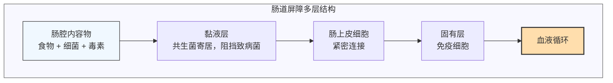

现代人由于饮食习惯（高糖低纤维、压力大），消化系统很容易出现功能紊乱，但很多问题可以通过饮食和生活方式调整改善。本文按从口腔到大肠的顺序，系统整理常见问题、循证证据和改善方案。

---

## 消化系统的屏障功能：为什么重要

消化系统不仅是消化吸收的管道，还是人体**最大的免疫屏障**：

**屏障功能分工：**
1. **化学屏障**：胃酸、胆汁、消化酶杀灭大部分随食物进入的微生物
2. **机械屏障**：肠上皮细胞之间的**紧密连接**，只允许小分子营养素通过，阻止大分子、毒素、细菌进入血液
3. **生物屏障**：共生菌群占据生态位，抑制致病菌定植
4. **免疫屏障**：肠道相关淋巴组织（GALT）产生免疫球蛋白A（IgA），中和病原体

完整的屏障功能是全身健康的基础，屏障破坏与多种慢性疾病相关[^1]。

---

## 口腔：消化系统的第一道门户

### 常见问题

1. **龋齿**：口腔菌群失调，变形杆菌产酸腐蚀牙釉质
2. **牙龈炎/牙周炎**：牙菌斑积累引发慢性炎症
3. **口臭**：菌群失调，产生挥发性硫化物
4. **口腔菌群失调**：高糖饮食促进致病菌生长，抑制有益菌

### 循证改善方案

| 措施 | 证据等级 | 说明 |
|------|----------|------|
| 每天刷牙两次 + 使用牙线 | 高 | 机械清除牙菌斑是最有效方法 |
| 限制添加糖摄入 | 高 | 减少致病菌能量来源 |
| 适当使用含氟牙膏 | 高 | 促进牙釉质再矿化 |
| 定期牙科检查洁牙 | 高 | 清除牙结石，早期发现问题 |
| 无糖口香糖（木糖醇） | 中高 | 促进唾液分泌，抑制某些致病菌 |

**整体健康关联**：
- 牙周炎与全身慢性炎症相关，可能增加心血管疾病和糖尿病风险[^2]
- 口腔菌群可以吞咽进入消化道，影响肠道菌群组成

---

## 胃：胃酸的重要性被严重低估

### 胃酸（HCl）的生理功能

很多人误认为"胃酸过多"是多数胃部问题的原因，但实际上**现代人胃酸不足更常见**：

1. **杀菌**：大多数摄入的细菌无法在pH < 3的强酸环境存活，胃酸是第一道杀菌屏障
2. **激活胃蛋白酶原**：胃蛋白酶原需要酸性环境激活为胃蛋白酶，开始蛋白质消化
3 **促进矿物质吸收**：钙、铁、镁等矿物质需要酸性环境才能溶解和吸收
4. **刺激胰液和胆汁分泌**：胃酸进入十二指肠促进促胰液素分泌，进而刺激胰液和胆汁分泌

### 常见胃部问题

**1. 胃食管反流病（GERD）**
- 症状：反酸、烧心、胸骨后不适
- 原因：贲门括约肌张力下降，胃内容物反流进入食管
- 循证改善：
  - 减重（特别是腹部肥胖）：高证据，腹压升高加重反流
  - 避免餐后立即平躺：高证据
  - 限制酒精、咖啡、巧克力、高脂肪食物：中高证据，这些降低贲门张力
  - 抬高床头：中证据，利用重力减少夜间反流

**2. 胃酸缺乏（低胃酸症）**
- 常见症状：餐后腹胀、嗳气、蛋白质消化不良、补铁补钙吸收差
- 危险因素：年龄增长（40岁后胃酸分泌逐渐下降）、长期使用质子泵抑制剂（PPI）、压力大
- 饮食建议：
  - 进餐时避免大量饮水：过多水稀释胃酸
  - 充分咀嚼，避免狼吞虎咽
  - 蛋白质食物需要足够胃酸，可尝试少量多餐

### 胃酸相关饮食原则

✅ **推荐**：
- 规律进餐，避免过度饥饿或暴饮暴食
- 充分咀嚼，让唾液充分混合食物
- 进餐时少喝水，避免稀释胃酸

❌ **需要限制**：
- 长期大量饮酒：损伤胃黏膜，降低胃酸分泌功能
- 高盐腌制食物：损伤胃黏膜，增加胃癌风险
- 长期高度精神压力：交感神经兴奋抑制胃酸分泌和胃蠕动

---

## 小肠：吸收核心与小肠细菌过度生长（SIBO）

### 小肠结构与功能复习

- 全长3-5米，表面积200-400 m²（绒毛+微绒毛）
- 主要功能：完成绝大部分营养素消化和吸收
- 传统认为**小肠细菌很少**，因为胃酸和蠕动抑制细菌定植

### 小肠菌群失调：SIBO（小肠细菌过度生长）

**定义**：小肠内细菌数量超过正常水平（> 10^5 CFU/ml）

**常见症状**：
- 餐后腹胀、胀气（最常见）
- 腹痛、腹泻或便秘
- 营养素吸收不良：脂肪泻、体重减轻、维生素B12缺乏
- 长期可能导致低钙血症、骨质疏松

**危险因素**：
- 胃酸抑制药物（PPI）长期使用：胃酸杀菌能力下降
- 肠道手术或粘连：影响正常蠕动
- 糖尿病：自主神经病变影响蠕动
- 慢性压力：减慢小肠蠕动[^3]

**循证诊断**：
- 金标准：小肠液细菌培养
- 常用筛查：乳糖呼气试验

**循证改善方案**：

| 阶段 | 措施 | 证据等级 |
|------|------|----------|
| **抗生素** | 利福昔明 | 高 |
| **饮食调整** | 低FODMAP饮食（减少可发酵碳水，减轻症状） | 中高 |
| **促动力** | 补充膳食纤维，改善蠕动 | 中 |
| **根除后** | 益生菌重建菌群 | 中 |

### 小肠菌群调节整体建议

1. **保证正常胃酸分泌**：避免不必要的长期抑酸药
2. **维持正常蠕动**：充足膳食纤维，适量运动，避免长期久坐
3. **避免快吃**：狼吞虎咽带入更多空气，增加腹胀
4. **SIBO患者**：低FODMAP饮食可以显著改善大多数患者症状

---

## 胰腺：内分泌外分泌双重功能

### 主要功能

1. **外分泌功能**：分泌胰液，含有所有主要营养素的消化酶（淀粉酶、脂肪酶、蛋白酶）
2. **内分泌功能**：分泌胰岛素、胰高血糖素，调节血糖

### 胰腺功能下降常见原因

- **急性胰腺炎**：多数与胆结石和酗酒相关
- **慢性胰腺炎**：长期酗酒，反复炎症导致纤维化
- **囊性纤维化**：遗传疾病，影响外分泌功能
- **年龄相关**：随着年龄增长，外分泌功能有轻度下降

### 胰腺功能不足的表现

- 脂肪消化不良：脂肪泻（粪便油腻、恶臭）
- 体重减轻：能量吸收不足
- 脂溶性维生素（A/D/E/K）缺乏
- 糖尿病：内分泌功能受累

### 循证改善与保护方案

1. **戒酒**：酒精是慢性胰腺炎的主要危险因素
2 **控制体重**：肥胖增加急性胰腺炎风险
3. **治疗胆结石**：胆囊结石是胆源性胰腺炎的根源，必要时切除胆囊
4 **外分泌功能不足**：医生指导下补充胰酶替代治疗
5. **饮食原则**：低脂肪饮食，少量多餐，补充脂溶性维生素

---

## 胆囊：储存浓缩胆汁，脂肪消化必需

### 胆囊主要功能

- 肝脏持续分泌胆汁，胆囊在进食间期储存和浓缩胆汁
- 进食后收缩，将胆汁排入十二指肠帮助脂肪乳化和吸收
- 胆汁酸盐帮助脂溶性维生素（A/D/E/K）吸收

### 常见问题：胆囊结石

**危险因素**：
- 女性、肥胖、快速减重、年龄增长
- 高能量、高碳水、低纤维饮食增加风险[^4]

**无症状胆囊结石**：
- 多数不需要预防性切除胆囊
- 定期观察，改善饮食习惯

**有症状胆囊结石**：
- 反复发作胆绞痛建议胆囊切除
- 现代腹腔镜手术对消化功能影响很小

### 胆囊切除后的饮食调整

胆囊切除后，胆汁持续排入肠道，不再集中分泌：

✅ **适应阶段建议**：
- 术后初期避免一次大量摄入脂肪，少量多餐
- 逐步增加脂肪摄入，肠道会逐渐适应
- 保证足够膳食纤维摄入，促进规律排便

❌ **需要避免**：
- 术后长期严格禁脂肪：不必要，影响脂溶性维生素吸收
- 一次大量摄入高脂肪食物：可能导致腹胀腹泻

### 胆囊功能改善（未切除者）

1. **规律进餐**：特别是规律吃早餐，促进胆汁排空，减少胆汁淤积
2. **控制体重**：避免肥胖和快速减重
3. **充足膳食纤维**：减少胆汁胆固醇饱和度
4. **适量运动**：改善胆囊收缩功能

---

## 大肠：水分吸收与菌群代谢中心

### 大肠主要功能

1. 吸收水分和电解质，将食糜浓缩为粪便
2. 肠道菌群发酵未消化的碳水化合物（膳食纤维、抗性淀粉）
3. 产生短链脂肪酸（SCFA），为结肠上皮提供能量，调节全身代谢
4. 储存和排出粪便

### 大肠常见问题

**1. 便秘**
- 定义：排便次数 < 3次/周，排便困难
- 循证改善：
  - 增加膳食纤维摄入（25-35g/天）：高证据
  - 充足水分摄入：高证据
  - 增加体力活动：中高证据
  - 养成规律排便习惯：中证据

**2. 腹泻**
- 急性腹泻多为感染性，通常自限
- 慢性腹泻需要排查原因（食物过敏、SIBO、肠易激综合征等）

**3. 肠易激综合征（IBS）**
- 功能性肠病，症状：腹痛腹胀 + 排便习惯改变
- 循证改善：
  - 低FODMAP饮食：高证据，可改善约60%患者症状
  - 压力管理：高证据，IBS是脑肠互动异常疾病
  - 益生菌：特定菌株有一定效果，证据中等[^5]

### 大肠菌群恢复与改善

**核心原则：** 膳食纤维是大肠菌群最佳"养料"

| 措施 | 证据等级 | 作用 |
|------|----------|------|
| 每天充足膳食纤维（25-35g） | 高 | 促进有益菌生长，增加短链脂肪酸产生 |
| 多样性植物性食物 | 高 | 不同膳食纤维喂养不同菌群，增加菌群多样性 |
| 发酵食品（酸奶、泡菜、纳豆） | 中高 | 提供活性微生物，改善菌群组成 |
| 避免长期滥用抗生素 | 高 | 抗生素会广谱杀灭细菌，破坏菌群结构 |
| 规律运动 | 中 | 增加菌群多样性，促进有益菌生长 |

**短链脂肪酸（SCFA）的益处：**
- 丁酸盐是结肠上皮细胞主要能量来源，维持结肠健康
- 降低肠道炎症，改善屏障功能
- 改善全身胰岛素敏感性
- 提供额外能量（约5-10%总能量来自SCFA）

---

## 肠漏症（Leaky Gut）：肠道屏障通透性增加

### 什么是肠漏

正常情况下，肠上皮细胞紧密连接只允许小分子营养素通过。当紧密连接被破坏，通透性增加，大分子（毒素、细菌、未完全消化的蛋白质）可以进入血液，引发慢性炎症。

**可能导致肠漏的因素：**
1. 慢性炎症性肠病（IBD）：明确病理
2. 长期慢性炎症：增加肿瘤坏死因子α（TNF-α），破坏紧密连接
3. 长期高酒精摄入：破坏肠上皮屏障
4. 非甾体抗炎药（NSAIDs）长期使用：损伤肠黏膜
5. 肠道菌群失调：共生菌抑制致病菌，菌群失调后致病菌内毒素增加[^6]

### 循证改善肠漏的方案

| 措施 | 证据等级 | 机制 |
|------|----------|------|
| 去除病因 | 高 | 治疗IBD，停止不必要的NSAIDs，限酒 |
| 充足膳食纤维 | 中高 | 纤维发酵产生SCFA，促进紧密连接蛋白表达 |
| 避免长期高糖高脂饮食 | 中高 | 高糖高脂增加内毒素血症和炎症 |
| 补充谷氨酰胺 | 中 | 谷氨酰胺是肠上皮细胞主要能量底物，促进黏膜修复 |
| 益生菌（特定菌株） | 中 | 改善菌群，降低炎症，增强屏障功能 |
| 控制慢性压力 | 中 | 压力激素皮质醇升高增加肠道通透性 |

**注意**："肠漏"是病理生理改变，不是一个独立的"疾病"诊断，需要找医生排查根本原因。

---

## 整体改善消化系统功能的循证方案

### 1. 饮食模式

✅ **推荐**：
- **充足膳食纤维**：25-35g/天，来自全谷物、蔬菜、水果、豆类
- **多样性饮食**：每天至少30种不同食物，喂饱多样菌群
- **规律进餐**：固定进餐时间，给消化系统形成规律
- **充分咀嚼**：每口饭咀嚼20-30次，减轻胃肠负担
- **进餐时少喝水**：避免稀释胃酸
- **限制加工食品**：减少添加糖、精制油、防腐剂摄入

❌ **需要避免/限制**：
- 长期大量饮酒：损伤胃黏膜、肝脏、胰腺
- 长期高糖低纤维饮食：促进菌群失调
- 暴饮暴食：一次给消化系统过大负担

### 2. 生活方式

- **适量运动**：每周150分钟中等强度有氧运动，促进肠道蠕动，改善菌群多样性
- **充足睡眠**：睡眠不足影响胃肠动力和激素调节
- **压力管理**：长期压力抑制消化功能，增加胃肠道症状，冥想、深呼吸有帮助
- **不要带着压力吃饭**：进食时交感神经兴奋抑制消化，尽量放松进餐

### 3. 常见误区澄清

| 误区 | 事实 |
|------|------|
| "所有胃病都是胃酸过多，需要长期抑酸" | 实际上现代人胃酸不足更常见，长期抑酸带来多种副作用（影响矿物质吸收、增加SIBO风险） |
| "益生菌需要长期吃才能健康" | 健康均衡饮食本身就能维持健康菌群，益生菌主要用于特定问题（如抗生素后恢复、IBS症状改善） |
| "膳食纤维对所有人都好" | 严重SIBO和IBS急性期，高纤维可能加重症状，需要阶段性调整 |
| "断食能排毒清洁肠道" | 断食可以让肠道休息，但长期断食会导致肌肉丢失，没有长期"排毒"证据 |

---

## 总结

消化系统常见问题遵循"从上游到下游"的影响链：口腔问题影响胃，胃功能影响小肠，小肠影响大肠。整体改善需要：

1. **从上到下逐个排查**：胃酸→SIBO→菌群→胆囊胰腺功能
2. **饮食调整优先**：多数轻中度功能紊乱可以通过饮食和生活方式改善
3. **必要时医学干预**：严重问题（如胆囊结石、胰腺炎）需要医生处理
4. **长期坚持**：菌群和功能改善需要时间，通常数月才能看到明显效果

消化系统健康是全身健康的基础，消化吸收好，才能充分利用食物营养素，维持运动表现和日常活力。

---

### 参考文献

[^1]: Camilleri M. (2019). Intestinal permeability in health and disease. *Gastroenterology*, 156(8):2100-2114.

[^2]: Tonetti MS, et al. (2018). Periodontitis and cardiovascular diseases: consensus report. *European Journal of Cardiovascular Prevention*, 25(2):128-148.

[^3]: Pimentel M, et al. (2020). Small intestinal bacterial overgrowth: a primer for clinicians. *American Journal of Gastroenterology*, 115(3):338-345.

[^4]: van der Linden F, et al. (2021). Dietary risk factors for gallstone disease: a systematic review and meta-analysis. *Clinical Gastroenterology and Hepatology*, 19(3):489-497.

[^5]: McKenzie Y, et al. (2022). The low FODMAP diet for irritable bowel syndrome: an updated systematic review and meta-analysis. *American Journal of Clinical Nutrition*, 115(2):356-365.

[^6]: Grosmark A, et al. (2021). Intestinal barrier dysfunction in chronic inflammatory bowel disease. *Nature Reviews Gastroenterology & Hepatology*, 18(3):183-197.

[^7]: Cani PD. (2019). Gut microbiota, obesity and metabolic dysfunction. *Nature Reviews Endocrinology*, 15(9):49-64.
