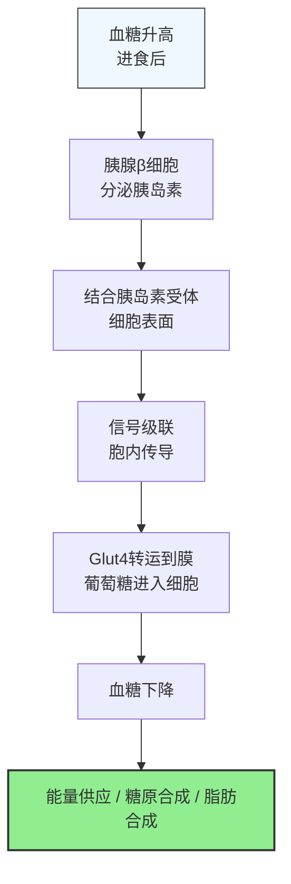
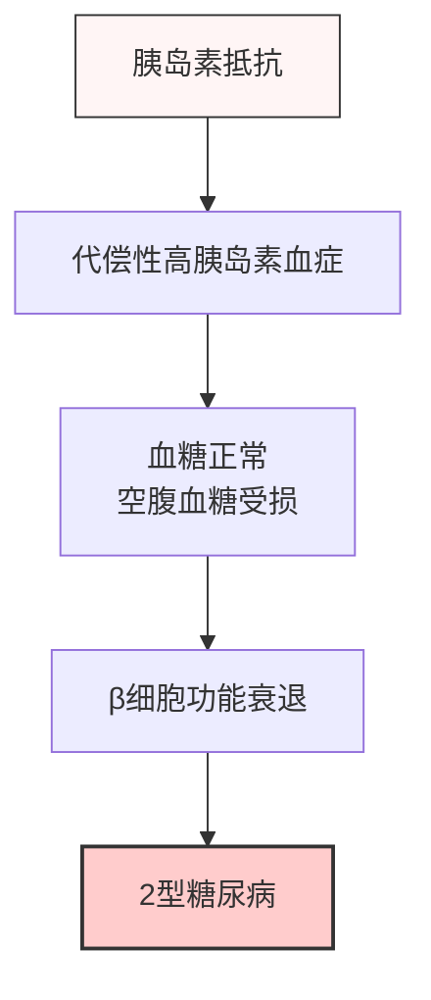
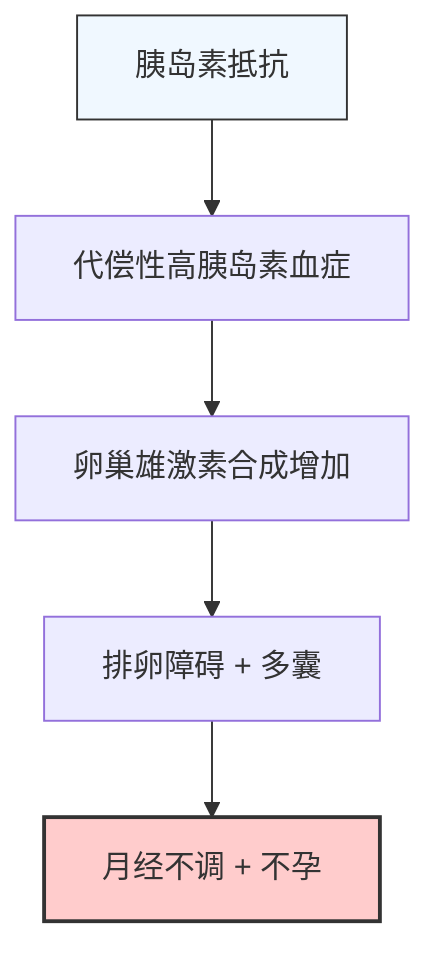

胰岛素抵抗（Insulin Resistance, IR）是现代最常见的代谢问题之一，与肥胖、2型糖尿病、多囊卵巢综合征（PCOS）、心血管疾病都密切相关。本文系统整理定义、机制、检测方法和循证改善方案。

---

## 基本定义与原理

### 什么是胰岛素
胰岛素是胰腺β细胞分泌的**降血糖激素**，也是主要的**合成代谢激素**：

**胰岛素的核心作用：**
1. 打开细胞"大门"，让葡萄糖进入细胞供能
2. 促进糖原合成（肌肉+肝脏）
3. 促进脂肪合成和储存
4. 抑制肝脏葡萄糖输出
5. 促进蛋白质合成

### 什么是胰岛素抵抗

胰岛素抵抗指：**细胞对胰岛素的反应减弱**，需要更高浓度的胰岛素才能让葡萄糖进入细胞。

- 正常：少量胰岛素就能让葡萄糖进入细胞
- 胰岛素抵抗：需要大量胰岛素才能达到相同的降糖效果
- 胰腺β细胞需要超负荷工作才能维持正常血糖

**自然病程：**

---

## 成因与危险因素

### 主要成因

| 机制 | 说明 |
|------|------|
| **脂质异位沉积** | 当能量摄入长期超过消耗，脂肪细胞储存满后，甘油三酯沉积在肝脏、肌肉、胰腺，影响胰岛素信号传导 |
| **慢性炎症** | 肥胖特别是内脏肥胖，脂肪组织分泌促炎细胞因子，抑制胰岛素信号 |
| **线粒体功能异常** | 线粒体氧化能力下降，能量产生效率降低，影响胰岛素反应 |
| **肠道菌群失调** | 内毒素（LPS）入血，引发慢性低度炎症 |
| **遗传因素** | 遗传易感性 + 生活方式环境因素共同作用 |

### 主要危险因素

- **肥胖**：特别是**内脏肥胖**（腰围：男性 > 90cm，女性 > 85cm）是最强危险因素
- **久坐不动**：肌肉是葡萄糖清除主要组织，缺乏运动降低肌肉胰岛素敏感性
- **高糖高饱和脂肪饮食**：高果糖饮食促进肝脏脂肪沉积
- **年龄**：随着年龄增长，胰岛素敏感性逐渐下降
- **睡眠呼吸暂停**：低氧血症加重胰岛素抵抗
- **多囊卵巢综合征（PCOS）**：女性患者80%存在胰岛素抵抗[^1]

---

## 危害与可能症状

### 主要危害

1. **2型糖尿病**：胰岛素抵抗是2型糖尿病最重要的前期病变
2. **心血管疾病**：高胰岛素血症促进血压升高、血脂异常、动脉粥样硬化
3. **非酒精性脂肪肝（NAFLD）**：肝脏脂肪沉积与胰岛素抵抗形成恶性循环
4. **多囊卵巢综合征**：胰岛素抵抗加重高雄激素血症，影响排卵
5. **代谢综合征**：满足以下三项即可诊断：中心型肥胖 + 高血压 + 高血糖 + 高甘油三酯 + 低HDL-C

### 可能症状（早期可能无症状）

- 餐后容易犯困
- 难以减重，即使控制热量
- 腰围增加，腹型肥胖
- 血糖升高（空腹血糖受损 > 6.1 mmol/L）
- 多囊女性：月经不调、多毛、痤疮
- 乏力，下午精力不足

---

## 如何确定胰岛素抵抗

### 常用检测方法

| 方法 | 优点 | 缺点 |
|------|------|------|
| **空腹胰岛素** | 简单便宜，常规体检可做 | 只能间接反映 |
| **HOMA-IR指数** | 计算简单：(空腹血糖 × 空腹胰岛素) / 22.5 | 同上 |
| **口服葡萄糖耐量试验（OGTT）** | 金标准，测2小时血糖和胰岛素 | 需要糖耐量，麻烦 |
| **持续葡萄糖监测（CGM，动态血糖仪）** | 可以看到全天血糖波动 | 相对昂贵 |

### 如何用动态血糖仪观察胰岛素抵抗

动态血糖仪可以连续14天监测组织间液葡萄糖，能看到**血糖波动模式**，这对发现早期胰岛素抵抗非常有帮助：

**胰岛素抵抗常见的血糖曲线模式：**
1. **餐后血糖高峰过高**：进食后血糖超过 7.8 mmol/L（140 mg/dL），且居高不下
2. **血糖回落缓慢**：餐后2-3小时血糖仍不能回到基线水平
3. **反应性低血糖**：高胰岛素分泌导致餐后3-4小时血糖低于基线，引发饥饿感
4 **空腹血糖缓慢升高**：即使空腹血糖仍在"正常范围"，但持续偏高（5.6-6.1 mmol/L）提示早期抵抗

**实践价值**：
- 可以测试不同食物对你的血糖影响，个体化调整饮食
- 观察运动对血糖的改善效果
- 早期发现问题，在发展为糖尿病之前干预[^2]

### 胰岛素抵抗与糖尿病的关系

- **胰岛素抵抗 → 糖尿病**：不是所有胰岛素抵抗都会发展为糖尿病，但几乎所有2型糖尿病早期都存在胰岛素抵抗
- **可逆阶段**：在空腹血糖受损阶段，胰岛素抵抗是**可逆**的，通过饮食运动可以显著改善
- **糖尿病阶段**：β细胞功能已经出现不可逆损伤，但改善胰岛素抵抗仍能帮助控制血糖，减少用药量

---

## 营养管理：宏量营养素建议

### 碳水化合物

**核心原则：** 不是完全禁碳水，而是**选择正确类型+控制总量+分散摄入**

✅ **推荐**：
- **低GI碳水**：全谷物（燕麦、糙米、藜麦）代替精制谷物
- **高纤维**：膳食纤维减缓碳水吸收，平缓餐后血糖
- **总量控制**：根据活动量调整，一般建议占总能量 40-50%
- **分散碳水**：一天多餐少量，避免一次大量碳水造成血糖剧烈波动

❌ **需要限制**：
- 添加糖（含糖饮料、甜点）：快速吸收，血糖飙升
- 精制谷物（白米白面过度加工）：纤维丢失，血糖指数高
- 高果糖玉米糖浆：特别促进肝脏脂肪沉积，加重胰岛素抵抗

### 脂肪

**核心原则：** 不是低脂，而是**正确的脂肪类型**

✅ **推荐**：
- **单不饱和脂肪酸**：橄榄油、牛油果、坚果
- **n-3多不饱和脂肪酸**：深海鱼、亚麻籽，降低炎症
- **饱和脂肪**：不需要完全禁止，控制在总能量 < 10% 即可

❌ **需要限制**：
- **反式脂肪**：工业氢化植物油，明确增加炎症和胰岛素抵抗
- **加工肉类中饱和脂肪**：通常同时含有大量钠和添加剂

### 蛋白质

- **充足蛋白质**：1.2-1.6 g/kg体重/天，增加饱腹感，改善餐后血糖
- **优质蛋白质来源**：鱼类、禽肉、鸡蛋、乳制品、豆制品
- 蛋白质减缓胃排空，平缓餐后血糖反应

---

## 矿物质与维生素建议

### 矿物质

| 矿物质 | 作用 | 食物来源 | 证据等级 |
|--------|------|----------|----------|
| **镁** | 改善胰岛素信号传导，增加胰岛素敏感性 | 绿叶菜、坚果、全谷物 | 中高 |
| **铬** | 增强胰岛素作用，改善葡萄糖耐受 | 全谷物、贝类、肉类 | 中 |
| **锌** | 改善胰岛素合成和信号，对PCOS特别有益 | 牡蛎、红肉、坚果 | 中高 |
| **硒** | 抗氧化，降低炎症 | 巴西坚果、海鲜 | 中 |

### 维生素

| 维生素 | 作用 | 食物来源 | 证据等级 |
|--------|------|----------|----------|
| **维生素D** | 低维生素D与胰岛素抵抗密切相关，补充改善抵抗 | 鱼油、晒太阳 | 中高 |
| **B族维生素** | 参与能量代谢，改善胰岛素功能 | 全谷物、肉类、绿叶菜 | 中 |
| **维生素E + C** | 抗氧化，降低慢性炎症 | 坚果、植物油、新鲜蔬果 | 中 |

---

## 可能有效的补剂（循证等级）

所有补剂都是**辅助**，不能替代饮食和运动改变。

| 补剂 | 证据 | 建议剂量 | 作用机制 |
|------|------|----------|----------|
| **N-乙酰半胱氨酸（NAC）** | 中 | 600-1800 mg/天 | 抗氧化，改善肝脏胰岛素信号，对PCOS有益[^3] |
| **肉桂** | 中高 | 1-3 g/天 | 肉桂提取物改善空腹血糖和HbA1c，轻度增强胰岛素敏感性 |
| **肌酸** | 中 | 3-5 g/天 | 增加肌肉量，改善肌肉胰岛素敏感性 |
| **鱼油** | 中高 | 1-2 g EPA+DHA/天 | 降低炎症，改善胰岛素敏感性 |
| **益生菌** | 中 | 特定菌株 | 改善肠道菌群，减少内毒素炎症 |
| **黄连素** | 中高 | 500-1000 mg/天 | 改善血糖和胰岛素敏感性，效果接近二甲双胍 |

**注意：** 补剂使用前建议咨询医生，特别是正在用药的情况。

---

## 推荐饮食模式

### 哪种饮食模式对胰岛素抵抗最好？

现有证据：**没有"最好"的饮食模式，适合自己、能长期坚持的就是最好的**。循证支持以下几种：

| 饮食模式 | 证据 | 特点 |
|----------|------|------|
| **地中海饮食** | 高 | 富含全谷物、橄榄油、鱼类、蔬果，降低炎症，改善胰岛素敏感性 |
| **得舒饮食（DASH）** | 高 |  originally for hypertension，同时显著改善胰岛素抵抗 |
| **低碳水化合物饮食** | 高 | 降低胰岛素需求，快速改善血糖，适合短期干预 |
| **间歇性能量限制（轻断食）** | 中高 | 减轻体重，改善胰岛素敏感性，不需要每天计算热量 |

**共同成功因素：**
1. 热量控制（如果超重，减轻体重5-10%就能显著改善胰岛素抵抗）
2. 充足膳食纤维
3. 充足不饱和脂肪酸
4. 低添加糖、低加工食品

---

## 特殊关联：多囊卵巢综合征（PCOS）

### 定义
多囊卵巢综合征是**育龄女性最常见的内分泌代谢疾病**，特征：
- 高雄激素血症（多毛、痤疮）
- 排卵障碍（月经不调、不孕）
- 卵巢多囊样改变

### 成因与胰岛素抵抗的关系

**80%的PCOS患者存在胰岛素抵抗**，胰岛素抵抗在PCOS发病中起到核心作用：

胰岛素抵抗既是病因，也是结果，形成恶性循环[^4]。

### 危害

- 不孕不育
- 子宫内膜癌风险增加（长期不排卵）
- 2型糖尿病风险增加（比正常人高5-10倍）
- 心血管疾病风险增加

### 循证改善方案

#### 1. 体重控制建议
- **超重/肥胖PCOS**：减重5-10%就能显著改善排卵和胰岛素抵抗，提高怀孕率
- **体重正常PCOS**：不需要减重，重点改善身体组成（增加肌肉量）

#### 2. 营养建议
- 和普通人胰岛素抵抗原则类似，但需要特别注意：
  - 足够蛋白质：1.2-1.5 g/kg体重，增加饱腹感
  - 补充锌：改善排卵和雄激素代谢
  - 补充肌醇：多项研究显示改善胰岛素抵抗和排卵（4 g/天）
  - 限制添加糖：高糖加重胰岛素抵抗

#### 3. 补剂建议（有证据支持）
- **肌醇**：Myo-肌醇 4 g/天，改善胰岛素抵抗和排卵
- **NAC**：600-1800 mg/天，改善卵子质量和胰岛素抵抗
- **维生素D**：低维生素D者补充改善内分泌
- **鱼油**：降低炎症，改善高雄激素

#### 4. 运动建议
- **有氧运动**：每周150分钟中等强度，改善全身胰岛素敏感性
- **力量训练**：每周2-3次，增加肌肉量，提高葡萄糖利用能力，特别推荐
- **组合运动**：有氧+力量效果最佳，比单一运动更好

**总结**：PCOS的核心代谢问题就是胰岛素抵抗，改善胰岛素抵抗是PCOS干预的基石，不仅改善月经和生育，也降低长期糖尿病和心血管病风险[^5]。

---

## 总结：整体改善胰岛素抵抗的核心步骤

1. **评估**：通过空腹胰岛素/HOMA-IR或动态血糖监测确定是否存在抵抗
2. **减重（如果超重）**：减轻5-10%体重就能获得显著改善
3. **饮食调整**：选择低GI碳水，充足纤维，正确脂肪类型，控制添加糖
4. **运动**：有氧+力量组合，增加肌肉葡萄糖利用
5. **营养素补充**：针对性补充镁、锌、维生素D等
6. **必要时用药**：严重高血糖在医生指导下使用二甲双胍等药物

胰岛素抵抗是**慢性代谢问题**，改善需要时间，通常坚持3-6个月才能看到显著变化，但它是**可逆**的，早期干预可以防止发展为糖尿病。

---

### 参考文献

[^1]: Kahn SE, et al. (2014). The pathogenesis of type 2 diabetes: contributions of beta-cell dysfunction and insulin resistance. *Nature Medicine*, 20(4):380-389.

[^2]: Hall H, et al. (2021). Continuous glucose monitoring in people with insulin resistance: a systematic review. *Diabetes Technology & Therapeutics*, 23(3):197-206.

[^3]: Nasr N, et al. (2020). N-acetylcysteine supplementation improves insulin resistance in patients with polycystic ovary syndrome: a randomized controlled trial. *Clinical Nutrition*, 39(3):748-754.

[^4]: Teede HJ, et al. (2023). Polycystic ovary syndrome: a complex condition with psychological, reproductive and metabolic manifestations that impacts on health across the lifespan. *Nature Reviews Endocrinology*, 19(1):41-59.

[^5]: Moran LJ, et al. (2019). Lifestyle intervention in polycystic ovary syndrome: systematic review and meta-analysis of randomised controlled trials. *Human Reproduction Update*, 25(2):183-202.

[^6]: Hu FB, et al. (2020). Dietary patterns and cardiovascular disease risk. *Journal of the American College of Cardiology*, 75(19):2421-2432.
