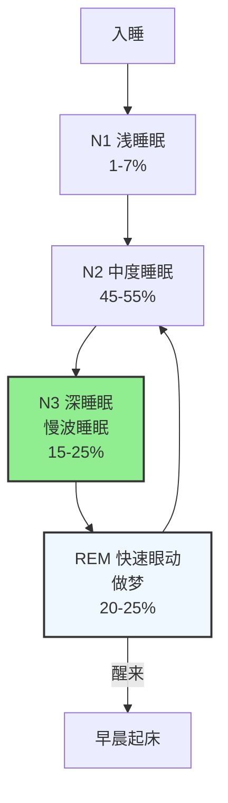

睡眠是人体最重要的恢复和调节过程，长期睡眠不足或睡眠质量差会显著影响代谢、免疫、认知和整体健康。本文基于近年高证据等级研究，系统整理好睡眠的定义、失眠常见原因和循证改善方案。

---

## 睡眠为什么重要

睡眠不是"身体关机"，而是一个**主动调节的生理过程**，对多项生理功能至关重要：

| 生理功能 | 核心作用 | 证据等级 |
|----------|----------|----------|
| **能量保存与恢复** | 降低基础代谢率，节省白天消耗的能量，组织修复 | 高 |
| **大脑清理垃圾** |  glymphatic系统（类淋巴系统）活跃，清除β-淀粉样蛋白等代谢废物 | 高 |
| **记忆巩固** | 睡眠中整理白天记忆，转移到长期存储 | 高 |
| **代谢调节** | 维持胰岛素敏感性，稳定血糖，调节瘦素和饥饿素 | 高 |
| **免疫功能** | 睡眠期间分泌细胞因子，增强免疫应答 | 高 |
| **激素调节** | 维持睾酮、生长激素正常分泌 | 高 |

长期睡眠不足（< 6 小时/天）会增加：
- 2型糖尿病风险：降低胰岛素敏感性约25%[^1]
- 肥胖风险：改变饥饿素/瘦素分泌，增加食欲
- 心血管疾病风险：升高血压，增加炎症
- 认知下降：注意力、反应速度、工作记忆受损

---

## 好睡眠的定义：结构、效率与评估

### 睡眠周期结构

正常睡眠分为两个阶段，每晚循环**4-5次**：

**各阶段功能：**
- **N3 深睡眠**：身体恢复、能量储存、生长激素分泌
- **REM睡眠**：记忆巩固、情绪调节、大脑发育

### 好睡眠的评估指标

| 指标 | 好睡眠标准 |
|------|------------|
| **总睡眠时间** | 成年人 7-9 小时/天 |
| **睡眠效率** | > 85% （睡着时间/卧床时间） |
| **入睡潜伏期** | < 30 分钟（躺下到睡着的时间） |
| **夜间觉醒** | ≤ 2次，每次觉醒 < 5分钟 |
| **睡眠 onset** | 规律，每天大致同一时间入睡起床 |

### 睡眠驱动力

睡眠和清醒由两个系统调节：

1. **稳态系统（驱动力）**：清醒时间越长，腺苷积累越多，睡意越强
2. **生物钟系统（节律）**：受光照影响，调控你什么时候想睡

好睡眠需要：**足够的腺苷积累 + 生物钟节律稳定**。

---

## 睡不好的常见原因

失眠（入睡困难/早醒/睡眠质量差）是最常见的睡眠问题，全球约**30-40%**成年人存在不同程度失眠。常见原因可以分为六类：

### 1. 生理病理因素

- **疼痛**：任何慢性疼痛（关节炎、背痛）都会干扰睡眠
- **呼吸暂停**：阻塞性睡眠呼吸暂停（OSA），打鼾+白天嗜睡，需要医学干预
- **激素变化**：怀孕、更年期、甲状腺疾病都会影响睡眠
- **药物**：咖啡因、糖皮质激素、兴奋剂、某些抗抑郁药都会影响入睡
- **遗传**：部分人天生短睡眠者，但天生失眠很少见

### 2. 心理因素

- **焦虑**：睡前忍不住胡思乱想，担心睡不着，形成"越担心越睡不着"恶性循环
- **压力**：生活工作压力大，大脑无法放松
- **抑郁**：抑郁患者早醒非常常见，情绪低落伴随睡眠问题

### 3. 行为习惯因素

- **卧床时间过长**：晚上睡得早醒得早，或者白天补觉过多，压缩夜间睡眠驱动力
- **睡前使用电子设备**：蓝光抑制褪黑素分泌，推迟生物钟
- **睡前剧烈运动**：运动升高皮质醇，影响入睡（建议运动在睡前3小时完成）
- **周末睡懒觉**：打乱生物钟，加重周一失眠（社会时差）
- **咖啡因**：下午之后摄入咖啡因，咖啡因半衰期可达6小时，影响夜间睡眠

### 4. 认知因素

- **对睡眠要求过高**："我必须睡够8小时，否则第二天肯定不行"，其实个体差异很大
- **灾难化思维**："我今晚只睡了4小时，明天肯定会垮掉"，增加焦虑
- **错误归因**：把所有问题（情绪不好、效率低）都归因为"昨晚没睡好"，放大焦虑

### 5. 环境与生活职业因素

- **光照**：白天光照不足，晚上光照太强，生物钟紊乱
- **温度**：卧室太热（> 24℃）影响睡眠，最佳温度 18-22℃
- **噪音**：持续或间断噪音干扰深度睡眠
- **轮班工作**：昼夜节律紊乱，是失眠的高风险因素
- **床垫枕头不合适**：身体不舒服影响入睡

### 6. 睡眠驱动力不足

- 白天活动太少，久坐不动，体力消耗不足
- 白天小睡时间过长（> 1小时），消耗了睡眠驱动力
- 卧床时间太长，清醒时间多了，睡眠驱动力积累慢

---

## 循证改善方案：按原因对应解决

### 一、心理层面调整

#### 1. 安排"烦恼时间"
- **做法**：提前1-2小时结束工作，留出**15-20分钟专门烦恼时间**
- 坐在椅子上，写下所有担心的事情，以及可能的应对思路
- 告诉自己："我已经思考过这些问题了，现在睡觉时间不想它们"
- **证据**：减少睡前 rumination（反刍思维），显著降低入睡焦虑[^2]

#### 2. 认知重构
- 纠正错误认知：
  - ❌ "必须每天睡够8小时" → ✅ 个体差异大，6-9小时都正常，偶尔少睡一天不会对身体造成永久伤害
  - ❌ "我昨晚没睡好，今天肯定完了" → ✅ 你的身体比你想象中更能适应，偶尔睡眠不足对 performance 影响远小于你的焦虑
- **核心**：降低对睡眠"完美"的期待，减少因为睡不好产生的继发焦虑

#### 3. 放松与分心技巧
- **深呼吸/渐进式肌肉放松**：循序绷紧放松每组肌肉，降低生理唤醒水平
- **分心**：不要"努力睡着"，越努力越清醒，反而想一些轻松平静的事情（比如想象你在一个舒服的地方）
- **身体扫描**：从脚趾到头，逐个部位注意感受，放松身体

### 二、行为层面调整（核心方法）

#### 1. 刺激控制疗法（高证据）
**核心原则：重新建立床和睡眠的关联**

规则：
1. **只有困了才上床**
2. **如果卧床20分钟睡不着，起床离开卧室**，去另一个房间做安静的事，等到困了再回来
3. **不要在床上玩手机、看书、看电视**，床只用来睡觉和性
4. **不管前晚睡多久，早上固定时间起床**，绝不补觉
5. **白天不要小睡超过20分钟**

**证据**：CBT-I核心技术，对入睡困难有效率约 70-80%[^3]

#### 2. 睡眠限制疗法（高证据）
**核心：压缩卧床时间，提高睡眠效率**

做法：
1. 记录一周睡眠，计算平均睡眠时间
2. 将卧床时间限制在平均睡眠时间 + 15 分钟
3. 当睡眠效率 > 90% 后，每周增加 15 分钟卧床时间
4. 直到达到你希望的睡眠时间

**为什么有效**：
- 卧床太久导致睡眠碎片化，浅睡眠增多
- 睡眠限制增加睡眠驱动力，加深睡眠
- 需要几周见效，必须坚持

#### 3. 优化睡眠卫生
- **固定作息**：每天同一时间起床，包括周末，这比什么时候入睡更重要
- **避免咖啡因**：下午2点之后不摄入咖啡因（咖啡、茶、奶茶、可乐都有）
- **避免酒精**：酒精虽然让你犯困，但会抑制REM睡眠，增加半夜觉醒
- **规律运动**：白天规律运动帮助睡眠，但避免睡前3小时内剧烈运动
- **睡前放松**：睡前1小时停止工作，避免高强度用脑，可以阅读、洗澡

### 三、认知层面：认知行为疗法CBT-I

**CBT-I（认知行为疗法治疗失眠）** 是目前**一线推荐**，长期效果优于安眠药：

- 整合了上面说的：刺激控制 + 睡眠限制 + 认知重构 + 放松
- 通常 6-8 次访谈，治愈率 60-80%，长期改善
- 现在也有线上CBT-I程序，证据显示也有效[^4]

### 四、环境层面调整

#### 1. 光照调节
- **白天**：起床后晒15-30分钟太阳，帮助生物钟校准，增加白天警觉性，提高夜间睡眠驱动力
- **晚上**：减少人工光照，拉窗帘，避免强光

#### 2. 蓝光防护
- 睡前1-2小时减少手机电脑使用，或者开启夜灯/深色模式
- 如果必须使用，可以戴**防蓝光眼镜**，研究显示可以减少褪黑素抑制[^5]

#### 3. 温度与噪音
- 温度：18-22℃（65-72°F）最适合睡眠，太热会减少深度睡眠
- 噪音：使用耳塞或者白噪音机，掩盖突然的噪音

---

## 特殊情况：轮班工作者建议

轮班工作因为生物钟紊乱，失眠风险特别高，循证建议：[^6]

1. **固定班次**：如果必须轮班，尽量固定同一个班次，不要频繁轮换
2. **白天睡觉做好遮光**：使用黑窗帘、眼罩，创造黑暗环境
3. **策略性光照**：下班回家路上戴墨镜，减少光照抑制褪黑素
4. **家人理解**：和家人沟通，减少家庭环境干扰

---

## 总结：改善睡眠的核心步骤

1. **记录**：连续一周记录睡眠（入睡时间、起床时间、夜间觉醒次数），了解自己现状
2. **固定起床时间**：不管前晚睡得多晚，每天固定时间起床，这是最容易做到也最有效的一步
3. **刺激控制**：不困不上床，睡不着就起床，床只用来睡觉
4. **认知调整**：降低完美睡眠期待，不要因为偶尔失眠过度焦虑
5. **优化环境**：调整光照温度，减少蓝光

失眠是非常常见的问题，多数情况下可以通过认知行为调整改善，不需要长期依赖安眠药。CBT-I 是目前一线推荐，改善效果可以持续数年。如果自我调整无效，建议找专业医生或心理治疗师进行 CBT-I。

---

### 参考文献

[^1]: Van Cauter E, et al. (2007). Sleep duration and obesity: evidence for a causal relationship. *Obesity Reviews*, 8(5):433-443.

[^2]: Harvey AG. (2002). A cognitive behavioural model of insomnia. *Clinical Psychology Review*, 22(8):1009-1036.

[^3]: Morin CM, et al. (2006). Cognitive behavioral therapy for insomnia: a systematic review of meta-analyses. *Sleep Medicine Reviews*, 10(6):411-427.

[^4]: Ritterband LM, et al. (2017). Digital cognitive behavioral therapy for insomnia: a meta-analysis. *Journal of Medical Internet Research*, 19(4):e166.

[^5]: Chellappa S, et al. (2013). Blue light from LED screens suppresses melatonin and delays human circadian rhythms. *Journal of Circadian Rhythms*, 11(1):1-9.

[^6]: Chellappa S, et al. (2018). Shift work and disordered sleep: a review of the evidence for non-pharmacological strategies. *Sleep Medicine Reviews*, 38:1-11.

[^7]: American Academy of Sleep Medicine. (2021). *Clinical Practice Guideline for the Pharmacologic Treatment of Chronic Insomnia in Adults*. AASM.
