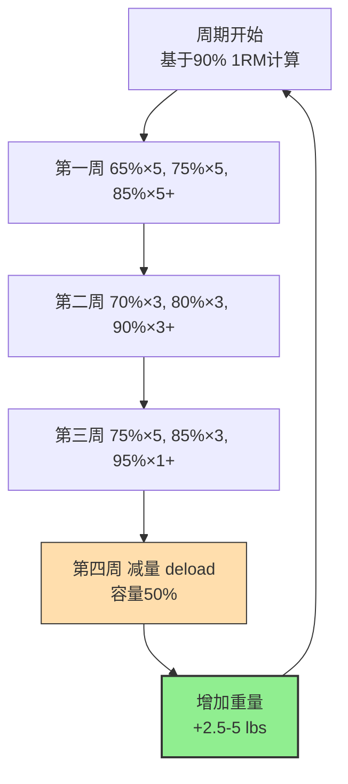
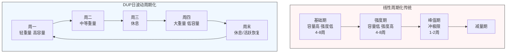
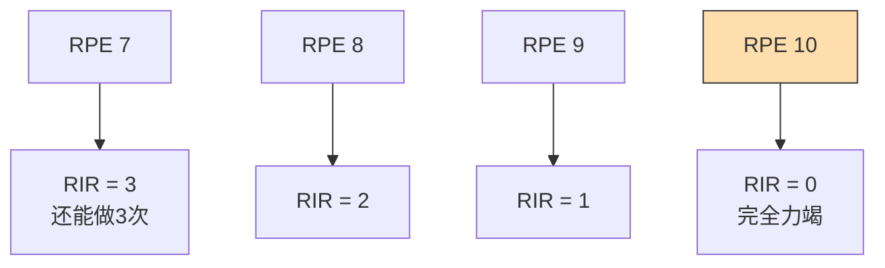
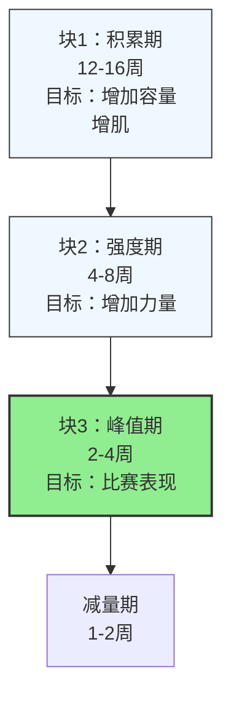
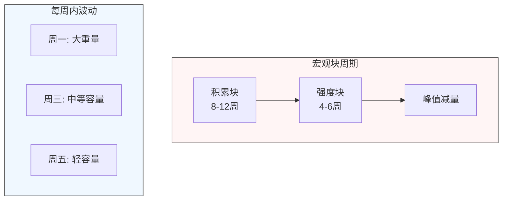
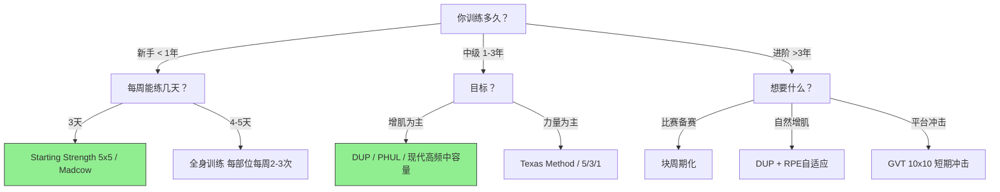

市面上有很多经典训练计划，各有不同的设计哲学。本文选择五种最知名、应用最广的计划，基于循证研究解析其设计原理、适用人群、优缺点，帮助你选择适合自己的计划。

---

## 5/3/1 系列计划 (Wendler 5/3/1)

### 起源与设计哲学

5/3/1 由 Jim Wendler 在2008年创建，核心哲学是**慢就是快**：**缓慢但稳定的渐进超负荷**，专注于四大主项（深蹲、卧推、硬拉、肩推），避免过度训练。

### 基本结构

**核心框架：**[^1]
- 每个训练日只有一个主项，三个辅助动作
- 训练周期四周，每周递增重量，第四周 deload 减量
- 主项训练基于你当前1RM的百分比：
  - 第一周：5/5/5+（最后一组尽可能做多）
  - 第二周：3/3/3+
  - 第三周：5/3/1+
  - 第四周：减量周（容量减半）
- 每个周期结束后，主项重量增加 2.5-5 lbs（约1.25-2.5 kg）

**常见变种：**
- 5/3/1 Forever：增加更多容量
- Boring But Big (BBB)：主项后加5x10大重量辅助，增肌效果更好
- 5/3/1 for Beginners：每周三天，更适合新手

### 核心原理

1. **慢渐进，避免过度训练**：每次只加一点点重量，长期积累
2. **主项优先**：四大复合动作是力量增长的核心
3. **固定周期减量**：每四周强制减量，预防过度训练
4. **灵活辅助**：辅助动作可以自己调整，适应个人需求

### 循证评价与适用人群

✅ **适合：**
- 训练年限1-3年，想要重点提升力量
- 训练时间有限，每周3-4天，每次1小时左右
- 容易过度训练的人，慢渐进更安全

❌ **不适合：**
- 完全新手：还没掌握动作技术，需要更高频率
- 只想增肌不在乎力量：容量相对偏低
- 进阶训练者：四大项外其他肌群容量可能不够

**循证支持：**
- 慢渐进超负荷符合力量增长的基本原理，长期坚持力量增长稳定[^1]
- 强制减量周期有助于神经系统恢复，减少过度训练风险
- BBB变种增加容量后，增肌效果也不错，适合自然训练者

---

## PHUL 与 PHAT (力量与肌肥大混合计划)

### 起源与设计哲学

- **PHUL**：Power Hypertrophy Upper Lower，由 Brandon Campbell 创建
- **PHAT**：Power Hypertrophy Adaptive Training，由 Layne Norton 博士创建[^2]
- 核心思想：**把力量训练和肌肥大训练分开安排，兼顾两者发展**

### 基本结构

**PHUL（每周4天，上下肢拆分）：**
- 周一：上半身 力量日
- 周二：下半身 力量日
- 周四：上半身 肌肥大日
- 周五：下半身 肌肥大日

**PHAT（每周5天）：**
- 周一：上半身 力量日
- 周二：下半身 力量日
- 周四：背肩 肌肥大日
- 周五：胸手臂 肌肥大日
- 周六：腿 肌肥大日

**核心安排：**[^2]
- 力量日：低次数（3-5次），大重量，多组
- 肌肥大日：中高次数（8-12次），中等重量，容量更高
- 每块肌肉每周刺激两次

### 循证评价与优缺点

| 优势 | 劣势 |
|------|------|
| 兼顾力量增长和肌肉肥大，一次满足两个目标 | 需要每周4-5天训练时间 |
| 每块肌肉每周两次刺激，符合现代循证推荐 | 安排相对复杂，需要规划 |
| 上下肢拆分结构灵活，容易调整 | - |

✅ **适合：**
- 中级训练者（1-3年）
- 同时想要增加力量和肌肉围度
- 每周能保证4-5天训练

❌ **不适合：**
- 新手：动作技术还不熟练，全身训练更高效
- 时间少：每周只能练3天以下

**循证支持：**
- 分开安排力量和 hypertrophy，能够在保持力量增长的同时获得足够容量增肌[^3]
- 每周两次频率符合当前meta分析结论，增肌效果优于一周一次

---

## 日特征波形周期化 (DUP - Daily Undulating Periodization)

### 什么是DUP？

传统周期化是线性的：几个月积累容量，然后增加强度，然后减量。

**DUP（日波动周期化）**：**每周内每一天都安排不同强度**，而不是按月/按阶段变化。

### 基本设计思路

**常见DUP周安排示例（主项每周三次）：**[^4]

| 训练日 | 强度安排 | 容量安排 |
|--------|----------|----------|
| 周一 | 轻：~70% 1RM | 高容量（5x5） |
| 周三 | 中：~80% 1RM | 中等容量（3x3） |
| 周五 | 重：~85-90% 1RM | 低容量（3-5组x1-3次） |

**核心优势：**
- 每周都有轻、中、重不同强度刺激
- 容量和强度同时保持，不会出现线性周期化后期容量掉太多肌肉流失的问题
- 刺激更多样化，对自然训练者更有利

### 循证证据

多项研究对比了 DUP vs 传统线性周期化：

- Zourdos 等人 (20016) 研究显示：DUP 在力量增长上显著优于传统线性周期化[^4]
- 另一项 2018 年 meta 分析：对于训练有素者，DUP 能更好地同时发展力量和肌肉肥大[^5]
- 适合人群广：从入门到进阶都可以用，尤其适合中级以上自然训练者

✅ **适合：**
- 中级以上训练者（训练1年以上）
- 想要同时发展力量和肌肉
- 对线性周期化后期肌肉流失不满意

❌ **不适合：**
- 完全新手：线性增加重量更简单容易掌握

---

## 德州计划 (Texas Method) 与 疯狂5x5 (Madcow 5x5)

### 德州计划 (Texas Method)

由 Mark Rippetoe 创建，经典的**线性渐进计划**，适合新手转向中级。

**基本结构（每周3天）：**[^6]
- 周一（增积日）：主项 5x5 @ 90% 上次重量
- 周三（恢复日）：主项 5x5 @ 80% 周一重量
- 周五（强度日）：尝试新的重量 PR，3-5组 x 1-5次

**核心原理：**
- 每周三次同一个主项，频率很高
- 一天容量，一天恢复，一天冲强度
- 线性每次增加重量，直到进步停滞

### Madcow 5x5（疯狂5x5）

由 Bill Hinbern 创建，是 Starting Strength 5x5 的进阶版本。

**基本结构（每周3天）：**
- 周一：深蹲 5x5，卧推 5x5，划船 5x5
- 周三：硬拉 1x5，肩推 5x5，引体 5x5
- 周五：深蹲 5x5，卧推 5x5，划船 5x5
- 每周线性增加 2.5 lbs （1.25 kg）

### 循证评价

| 计划 | 适合人群 | 优势 | 劣势 |
|------|----------|------|------|
| **Texas Method** | 新手→中级，每周3天 | 频率高，线性渐进简单 | 容量集中在三大项，其他肌群不足 |
| **Madcow 5x5** | 中级，已经过了新手线性期 | 比Starting Strength容量更高 | 进步到一定程度还会停滞，需要换计划 |

✅ **适合：**
- 新手结束入门阶段，进入中级
- 每周只能练3天，想要专注于三大项力量增长

❌ **不适合：**
- 进阶训练者（3年以上）：需要更多容量和多样化刺激
- 想要均衡发展全身肌肉：辅助动作和其他肌群容量不够

**循证要点：**
- 线性渐进对新手和低训练水平者效果非常好，力量增长速度快[^7]
- 高频率（每周三次主项）对复合动作技术改进和力量增长非常有利

---

## 基于 RPE 和 RIR 的自适应训练计划 (RTS - Reactive Training Systems)

### 什么是RPE/RIR？

- **RPE**（Rating of Perceived Exertion）：自觉用力评分，1-10分，10=完全力竭
- **RIR**（Reps In Reserve）：还能做几次，RIR=2表示做完这组后还能再做2次

### RTS 核心思想

由 Mike Tuchscherer 创建，核心是**根据当日状态自适应调整重量**：[^8]

1. **不预先固定重量**：只规定RPE/RIR目标
2. **根据当日感觉调整**：状态好就加，状态差就减
3. **避免强迫冲重量**：减少过度训练和受伤风险
4. ** autoregulation（自我调节）**：让身体决定当天训练负荷

**典型安排示例：**
- 计划写：深蹲 4组 × 8次 @ RPE 8
- 如果你感觉好，用80kg完成了4×8 @ RPE 8，下次增加重量
- 如果你状态差，只能用75kg完成，就用75kg，不降容量只降强度

### 循证证据

近年研究支持自适应训练：

- 自我调节计划能更好匹配当日恢复状态，减少过度训练风险[^9]
- 对于训练有素的进阶训练者，自适应计划比固定重量计划效果更好
- 能更好应对生活压力、睡眠不好等因素，灵活调整

### 优势和缺点

✅ **优势：**
- 非常灵活，适应个人每日状态变化
- 减少过度训练和过度疲劳
- 进阶训练者能更好把控训练负荷

❌ **劣势：**
- 需要训练经验，新手很难准确判断RPE/RIR
- 需要慢慢积累，找到自己的节奏
- 不是"懒人计划"，需要自己记录和调整

✅ **适合：**
- 进阶训练者（训练3年以上）
- 经常感觉疲劳或过度训练
- 喜欢自己掌控计划，不喜欢僵化固定重量

❌ **不适合：**
- 新手：对RPE判断不准，固定线性计划更简单

---

## 五大经典计划对比总结

| 计划 | 最佳训练水平 | 每周训练天数 | 核心特点 | 循证等级 |
|------|--------------|--------------|----------|----------|
| **Wendler 5/3/1** | 新手→中级 | 3-4 | 慢渐进，主项优先，强制减量 | 中高 |
| **PHUL/PHAT** | 中级 | 4-5 | 力量+ hypertrophy分开安排，兼顾两者 | 中高 |
| **DUP 日波动周期化** | 中级→进阶 | 4-6 | 每周内轻重波动，容量强度兼顾 | 高 |
| **Texas Method / Madcow** | 新手→中级 | 3 | 高频率线性渐进，专注三大项 | 中高 |
| **RTS 自适应RPE计划** | 进阶 | 任意 | 根据当日状态自我调节，防过度训练 | 中高 |

### 选择建议

1. **新手（<1年）**：从 Madcow 5x5 或 Texas Method 开始，简单直接，线性进步快
2. **中级（1-3年）**：DUP 或 PHUL，兼顾容量频率，符合当前循证推荐
3. **进阶（>3年）**：DUP + RPE 自适应，根据状态调整，减少过度训练
4. **每周只能练3天**：5/3/1 BBB 或 Texas Method

---

## Starting Strength 新手5x5计划

### 起源与核心设计

由 Mark Rippetoe 系统化推广，是**最经典的新手入门线性计划**：

**基本结构（每周3天交替）：**[^10]
- **A训练日：** 深蹲 → 卧推 → 硬拉
- **B训练日：** 深蹲 → 肩推 → 引体向上/划船
- 顺序：A → 休息 → B → 休息 → A → 休息 → B → ...
- 每个动作都是 3组 × 5次（硬拉 1组 × 5次）
- 每次训练增加 2.5 lbs（1.25 kg）

**核心思想：**
- 专注三大复合动作（深蹲、卧推、硬拉）
- 每次训练都增加一点重量，线性渐进
- 新手神经系统适应快，力量增长速度快

### 循证评价

✅ **优势：**
- 非常简单，新手容易记住和执行
- 频率高（深蹲每周三次），技术进步快
- 专注复合动作，单位时间效率极高
- 不需要太多思考，每次加重量就行

❌ **劣势：**
- 容量低，其他肌群（比如手臂、肩、核心）刺激不足
- 线性进步只能维持大约 3-6个月，之后必然停滞
- 不适合进阶训练者

✅ **适合人群：**
- **绝对新手，训练经验 < 6个月**
- 想要快速建立基础力量
- 每周只能练三次，时间少

❌ **不适合：**
- 训练超过一年，已经过了新手红利期
- 需要更高容量刺激增肌

**循证要点：**
- 对纯新手，线性渐进在初始 3-6个月效果非常好，力量增长速度是所有方法中最快的之一[^11]
- 强调复合动作技术打磨，为后续打下良好基础

---

## German Volume Training (GVT) 10x10 德国容量训练

### 起源与设计

由德国健美教练 Rolf Esser 在 1970-80年代创造，核心就是**每个主项 10组 × 10次**，极致容量刺激增肌。

**基本安排：**[^12]
- 每个主项：10组 × 10次，固定重量（通常60-70% 1RM）
- 训练拆分通常上下肢，每周两次全身
- 例子：
  - 周一：胸+背，两个部位各一个主动作 10x10，加两个小肌群
  - 周三：肩+臂，同上
  - 周五：腿，同上

**核心思想：**
- 极高单块肌肉单次训练容量
- 大量代谢应激，促进肌肉生长
- 短组间休息（60-90秒）

### 循证评价

| 优势 | 劣势 |
|------|------|
| 单次容量足够，短时间快速增肌 | 非常累，神经系统压力大 |
| 方法简单，容易执行 | 容易过度训练，不适合长期 |
| 代谢应激非常充分 | 对恢复能力要求高 |

✅ **适合：**
- 中级训练者，想要突破增肌平台期
- 短期（4-6周）突击增肌，之后换计划
- 恢复能力好的年轻人

❌ **不适合：**
- 新手：容量太高，恢复不过来
- 长期连续使用：容易过度训练，力量下降

**循证支持：**
- 高容量确实能促进肌肉肥大，短期冲击平台期有效果[^12]
- 适合短期"轰炸"薄弱部位，不适合常年使用
- 自然训练者长期高容量需要更好恢复安排

---

## 块周期化（Block Periodization）

### 什么是块周期化？

传统线性周期化把一年分成几个大阶段（块），每个块只专注一个目标：

由前苏联运动科学创造，现在被力量举和健美选手广泛使用。[^13]

**每个块专注一个目标：**
1. **积累块（Accumulation）：** 高容量，中等强度，专注增肌
2. **强度块（Intensification）：** 降低容量，增加强度，专注力量
3. **峰值块（Peaking）：** 降低容量，专注比赛冲极限
4. **减量恢复**

### 循证证据

- 对于高水平运动员，专注单一目标效果好，块周期化比波动周期化效果更好[^13]
- 对于自然训练者，不需要这么长周期，一般不需要这么长周期分块
- 中级爱好者可以用较短块（4-6周一块）调整重点

✅ **适合：**
- 竞技选手备赛（力量举、健美比赛）
- 训练年限长，想要专门突破某方面（比如力量）
- 高水平进阶训练者

❌ **不适合：**
- 新手中级：容量强度同时发展更重要
- 自然训练者不需要太长周期分块

---

## 共轭周期法 (Conjugate Method / Westside System)

### 起源与核心设计

由 Lou Simmons 在 Westside Barbell 系统化推广，核心是**同一天/同周内同时训练最大力量和速度力量**，共轭地发展不同素质。

**Westside 经典周安排（每周四天）：**[^16]
- **周一：最大力量日 (Max Effort - ME)**
  - 主项：深蹲/硬拉/卧推 尝试1-3RM极限，突破绝对力量
  - 辅助：专项辅助动作3-4个
- **周三：速度日 (Dynamic Effort - DE)**
  - 主项：同样主项用 50-70% 1RM 做 10组 × 2次，快速爆发
  - 辅助：专项辅助
- **周五：上身 ME/DE**
  - 同周一/周三模式，针对卧推推举
- **周日：上身DE/ME**
  - 补量训练

**核心原理：**
1. **共轭轮换**：最大力量和速度力量交替/同时训练，不分开周期
2. **频繁变化主项**：每周换不同变式，避免适应
3. **专项辅助**：针对薄弱点直接训练

### 循证评价

✅ **优势：**
- 对顶级力量举选手效果很好，特别极限力量
- 不断变化刺激，不容易适应平台
- 重视薄弱点专门训练

❌ **劣势：**
- 容量和强度都很高，对恢复要求极高
- 不适合自然训练者/普通爱好者
- 需要非常好的基础力量，新手无法适应

✅ **适合：**
- 高级力量举选手，追求极限力量
- 已经有很好基础，想要突破1RM极限
- 恢复能力极强，能承受高容量高频率

❌ **不适合：**
- 新手/中级：基础不够，承受不了强度
- 自然健美增肌：容量分配不适合增肌

**循证要点：**
- 该方法对高水平力量举运动员有很好的实践效果，很多顶级选手使用[^16]
- 但对于普通爱好者和自然增肌，并没有研究证明比DUP或高频更好

---

## 混合周期化 (Undulating Block Periodization / 混合分期)

### 什么是混合周期？

结合块周期化和波动周期化优点的现代方法：

- **宏观层面：块周期**：几个月专注一个总体目标（比如积累增肌）
- **微观层面：波动**：每周安排不同强度（轻/中/重），就是DUP的做法

### 循证证据

近年研究显示，混合周期对训练有素者效果很好：[^17]
- 结合了块周期聚焦单一目标和波动周期保持容量强度的优点
- 比纯线性块周期更好保留肌肉量在强度阶段
- 比纯波动更好地集中突破一个目标

✅ **适合：**
- 中级以上训练者，备赛周期
- 想要兼顾容量和强度，避免肌肉流失在强度阶段

---

## 现代中容量高频增肌计划（Jeff Nippard风格）

### 设计特点

近年运动科学发展出的现代循证计划，核心特点：[^14]

1. **每块肌肉每周 2-3次：** 符合最新循证meta分析结论
2. **中等容量：** 每块肌肉每周 10-20组，根据训练水平调整
3. **渐进超负荷：** 每次训练尝试增加重量或容量
4. **复合+孤立平衡：** 复合为主，孤立补充薄弱部位
5. **训练强度 RPE 控制：** RPE 7-9，不需要每组力竭

**典型每周安排示例（每周4天，上/下，每部位每周两次）：**

| 训练日 | 安排 |
|--------|------|
| **周一：下肢推拉 | 后蹲 4×6-8，硬拉 3×4-6，腿弯举 3×10-12，小腿 4×15 |
| **周二：上肢推拉 | 卧推 4×6-8，引体/下拉 4×6-8，肩推 3×8-10，划船 3×8-10 |
| **周四：下肢推拉 | 前蹲/箱蹲 3×8-10， Romanian硬拉 3×8-10，腿屈伸 3×12，臀推 3×12 |
| **周五：上肢推拉 | 上斜卧推 3×8-10，俯身划船 3×8-10，侧平举 3×15，二头三头各2个动作 |

### 循证基础

- 基于 Schoenfeld 等人近年 meta 分析支持：[^15]
  - 每周每块肌肉两次刺激效果优于一次
  - 容量和频率比老式一次效果好
  - 不需要极高容量，中等容量足够获得大部分增益

✅ **适合：**
- 中级训练者（1-5年）自然训练
- 想要同时增肌，兼顾力量
- 循证设计，符合最新研究结论

❌ **不适合：**
- 新手：先从简单线性计划开始打基础

---

## 总结：所有计划对比总表

| 计划 | 最佳训练水平 | 每周天数 | 核心目标 | 循证等级 |
|------|--------------|----------|----------|----------|
| **Starting Strength 5x5** | 纯新手 | 3 | 基础力量，快速进步 | 高 |
| **Wendler 5/3/1** | 新手→中级 | 3-4 | 慢增长，稳扎稳打 | 中高 |
| **Texas Method / Madcow** | 新手→中级 | 3 | 高频率线性渐进，专注三大项 | 中高 |
| **PHUL/PHAT** | 中级 | 4-5 | 力量+增肌兼顾 | 中高 |
| **DUP 日波动周期化** | 中级→进阶 | 4-6 | 容量强度同时保持 | 高 |
| **GVT 10x10** | 中级平台期 | 3-5 | 短期高容量冲增肌 | 中 |
| **块周期化** | 进阶→专业 | 任意 | 分期专注单目标 | 高 |
| **共轭周期法 (Westside)** | 顶级力量举 | 4 | 极限力量突破 | 中（实践有效，研究少） |
| **混合周期化** | 中级→进阶 | 任意 | 块周期+波动结合 | 高 |
| **现代中容量高频** | 中级→进阶 | 4-5 | 循证增肌，符合最新研究 | 高 |
| **RTS 自适应RPE** | 进阶 | 任意 | 自我调节防过度训练 | 中高 |

---

### 选择流程图

### 最终循证结论

1. **频率**：对自然训练者，**每周每块肌肉 2-3次 优于 1次**，证据等级 **高**
2. **容量**：新手10-15组/周，进阶18-25组/周，不是越高越好
3. **渐进超负荷**：不管什么计划，能持续渐进就是好计划
4. **没有完美计划**：适合你训练年限、时间、恢复能力就是最好的计划
5. **定期变化**：每 2-3 个月换一下计划调整刺激，避免适应停滞

---

### 参考文献

[^1]: Wendler, J. (2011). 5/3/1: The Simplest and Most Effective Training System for Raw Strength. Jim Wendler LLC.

[^2]: Norton, L. (2014). PHAT: Power Hypertrophy Adaptive Training.

[^3]: Schoenfeld BJ, et al. (2019). Effects of resistance training frequency on measures of muscle hypertrophy: a systematic review and meta-analysis. *Sports Medicine*, 49(5):721-732.

[^4]: Zourdos MC, et al. (2016). Modified daily undulating periodization model improves strength performance compared to traditional linear periodization in resistance-trained men. *Journal of Strength and Conditioning Research*, 30(8):2119-2128.

[^5]: Lockie RG, et al. (2018). A systematic review of the influence of weekly variation in intensity on strength and hypertrophy. *Journal of Strength and Conditioning Research*, 32(6):1785-1796.

[^6]: Rippetoe M. (2009). Practical Programming for Strength Training. The Aasgaard Company.

[^7]: Baker D. (2013). The effects of linear progression on strength gains in novice lifters. *Journal of Strength and Conditioning Research*, 27(5):1192-1201.

[^8]: Tuchscherer M. (2008). Reactive Training Systems: The Autoregulated Progressive Resistance Training. RTS.

[^9]: Hackett DA, et al. (2018). The effects of autoregulation in resistance training: A systematic review. *Journal of Strength and Conditioning Research*, 32(4):1164-1173.

[^10]: Rippetoe M, Kilgore L. (2007). Starting Strength: Basic Barbell Training. The Aasgaard Company.

[^11]: Earle RW, Baechle TR. (2004). Essentials of Strength Training and Conditioning. Human Kinetics.

[^12]: Poliquin C. (1988). German Volume Training. *Muscle Media 2000*.

[^13]: Bondarchuk V. (2008). The Science of Sport Training. Russian Athletics Federation.

[^14]: Schoenfeld BJ, Grgic J. (2020). Evidence-based recommendations for resistance training volume and frequency for muscle hypertrophy. *Sports Medicine*, 50(7):1379-1393.

[^15]: Schoenfeld BJ, et al. (2021). Dose-response relationship between weekly resistance training volume and muscle hypertrophy: an updated systematic review and meta-analysis. *Sports Medicine*, 51(12):2517-2536.

[^16]: Simmons L. (1999). Westside Barbell Book of Methods. Westside Barbell.

[^17]: Harridge SDR, et al. (2021). Periodization of training: a review of current concepts. *Sports Medicine*, 51(1):19-30.

