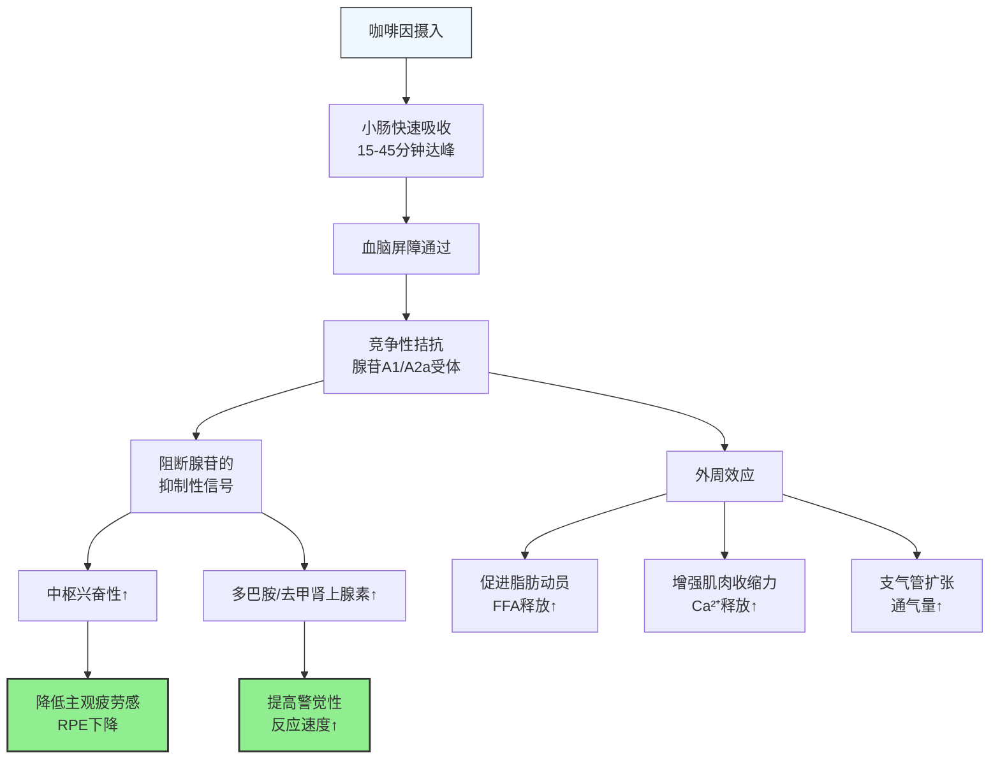

咖啡因是全球使用最广泛的中枢神经兴奋剂，也是循证等级最高的运动增效补剂之一。ISSN 将其列为"明确有效"的运动表现增强剂。

---

### 咖啡因的作用机制

**核心机制**：咖啡因的主要作用是**拮抗腺苷受体**。腺苷是运动中积累的代谢产物，正常情况下与受体结合产生疲劳感和困倦感。咖啡因结构类似腺苷，占据受体但不激活抑制信号，从而延缓疲劳感知[^1]。

---

### 对运动表现的循证效果

| 运动类型 | 效果 | 效应量 | 证据等级 |
|----------|------|--------|----------|
| **耐力运动**（>5分钟） | 延长力竭时间，提高平均功率 | +2-4% 表现提升 | 高 |
| **力量/爆发力** | 增加最大力量和爆发力输出 | +3-5% 1RM提升 | 中-高 |
| **高强度间歇** | 提高重复冲刺能力 | +3-7% 总做功量 | 高 |
| **团队运动** | 改善决策速度和反应时间 | 显著改善 | 中-高 |
| **认知表现** | 提高注意力和反应速度 | 显著改善 | 高 |

荟萃分析显示，咖啡因对耐力运动的平均效应量约为 ES=0.41（中等效应），对力量运动约为 ES=0.20（小-中等效应）[^2]。

---

### 剂量与时机

**有效剂量**：
- **最佳范围**：3-6 mg/kg 体重（70kg的人 = 210-420mg）
- **最低有效剂量**：约 2 mg/kg（部分人群即可获益）
- **上限**：>9 mg/kg 不增加额外效果，反而增加副作用（焦虑、心悸、胃肠不适）
- WADA 已于2004年将咖啡因从禁药名单移除，但尿液浓度 >12 μg/mL 仍会被标记[^3]

**服用时机**：
- 运动前 **30-60分钟**（口服胶囊/咖啡）
- 血浆浓度达峰时间：摄入后约 45-60 分钟
- 半衰期：3-7小时（个体差异大，受CYP1A2基因影响）

**常见咖啡因来源对比**：

| 来源 | 咖啡因含量 | 特点 |
|------|-----------|------|
| 浓缩咖啡（1 shot） | ~63mg | 快速吸收 |
| 美式咖啡（240ml） | ~95mg | 最常见 |
| 红牛（250ml） | ~80mg | 含糖和牛磺酸 |
| 咖啡因胶囊 | 100-200mg/粒 | 剂量精确 |
| 绿茶（240ml） | ~30-50mg | 含L-茶氨酸，更温和 |
| 无水咖啡因粉 | 自定义 | 需要精确称量，过量危险 |

---

### 耐受性与个体差异

**耐受性**：
- 长期每日摄入咖啡因会产生耐受，运动增效作用减弱
- 研究显示：停用 2-7 天后重新使用，增效作用恢复
- 实践建议：日常低剂量（1-2杯咖啡），重要训练/比赛前使用较高剂量[^4]

**基因差异（CYP1A2多态性）**：
- **快代谢型（AA基因型）**：咖啡因代谢快，增效作用更明显，副作用更少
- **慢代谢型（AC/CC基因型）**：代谢慢，副作用更多，增效作用可能更小甚至无效
- 约50%人群为快代谢型[^5]

**如何判断自己的反应**：
- 如果1杯咖啡就心悸、焦虑、失眠 → 可能是慢代谢型，用低剂量（2-3 mg/kg）
- 如果2-3杯咖啡才有明显提神效果 → 可能是快代谢型，可以用较高剂量

---

### 副作用与注意事项

**常见副作用（剂量相关）**：
- 焦虑、心悸（>6 mg/kg 更常见）
- 胃肠不适、腹泻（空腹摄入更明显）
- 失眠（下午3点后摄入影响睡眠）
- 利尿作用（轻度，不会导致运动中脱水）
- 依赖性和戒断症状（头痛、疲劳，停用1-2天出现）

**重要注意事项**：
- **不要在下午/晚上训练前使用高剂量**：半衰期长，影响睡眠质量，睡眠对恢复和增肌比咖啡因的训练增效更重要
- **不要用咖啡因弥补睡眠不足**：长期这样做会加重疲劳循环
- **与肌酸可以同时使用**：早期研究担心咖啡因抵消肌酸效果，但近年研究不支持这个结论[^6]

---

### 实操建议

**力量训练者**：
- 训练前 45 分钟摄入 3-5 mg/kg
- 不需要每次训练都用，留给高强度日或测试日
- 日常保持低咖啡因摄入（1-2杯咖啡），避免耐受

**耐力运动者**：
- 比赛/长距离训练前 3-6 mg/kg
- 长时间运动中可以分次补充（如每小时 1-2 mg/kg）
- 配合碳水补充效果更好

**减脂期**：
- 咖啡因轻度提高代谢率（约 3-5%），促进脂肪氧化
- 但不要依赖咖啡因减脂，效果很小
- 主要价值是在热量赤字下维持训练强度和精力

---

### 参考文献

[^1]: Fredholm BB, et al. (1999). Actions of caffeine in the brain with special reference to factors that contribute to its widespread use. *Pharmacological Reviews*, 51(1):83-133.

[^2]: Grgic J, et al. (2020). Wake up and smell the coffee: caffeine supplementation and exercise performance—an umbrella review of 21 published meta-analyses. *British Journal of Sports Medicine*, 54(11):681-688.

[^3]: Goldstein ER, et al. (2010). International society of sports nutrition position stand: caffeine and performance. *Journal of the International Society of Sports Nutrition*, 7(1):5.

[^4]: Beaumont R, et al. (2017). Chronic coffee consumption does not affect the acute response to caffeine supplementation. *European Journal of Applied Physiology*, 117(7):1341-1349.

[^5]: Guest N, et al. (2018). Caffeine, CYP1A2 genotype, and endurance performance in athletes. *Medicine & Science in Sports & Exercise*, 50(8):1570-1578.

[^6]: Trexler ET, et al. (2016). Effects of coffee and caffeine anhydrous on strength and sprint performance. *European Journal of Sport Science*, 16(6):702-710.
