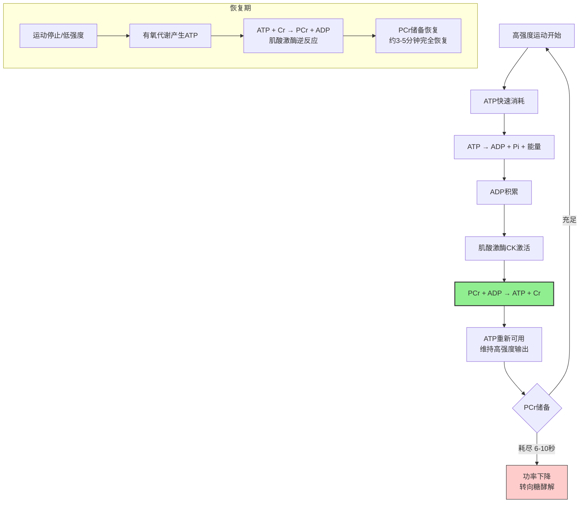

肌酸（Creatine）是目前循证等级最高的运动补剂之一，ISSN（国际运动营养学会）明确将其列为"有效且安全"的补剂。本文系统整理肌酸的机制、使用方法和安全性。

---

### 肌酸是什么

肌酸是一种天然存在于人体内的含氮有机酸，主要储存在骨骼肌中（约95%），少量存在于大脑和睾丸。

**体内来源**：
- **内源性合成**：肝脏、肾脏、胰腺每天合成约 1-2g（由精氨酸、甘氨酸、蛋氨酸合成）
- **外源性摄入**：红肉和鱼类是主要食物来源（每kg生肉含约 4-5g 肌酸）
- **每日周转**：约 1.7% 的肌酸池每天被不可逆地转化为肌酐排出，需要持续补充[^1]

**体内储存**：
- 总肌酸池：约 120-140g（70kg成年人）
- 其中约 2/3 以磷酸肌酸（PCr）形式存在，1/3 以游离肌酸形式存在
- 肌肉中肌酸浓度约 120-140 mmol/kg干重，补充后可增加到 150-160 mmol/kg[^2]

---

### 肌酸的供能机制

**核心机制**：
- 磷酸肌酸（PCr）是磷酸原系统的核心底物
- 肌酸激酶（CK）催化 PCr 将高能磷酸基团转移给 ADP，快速再生 ATP
- 这个反应不需要氧气，速度极快（~1.8 mmol ATP/kg/s）
- 补充肌酸 → 增加肌肉 PCr 储备 → 延长磷酸原系统供能时间 → 提高高强度运动表现[^3]

---

### 肌酸的循证益处

**1. 提高高强度运动表现（证据等级：高）**

- 增加最大力量输出 5-10%
- 增加高强度间歇运动的总做功量 10-20%
- 延长最大功率输出时间 1-2 秒
- 对短时间爆发性运动（<30秒）效果最显著[^4]

**2. 促进肌肉肥大（证据等级：高）**

- 荟萃分析显示：肌酸+力量训练比单独力量训练多增加瘦体重约 1-2 kg/12周
- 机制：更高训练容量 → 更大机械张力刺激 → 更多肌肉增长
- 细胞水合作用：肌酸吸水进入肌细胞，细胞肿胀本身可能是合成代谢信号[^5]

**3. 加速组间恢复（证据等级：高）**

- PCr恢复更快，组间休息后能维持更高的力量输出
- 对多组训练和间歇训练特别有益

**4. 认知功能（证据等级：中）**

- 大脑也使用磷酸肌酸系统供能
- 研究显示肌酸补充可能改善睡眠剥夺后的认知表现
- 对素食者认知改善效果更明显（基线肌酸水平较低）[^6]

**5. 对耐力运动的影响（证据等级：低-中）**

- 对纯耐力运动（>30分钟稳态有氧）帮助不大
- 但对包含冲刺的间歇性耐力运动（如足球、篮球）有益
- 体重增加（水分）可能对需要移动体重的耐力项目不利

---

### 补充方案

**方案一：加载期+维持期（传统方案）**

| 阶段 | 剂量 | 时长 | 目的 |
|------|------|------|------|
| 加载期 | 20g/天（分4次，每次5g） | 5-7天 | 快速饱和肌肉肌酸储备 |
| 维持期 | 3-5g/天 | 持续 | 维持饱和状态 |

**方案二：低剂量持续（推荐方案）**

| 阶段 | 剂量 | 时长 | 目的 |
|------|------|------|------|
| 持续补充 | 3-5g/天 | 持续 | 约3-4周达到饱和，之后维持 |

**两种方案效果相同**，区别只是达到饱和的速度。低剂量方案胃肠道不适更少，更适合大多数人[^7]。

**补充时机**：
- 没有严格的最佳时机，每天固定时间服用即可
- 训练后与碳水+蛋白质一起服用可能略微提高肌肉摄取（胰岛素促进）
- 但差异很小，不需要过度纠结时机

**补充形式**：
- **一水肌酸（Creatine Monohydrate）**：最便宜、研究最多、效果确认，首选
- 其他形式（盐酸肌酸、缓冲肌酸、液态肌酸等）没有证据显示优于一水肌酸
- 不要为花哨的形式多花钱[^8]

---

### 安全性

**短期安全性（证据等级：高）**：
- 数百项研究确认，健康人群补充肌酸（3-5g/天）无明显副作用
- 最常见的"副作用"是体重增加 1-2kg（水分，不是脂肪）

**长期安全性（证据等级：中-高）**：
- 长达5年的跟踪研究未发现健康危害
- ISSN 2017年立场声明明确表示：肌酸是安全的运动补剂[^9]

**常见误区澄清**：

| 误区 | 事实 |
|------|------|
| ❌ 肌酸伤肾 | 健康人群无证据支持。肌酐（肌酸代谢产物）升高是正常的，不代表肾损伤。已有肾病者需咨询医生 |
| ❌ 肌酸导致脱水/抽筋 | 研究显示肌酸使用者抽筋发生率不高于安慰剂组，甚至可能更低 |
| ❌ 肌酸是类固醇 | 肌酸是天然营养素，不是激素，不在任何禁药名单上 |
| ❌ 停用肌酸肌肉会"缩水" | 停用后PCr储备和水分会减少，但训练获得的真实肌肉不会消失 |
| ❌ 需要"循环使用"（用几周停几周） | 没有证据支持需要循环，持续使用安全有效 |

**真正需要注意的人群**：
- 已有肾脏疾病者：需要医生评估
- 青少年（<18岁）：证据较少，建议优先从食物获取
- 孕妇/哺乳期：证据不足，不建议使用[^10]

---

### 谁最受益

| 人群 | 受益程度 | 原因 |
|------|----------|------|
| 力量训练者 | ⭐⭐⭐⭐⭐ | 直接提高训练容量和力量 |
| 间歇运动（球类） | ⭐⭐⭐⭐ | 改善重复冲刺能力 |
| 素食者 | ⭐⭐⭐⭐⭐ | 基线肌酸水平低，补充效果更明显 |
| 老年人 | ⭐⭐⭐⭐ | 对抗肌肉减少症，改善功能 |
| 纯耐力运动员 | ⭐⭐ | 帮助有限，体重增加可能不利 |
| 需要控体重的运动员 | ⭐⭐ | 水分增加可能影响称重 |

---

### 实操总结

1. **买什么**：一水肌酸（Creatine Monohydrate），选大品牌，看 Creapure 认证
2. **吃多少**：每天 3-5g，不需要加载期
3. **什么时候吃**：任何时间，固定就行，训练后随餐方便
4. **吃多久**：持续吃，不需要循环
5. **配什么**：和正常饮食一起即可，不需要特别配碳水（虽然理论上有帮助，但差异很小）
6. **期望效果**：2-4周后感受到训练容量提升，体重增加1-2kg（水分）

---

### 参考文献

[^1]: Wyss M, Kaddurah-Daouk R. (2000). Creatine and creatinine metabolism. *Physiological Reviews*, 80(3):1107-1213.

[^2]: Harris RC, Söderlund K, Hultman E. (1992). Elevation of creatine in resting and exercised muscle of normal subjects by creatine supplementation. *Clinical Science*, 83(3):367-374.

[^3]: Greenhaff PL, et al. (1994). Influence of oral creatine supplementation of muscle torque during repeated bouts of maximal voluntary exercise in man. *Clinical Science*, 84(5):565-571.

[^4]: Branch JD. (2003). Effect of creatine supplementation on body composition and performance: a meta-analysis. *International Journal of Sport Nutrition and Exercise Metabolism*, 13(2):198-226.

[^5]: Chilibeck PD, et al. (2017). Effect of creatine supplementation during resistance training on lean tissue mass and muscular strength in older adults: a meta-analysis. *Open Access Journal of Sports Medicine*, 8:213-226.

[^6]: Avgerinos KI, et al. (2018). Effects of creatine supplementation on cognitive function of healthy individuals: a systematic review of randomized controlled trials. *Experimental Gerontology*, 108:166-173.

[^7]: Hultman E, et al. (1996). Muscle creatine loading in men. *Journal of Applied Physiology*, 81(1):232-237.

[^8]: Jäger R, et al. (2011). Analysis of the efficacy, safety, and regulatory status of novel forms of creatine. *Amino Acids*, 40(5):1369-1383.

[^9]: Kreider RB, et al. (2017). International Society of Sports Nutrition position stand: safety and efficacy of creatine supplementation in exercise, sport, and medicine. *Journal of the International Society of Sports Nutrition*, 14:18.

[^10]: Antonio J, et al. (2021). Common questions and misconceptions about creatine supplementation: what does the scientific evidence really show? *Journal of the International Society of Sports Nutrition*, 18(1):13.
