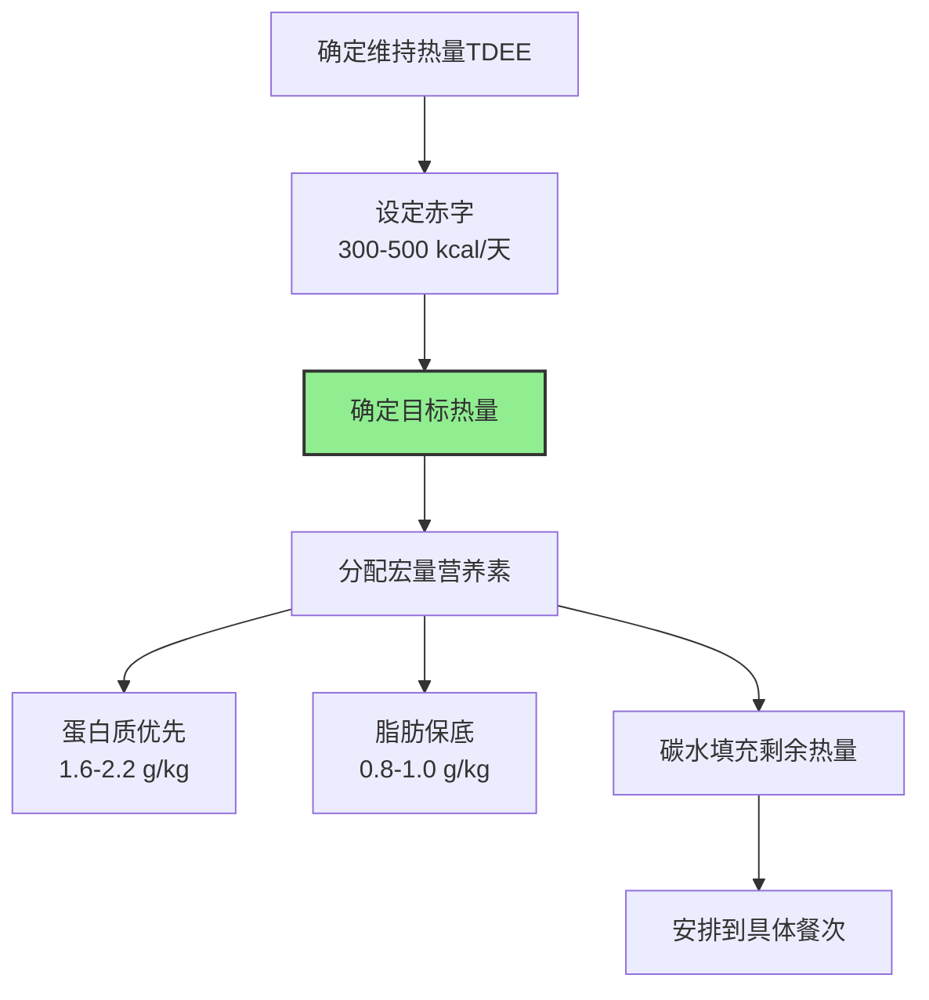

前面的文章讲了宏量营养素比例、碳水选择、蛋白质来源等理论，本文给出具体的减脂期饮食计划示例，把理论落地到每一餐。

---

### 第一步：计算你的热量目标

**TDEE 估算公式（Mifflin-St Jeor）**[^1]：
- 男性 RMR = 10 × 体重(kg) + 6.25 × 身高(cm) - 5 × 年龄 - 5
- 女性 RMR = 10 × 体重(kg) + 6.25 × 身高(cm) - 5 × 年龄 - 161
- TDEE = RMR × 活动系数（久坐1.2 / 轻度活动1.375 / 中度活动1.55 / 高度活动1.725）

**示例人物**：
- 男性，75kg，175cm，28岁，每周力量训练4次
- RMR = 10×75 + 6.25×175 - 5×28 - 5 = 1,699 kcal
- TDEE = 1,699 × 1.55 = **2,633 kcal**
- 减脂目标热量 = 2,633 - 400 = **~2,200 kcal/天**

---

### 第二步：宏量营养素分配

以 75kg 男性、目标 2,200 kcal 为例：

| 营养素 | 计算方式 | 克数 | 热量 | 占比 |
|--------|----------|------|------|------|
| **蛋白质** | 2.0 g/kg × 75 | 150g | 600 kcal | 27% |
| **脂肪** | 0.9 g/kg × 75 | 67g | 603 kcal | 27% |
| **碳水** | 剩余热量 ÷ 4 | 249g | 997 kcal | 46% |

这个分配大约是 **45C/27P/27F**，属于中碳水高蛋白方案，适合力量训练者减脂。

---

### 第三步：具体一天饮食示例

**训练日（下午训练）**：

| 餐次 | 时间 | 食物 | 蛋白质 | 碳水 | 脂肪 | 热量 |
|------|------|------|--------|------|------|------|
| **早餐** | 7:30 | 3个全蛋 + 100g燕麦 + 1根香蕉 | 25g | 75g | 18g | 560 |
| **午餐** | 12:00 | 150g鸡胸肉 + 200g糙米 + 蔬菜200g + 10ml橄榄油 | 40g | 65g | 14g | 550 |
| **训前加餐** | 15:30 | 1片全麦面包 + 20g花生酱 + 1个苹果 | 8g | 45g | 12g | 320 |
| **训后** | 17:30 | 30g乳清蛋白 + 60g即食燕麦 + 200ml脱脂奶 | 35g | 55g | 3g | 390 |
| **晚餐** | 19:30 | 150g三文鱼 + 150g红薯 + 蔬菜200g | 35g | 35g | 18g | 440 |
| **总计** | | | **143g** | **275g** | **65g** | **2,260** |

**休息日**：

| 餐次 | 时间 | 食物 | 蛋白质 | 碳水 | 脂肪 | 热量 |
|------|------|------|--------|------|------|------|
| **早餐** | 8:00 | 2个全蛋 + 2个蛋白 + 150g希腊酸奶 + 蓝莓50g | 30g | 20g | 14g | 330 |
| **午餐** | 12:30 | 150g牛肉 + 150g糙米 + 蔬菜300g + 5ml橄榄油 | 38g | 50g | 18g | 510 |
| **下午加餐** | 15:30 | 30g坚果 + 1个苹果 | 5g | 25g | 15g | 250 |
| **晚餐** | 18:30 | 200g鳕鱼 + 200g蔬菜 + 100g土豆 + 10ml橄榄油 | 40g | 30g | 14g | 400 |
| **睡前** | 21:00 | 200g低脂cottage cheese + 10g亚麻籽 | 28g | 8g | 7g | 210 |
| **总计** | | | **141g** | **133g** | **68g** | **1,700** |

**说明**：休息日碳水降低、总热量降低约500kcal，这是一种简单的碳水循环策略。训练日保证训练表现，休息日加大赤字。周平均赤字约400kcal。

---

### 食物替换清单

不需要每天吃一样的，以下是等价替换：

**蛋白质来源（每份约30-35g蛋白质）**：
- 150g 鸡胸肉 / 火鸡胸
- 150g 瘦牛肉（里脊/腱子）
- 170g 鱼类（三文鱼/鳕鱼/鲈鱼）
- 200g 虾仁
- 4个全蛋 + 2个蛋白
- 300g 希腊酸奶（脱脂）
- 30g 乳清蛋白粉 + 200ml 牛奶

**碳水来源（每份约50g碳水）**：
- 65g 干燕麦
- 180g 熟糙米
- 200g 熟白米
- 250g 红薯/紫薯
- 300g 土豆
- 2片全麦面包
- 80g 干意面

**脂肪来源（每份约15g脂肪）**：
- 10ml 橄榄油/牛油果油
- 30g 坚果（杏仁/核桃/腰果）
- 1/3 个牛油果
- 20g 花生酱
- 15g 黄油

---

### 减脂期饮食的关键原则

**1. 蛋白质优先**
- 每餐 30-40g 蛋白质，均匀分配
- 蛋白质饱腹感最强，TEF最高，保护肌肉
- 这是减脂期唯一不能妥协的宏量营养素[^2]

**2. 蔬菜大量**
- 每天 500g+ 蔬菜（非淀粉类）
- 体积大、热量低、纤维高 → 饱腹感的"免费"来源
- 不需要精确计算蔬菜热量

**3. 碳水集中在训练前后**
- 训练前1-2小时：复合碳水保证能量
- 训练后：快碳+蛋白质促进恢复
- 其他餐次以蛋白质+蔬菜+脂肪为主

**4. 不要完全禁止任何食物**
- 80/20法则：80%来自营养密度高的食物，20%可以灵活
- 完全禁止 → 心理压力 → 暴食 → 失败
- 一周吃一顿"自由餐"不会影响减脂进度[^3]

**5. 准备和计划**
- 周末批量准备蛋白质（煮鸡胸、煎牛肉）
- 提前称量主食分装
- 减少决策疲劳，降低外卖诱惑

---

### 常见问题

**Q：需要精确到每一克吗？**
A：不需要。初期用食物秤建立感觉（1-2周），之后目测即可。误差 ±10% 完全可以接受。

**Q：外食怎么办？**
A：选择蛋白质为主的菜品，蔬菜多点，主食少点。偶尔一顿不完美不影响大局。

**Q：减脂期可以喝酒吗？**
A：可以偶尔，但酒精热量高（7kcal/g）且抑制脂肪氧化。如果喝，当天减少脂肪和碳水摄入来腾出热量空间。

**Q：体重不动了怎么办？**
A：先确认是否真的平台（排除水分波动，看2-3周趋势）。如果确认平台：减少100-200kcal，或增加NEAT（步数+2000步），或安排diet break。

---

### 参考文献

[^1]: Mifflin MD, et al. (1990). A new predictive equation for resting energy expenditure in healthy individuals. *American Journal of Clinical Nutrition*, 51(2):241-247.

[^2]: Helms ER, et al. (2014). Evidence-based recommendations for natural bodybuilding contest preparation: nutrition and supplementation. *Journal of the International Society of Sports Nutrition*, 11:20.

[^3]: Stewart TM, et al. (2002). Rigid vs. flexible dieting: association with eating disorder symptoms in nonobese women. *Appetite*, 38(1):39-44.
