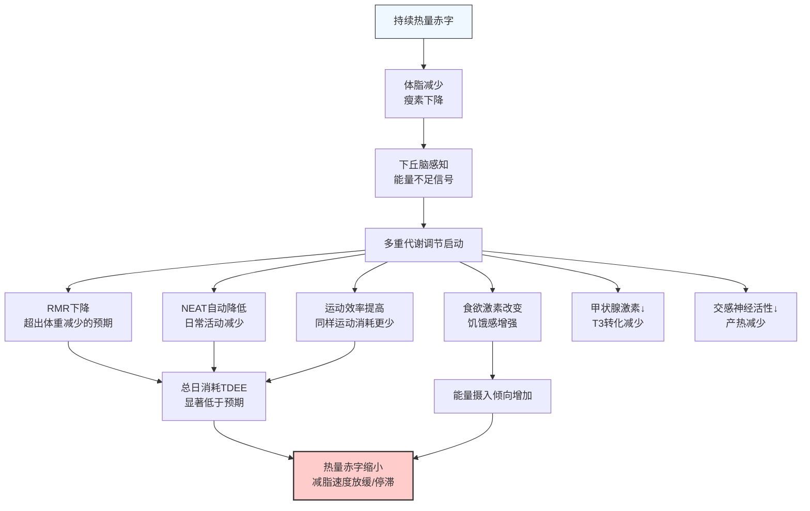

代谢适应（Adaptive Thermogenesis / Metabolic Adaptation）是减脂过程中身体对能量赤字的生理性防御反应。理解这个机制是突破减脂平台期的关键。

---

### 什么是代谢适应

当你持续处于热量赤字时，身体不会"配合"你一直减下去。进化赋予了我们强大的防饥荒机制：

**定义**：代谢适应是指减脂过程中，实际静息代谢率（RMR）的下降幅度**超过**了体重和瘦体重减少所能解释的部分。也就是说，即使考虑了你变轻了、肌肉少了，你的代谢仍然比预期更低[^1]。

---

### 代谢适应的组成部分

**总日能量消耗（TDEE）的构成**：

| 组成部分 | 占比 | 代谢适应中的变化 |
|----------|------|-----------------|
| **RMR（静息代谢率）** | 60-70% | 下降 5-15%（超出体重变化预期） |
| **NEAT（非运动活动产热）** | 15-30% | 下降 200-500 kcal/天（最大变量） |
| **TEF（食物热效应）** | 8-10% | 随摄入量减少而减少 |
| **EAT（运动消耗）** | 5-10% | 运动效率提高，同样运动消耗减少 |

**量化影响**：
- 研究显示，减重10%后，TDEE 下降幅度比体重变化预期多出约 **200-300 kcal/天**
- 这个"额外"的下降就是代谢适应的核心[^2]
- The Biggest Loser 研究（Fothergill 2016）显示极端减重后代谢适应可持续6年以上[^3]

---

### 代谢适应的驱动因素

**1. 瘦素下降（核心驱动）**

瘦素与体脂成正比，减脂 → 瘦素下降 → 下丘脑启动节能模式：
- 降低交感神经活性
- 降低甲状腺激素（T4→T3转化减少）
- 增加饥饿素分泌
- 降低自发活动意愿

**2. 甲状腺激素变化**

- 活性甲状腺激素 T3 下降 10-20%
- 反向T3（rT3）升高
- 直接降低细胞代谢率

**3. 交感神经系统下调**

- 去甲肾上腺素分泌减少
- 产热减少（棕色脂肪活性降低）
- 心率和血压轻度下降

**4. 肌肉代谢效率提高**

- 线粒体效率提高（同样ATP产出消耗更少氧气）
- 运动经济性改善（同样速度/功率消耗更少能量）
- 这在进化上是优势，但对减脂是阻碍[^4]

---

### 如何识别代谢适应

**早期信号（比体重平台更早出现）**：

- 日常步数/活动量不自觉下降
- 训练中主观疲劳感增加，同样重量感觉更重
- 体温轻度下降（晨起体温 < 36.2°C）
- 睡眠质量变差
- 性欲下降
- 情绪低落、易怒
- 饥饿感明显增强，尤其对碳水/甜食的渴望

**确认方法**：
- 体重平台 > 2-3周（排除水分波动）
- 热量摄入已经很低但体重不动
- 计步器显示日常步数持续下降

---

### 应对策略

**策略一：Diet Break（饮食休息）**

- 回到维持热量（TDEE）1-2周
- 主要通过增加碳水实现
- 目的：部分恢复瘦素、甲状腺激素、NEAT
- MATADOR研究显示：间歇性减脂（2周赤字+2周维持交替）比持续减脂保留更多代谢率，最终减脂效果更好[^5]

**策略二：Refeed Day（高碳日）**

- 每周1-2天回到维持热量或轻微盈余
- 碳水增加到 5-7 g/kg，脂肪降低
- 短期刺激瘦素回升
- 适合体脂率较低、不想完全中断减脂的人

**策略三：反向饮食（Reverse Diet）**

- 减脂结束后，不要立刻恢复到减脂前的摄入量
- 每周增加 50-100 kcal（主要来自碳水）
- 持续 4-8 周逐步回到维持热量
- 目的：让代谢逐步恢复，减少脂肪反弹[^6]

**策略四：维持训练强度**

- 减脂期最重要的训练目标是**保持力量**，不是增加有氧
- 力量下降 = 肌肉流失信号 = 代谢率进一步下降
- 宁可减少训练容量（组数），也不要降低强度（重量）

**策略五：维持NEAT**

- 设定每日最低步数目标（如 8000-10000步）
- 如果步数自然下降，刻意恢复
- NEAT 是代谢适应中最大的可调变量

---

### 预防代谢适应的原则

| 原则 | 做法 | 原因 |
|------|------|------|
| 中等赤字 | 300-500 kcal/天，不超过 TDEE 的 20-25% | 赤字越大，适应越快越严重 |
| 足够蛋白质 | 1.6-2.4 g/kg 体重 | 保留肌肉，维持代谢率 |
| 力量训练 | 每周 3-4 次，保持强度 | 肌肉是代谢率的主要贡献者 |
| 合理减脂速度 | 每周 0.5-1% 体重 | 太快会加速适应 |
| 计划性中断 | 每 8-12 周安排 diet break | 定期恢复代谢 |
| 监测 NEAT | 追踪每日步数 | 最早的适应信号 |

---

### 代谢适应 vs "代谢损伤"

**重要澄清**：

- "代谢损伤"（metabolic damage）这个概念在科学文献中**不存在**
- 代谢适应是**正常的生理反应**，不是"损伤"
- 几乎所有代谢适应都是**可逆的**，回到维持热量后会逐步恢复
- 恢复时间因人而异：轻度适应几周恢复，严重适应（如长期极低热量+过度有氧）可能需要数月
- 真正的甲状腺功能减退是病理性的，需要医学检查确认[^7]

---

### 参考文献

[^1]: Rosenbaum M, Leibel RL. (2010). Adaptive thermogenesis in humans. *International Journal of Obesity*, 34(Suppl 1):S47-S55.

[^2]: Müller MJ, et al. (2015). Adaptive thermogenesis with weight loss in humans. *Obesity*, 23(4):793-799.

[^3]: Fothergill E, et al. (2016). Persistent metabolic adaptation 6 years after "The Biggest Loser" competition. *Obesity*, 24(8):1612-1619.

[^4]: Rosenbaum M, et al. (2003). Effects of experimental weight perturbation on skeletal muscle work efficiency in human subjects. *American Journal of Physiology*, 285(1):R183-R192.

[^5]: Byrne NM, et al. (2018). Intermittent energy restriction improves weight loss efficiency in obese men: the MATADOR study. *International Journal of Obesity*, 42(2):129-138.

[^6]: Trexler ET, et al. (2014). Metabolic adaptation to weight loss: implications for the athlete. *Journal of the International Society of Sports Nutrition*, 11(1):7.

[^7]: Dulloo AG, et al. (2012). How dieting makes the lean fatter: from a perspective of body composition autoregulation through adipostats and proteinstats awaiting discovery. *Obesity Reviews*, 13(Suppl 2):1-21.
