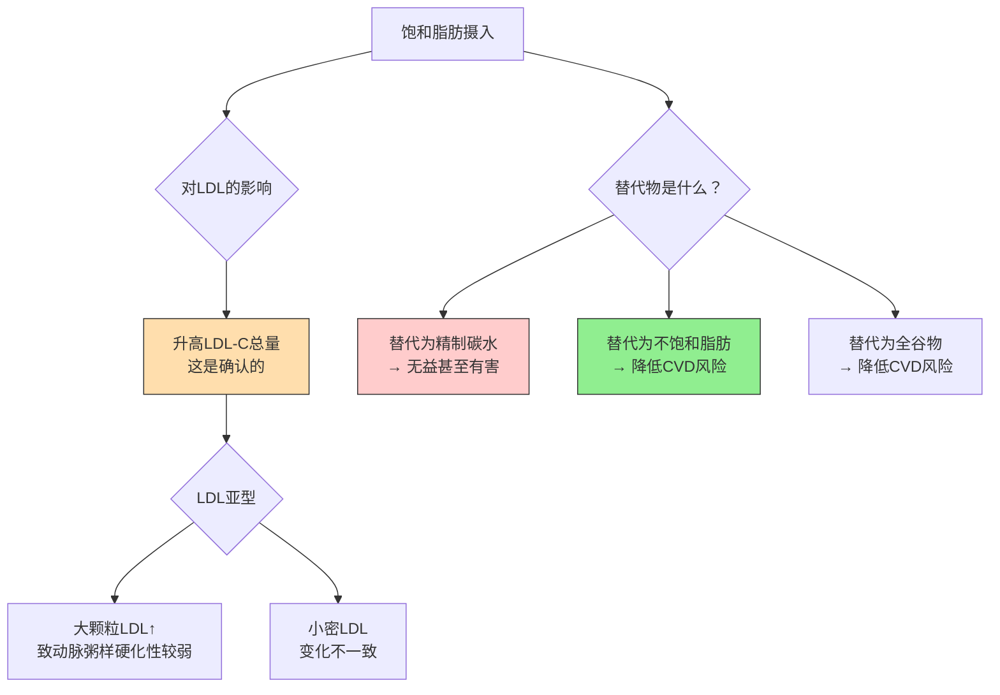

脂肪摄入建议文章介绍了必需脂肪酸和Omega-3/6，本文深入讨论饱和脂肪的循证争议、反式脂肪的危害，以及日常烹饪油的科学选择。

---

### 饱和脂肪与心血管疾病：争议与现状

**传统观点（1960s-2010s）**：
- 饱和脂肪 → 升高LDL胆固醇 → 动脉粥样硬化 → 心血管疾病
- 基于 Keys 的七国研究和后续流行病学数据
- 各国膳食指南建议饱和脂肪 < 10% 总能量

**近年争议（2010s至今）**：

**2020年代的循证共识**[^1][^2]：

1. 饱和脂肪确实升高LDL胆固醇，这一点没有争议
2. 但"饱和脂肪→心血管疾病"的直接因果关系比以前认为的更复杂
3. **关键在于替代物**：用不饱和脂肪或全谷物替代饱和脂肪 → 降低风险；用精制碳水替代 → 无益
4. 不同来源的饱和脂肪可能有不同效应（乳制品中的饱和脂肪 vs 加工肉类中的）
5. 整体饮食模式比单一营养素更重要

**实践建议**：
- 不需要"恐惧"饱和脂肪，但也不需要刻意多吃
- 控制在总能量的 **7-10%** 是合理范围
- 优先用单不饱和脂肪（橄榄油、牛油果）和多不饱和脂肪（鱼油、坚果）替代部分饱和脂肪
- 加工肉类（培根、香肠）的风险不仅来自饱和脂肪，还有亚硝酸盐和高钠

---

### 反式脂肪：必须避免

**工业反式脂肪（部分氢化植物油）**：
- 明确增加心血管疾病风险，没有安全摄入量
- 升高LDL，降低HDL（双重不利）
- 促进炎症反应
- WHO 目标：2023年前全球消除工业反式脂肪[^3]

**常见来源**：
- 人造黄油（老式硬质）
- 起酥油
- 油炸食品（反复使用的油）
- 部分烘焙食品（饼干、蛋糕、酥皮）

**如何识别**：
- 配料表中看到"部分氢化植物油"/"氢化植物油" → 含反式脂肪
- 中国标签标注 ≤0.3g/100g 可标注为"0"，所以看配料表比看营养表更准

**天然反式脂肪**：
- 反刍动物（牛羊）乳制品和肉类中含少量天然反式脂肪（如共轭亚油酸CLA）
- 含量很低，目前证据不支持其有害，甚至CLA可能有轻微益处

---

### 烹饪油选择指南

选择烹饪油需要考虑三个因素：**烟点**（能承受多高温度）、**脂肪酸组成**（健康程度）、**稳定性**（是否容易氧化）。

**常见烹饪油对比**：

| 油脂 | 烟点 | 主要脂肪酸 | 适合烹饪方式 | 健康评价 |
|------|------|-----------|-------------|----------|
| **特级初榨橄榄油** | 190-210°C | 单不饱和（73%） | 中低温炒、凉拌、烤 | ⭐⭐⭐⭐⭐ |
| **精炼橄榄油** | 240°C | 单不饱和（73%） | 煎炒、烤 | ⭐⭐⭐⭐ |
| **牛油果油** | 270°C | 单不饱和（70%） | 高温煎炒、烤 | ⭐⭐⭐⭐⭐ |
| **茶籽油（山茶油）** | 220°C | 单不饱和（80%） | 煎炒、烤 | ⭐⭐⭐⭐⭐ |
| **菜籽油（芥花油）** | 230°C | 单不饱和（62%） | 煎炒 | ⭐⭐⭐⭐ |
| **花生油** | 230°C | 单不饱和（46%）+多不饱和（32%） | 煎炒、炸 | ⭐⭐⭐ |
| **葵花籽油** | 230°C | 多不饱和Omega-6（65%） | 煎炒 | ⭐⭐（Omega-6过高） |
| **大豆油** | 230°C | 多不饱和Omega-6（51%） | 煎炒 | ⭐⭐（Omega-6过高） |
| **椰子油** | 175°C | 饱和脂肪（82%） | 低温烘焙、咖啡 | ⭐⭐⭐（争议） |
| **黄油** | 150°C | 饱和脂肪（63%） | 低温煎、烘焙 | ⭐⭐⭐（适量） |
| **猪油** | 190°C | 饱和（39%）+单不饱和（45%） | 中温炒 | ⭐⭐⭐（适量） |

**选择原则**[^4]：

1. **日常炒菜首选**：橄榄油（精炼）、茶籽油、牛油果油 — 单不饱和脂肪酸高，稳定性好
2. **凉拌/低温**：特级初榨橄榄油、亚麻籽油 — 保留多酚和Omega-3
3. **高温煎炸**：牛油果油、精炼菜籽油 — 烟点高且稳定
4. **减少使用**：纯葵花籽油、大豆油、玉米油 — Omega-6 过高，促炎
5. **偶尔使用**：黄油、椰子油 — 风味好但饱和脂肪高

---

### 椰子油和MCT的特殊讨论

**椰子油**：
- 82% 饱和脂肪，但主要是中链脂肪酸（月桂酸C12为主）
- 中链脂肪酸代谢途径不同：直接进入门静脉到肝脏氧化，不经过淋巴系统
- 升高LDL的程度低于长链饱和脂肪（如棕榈酸），但仍然升高
- **结论**：不是"超级食物"，也不是"毒药"，适量使用可以，不建议作为主要烹饪油[^5]

**MCT油（中链甘油三酯）**：
- 纯化的中链脂肪酸（C8辛酸 + C10癸酸）
- 快速氧化供能，不易储存为脂肪
- 对生酮饮食者有帮助（快速产生酮体）
- 对普通饮食者：轻度增加能量消耗，但效果很小（约50-100 kcal/天）
- 不适合高温烹饪（烟点低）

---

### 油脂储存与氧化

**多不饱和脂肪酸（PUFA）最容易氧化**：
- 双键越多越不稳定：亚麻籽油 > 葵花籽油 > 橄榄油
- 氧化后产生自由基、醛类等有害物质
- 储存建议：深色瓶、避光、冷藏、尽快用完

**判断油脂是否变质**：
- 闻：有哈喇味（rancid）→ 已氧化，丢弃
- 看：颜色明显变深、浑浊 → 可能变质
- 尝：有辛辣刺激感 → 已氧化

**烹饪中的氧化**：
- 油温超过烟点 → 大量产生有害物质（醛类、丙烯醛）
- 反复使用的油 → 氧化产物累积，反式脂肪增加
- 建议：不要反复使用炸油，炒菜油温不要冒烟

---

### 参考文献

[^1]: Astrup A, et al. (2020). Saturated fats and health: a reassessment and proposal for food-based recommendations. *Journal of the American College of Cardiology*, 76(7):844-857.

[^2]: Sacks FM, et al. (2017). Dietary fats and cardiovascular disease: a presidential advisory from the American Heart Association. *Circulation*, 136(3):e1-e23.

[^3]: World Health Organization. (2018). REPLACE trans fat: an action package to eliminate industrially-produced trans-fatty acids. WHO/NMH/NHD/18.4.

[^4]: Schwingshackl L, Hoffmann G. (2014). Monounsaturated fatty acids, olive oil and health status: a systematic review and meta-analysis of cohort studies. *Lipids in Health and Disease*, 13:154.

[^5]: Eyres L, et al. (2016). Coconut oil consumption and cardiovascular risk factors in humans. *Nutrition Reviews*, 74(4):267-280.
