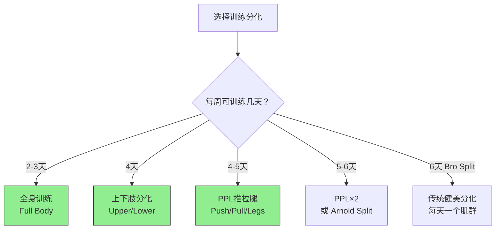

训练分化（Training Split）是指如何将不同肌群的训练分配到一周的不同日子中。选择合适的分化方案直接影响训练频率、恢复和长期增肌效果。

---

### 训练编排的核心变量

在讨论分化方案之前，需要理解几个关键训练变量：

**1. 训练量（Volume）**

- 定义：每周每肌群的有效训练组数（接近力竭的组）
- 荟萃分析推荐：每周每肌群 **10-20 组** 对大多数人最优[^1]
- 新手：10-12 组/周足够
- 进阶：15-20 组/周
- 高级：可能需要 20+ 组/周（但需要更多恢复）

**2. 训练频率（Frequency）**

- 定义：每周训练同一肌群的次数
- 荟萃分析结论：每周 **2次/肌群** 优于 1次，2次和3次差异不大[^2]
- 频率的主要价值是**分散训练量**，而非频率本身有魔力

**3. 训练强度（Intensity/Load）**

- 定义：使用的重量相对于1RM的百分比
- 增肌：6-30RM 范围内都有效，只要接近力竭[^3]
- 力量：需要更高强度（1-5RM），神经适应需要高负荷

**4. 渐进超负荷（Progressive Overload）**

- 定义：随时间逐步增加训练刺激
- 形式：增加重量、增加次数、增加组数、缩短休息
- 这是长期进步的**唯一必要条件**

---

### 常见分化方案对比

---

### 全身训练（Full Body）

**安排**：每次训练覆盖所有主要肌群，每周 2-4 次

**示例（3天/周）**：

| 周一 | 周三 | 周五 |
|------|------|------|
| 深蹲 4×6-8 | 硬拉 4×5-6 | 前蹲 3×8-10 |
| 卧推 4×6-8 | 俯身划船 4×8-10 | 上斜哑铃推 3×10-12 |
| 引体向上 3×8-10 | 过头推举 3×8-10 | 坐姿划船 3×10-12 |
| 腿弯举 3×10-12 | 腿举 3×10-12 | 侧平举 3×12-15 |
| 面拉 3×15 | 二头弯举 3×10-12 | 三头下压 3×10-12 |

**优点**：
- 每肌群频率高（2-4次/周），蛋白质合成持续刺激
- 适合时间有限的人（每周只需3天）
- 新手最佳选择：学习动作模式，全面发展

**缺点**：
- 单次训练时间长（60-90分钟）
- 后半段训练质量可能下降（疲劳累积）
- 难以给单个肌群足够的训练量（进阶者）

**适合人群**：新手、时间有限者、恢复能力强的人[^4]

---

### 上下肢分化（Upper/Lower）

**安排**：上肢日和下肢日交替，每周 4 次

**示例（4天/周）**：

| 周一（上肢A） | 周二（下肢A） | 周四（上肢B） | 周五（下肢B） |
|--------------|--------------|--------------|--------------|
| 卧推 4×6-8 | 深蹲 4×6-8 | 上斜哑铃推 4×8-10 | 罗马尼亚硬拉 4×8-10 |
| 杠铃划船 4×6-8 | 腿举 3×10-12 | 引体向上 4×8-10 | 保加利亚分腿蹲 3×10-12 |
| 过头推举 3×8-10 | 腿弯举 4×10-12 | 坐姿划船 3×10-12 | 腿屈伸 3×12-15 |
| 面拉 3×12-15 | 小腿提踵 4×12-15 | 侧平举 4×12-15 | 臀推 3×10-12 |
| 二头弯举 3×10-12 | 腹肌 3组 | 三头下压 3×10-12 | 小腿 4×12-15 |

**优点**：
- 频率合理（每肌群2次/周）
- 训练量分配均匀
- 恢复时间充足（上下肢交替）
- 适合大多数中级训练者

**缺点**：
- 上肢日可能时间较长（胸背肩手臂都要练）
- 需要每周4天，比全身多1天

**适合人群**：中级训练者、想要平衡发展的人[^5]

---

### PPL 推拉腿（Push/Pull/Legs）

**安排**：推日（胸肩三头）、拉日（背二头）、腿日，每周 3-6 次

**示例（6天/周，PPL×2）**：

| 推A | 拉A | 腿A | 推B | 拉B | 腿B |
|-----|-----|-----|-----|-----|-----|
| 卧推 4×5-6 | 硬拉 4×5-6 | 深蹲 4×5-6 | 上斜推 4×8-10 | 划船 4×8-10 | 前蹲 4×8-10 |
| 上斜推 3×8-10 | 引体 4×6-8 | 腿举 3×10-12 | 哑铃飞鸟 3×12 | 面拉 3×15 | 罗马尼亚硬拉 3×10 |
| 过头推 3×8-10 | 坐姿划船 3×10 | 腿弯举 4×10 | 侧平举 4×12-15 | 单臂划船 3×10 | 腿屈伸 3×12 |
| 侧平举 3×12-15 | 二头弯举 3×10 | 臀推 3×10 | 反向飞鸟 3×15 | 锤式弯举 3×10 | 小腿 4×15 |
| 三头下压 3×10 | 面拉 3×15 | 小腿 4×15 | 三头过头 3×10 | 二头集中 3×12 | 腹肌 3组 |

**优点**：
- 每肌群频率2次/周
- 协同肌群同天训练，效率高
- 训练量可以很高（每天只关注2-3个肌群）
- 最流行的进阶方案

**缺点**：
- 需要每周5-6天
- 腿日训练量大，恢复要求高
- 如果只做3天（PPL×1），频率只有1次/周

**适合人群**：中高级训练者、每周能训练5-6天的人

---

### 传统健美分化（Bro Split）

**安排**：每天一个肌群，每周 5-6 天

**示例**：周一胸、周二背、周三肩、周四腿、周五手臂

**优点**：
- 单次训练量极大，泵感强
- 简单直观，容易安排

**缺点**：
- 每肌群频率只有1次/周，蛋白质合成刺激不够频繁
- 荟萃分析显示：相同总量下，1次/周不如2次/周增肌效果好[^2]
- 对自然训练者不是最优选择

**适合人群**：使用药物的高级健美运动员（药物延长蛋白质合成窗口）、恢复能力差的人

---

### 如何选择

| 训练经验 | 推荐方案 | 每周天数 | 理由 |
|----------|----------|----------|------|
| 新手（<1年） | 全身训练 | 3天 | 学习动作，频率高，简单 |
| 中级（1-3年） | 上下肢分化 | 4天 | 平衡频率和容量 |
| 中高级（2-4年） | PPL | 5-6天 | 高容量高频率 |
| 高级（4年+） | PPL或自定义 | 5-6天 | 根据弱点定制 |
| 时间有限 | 全身训练 | 2-3天 | 最少时间最大效果 |

---

### 渐进超负荷的实操方法

不管用什么分化方案，渐进超负荷是进步的核心：

**双重渐进法（Double Progression）**：
1. 设定一个次数范围（如 8-12次）
2. 用固定重量，每次训练尝试增加次数
3. 当所有组都能做到范围上限（12次）→ 增加重量 2.5-5kg
4. 重新从范围下限（8次）开始

**示例**：
- 第1周：卧推 60kg × 8, 8, 7
- 第2周：卧推 60kg × 9, 8, 8
- 第3周：卧推 60kg × 10, 10, 9
- 第4周：卧推 60kg × 12, 11, 11
- 第5周：卧推 62.5kg × 8, 8, 7 ← 加重，重新开始

**RIR/RPE 管理**：
- RIR（Reps in Reserve）= 还能做几个
- 大多数训练组保持 RIR 1-3（接近力竭但不完全力竭）
- 最后一组可以 RIR 0-1（接近或达到力竭）
- 完全力竭每组都做会增加疲劳，不利于恢复[^6]

---

### 减载周（Deload）

每 4-8 周安排一个减载周：
- 训练量减少 40-60%（减少组数）
- 强度保持或轻度降低
- 目的：消除累积疲劳，让身体超量恢复
- 减载后通常能突破之前的平台

---

### 参考文献

[^1]: Schoenfeld BJ, et al. (2017). Dose-response relationship between weekly resistance training volume and increases in muscle mass: a systematic review and meta-analysis. *Journal of Sports Sciences*, 35(11):1073-1082.

[^2]: Schoenfeld BJ, et al. (2016). Effects of resistance training frequency on measures of muscle hypertrophy: a systematic review and meta-analysis. *Sports Medicine*, 46(11):1689-1697.

[^3]: Schoenfeld BJ, et al. (2021). Loading recommendations for muscle strength, hypertrophy, and local endurance: a re-examination of the repetition continuum. *Sports*, 9(2):32.

[^4]: Ralston GW, et al. (2017). The effect of weekly set volume on strength gain: a meta-analysis. *Sports Medicine*, 47(12):2585-2601.

[^5]: Grgic J, et al. (2018). The effects of short versus long inter-set rest intervals in resistance training on measures of muscle hypertrophy: a systematic review. *European Journal of Sport Science*, 18(7):971-980.

[^6]: Helms ER, et al. (2016). Application of the repetitions in reserve-based rating of perceived exertion scale for resistance training. *Strength and Conditioning Journal*, 38(4):42-49.
