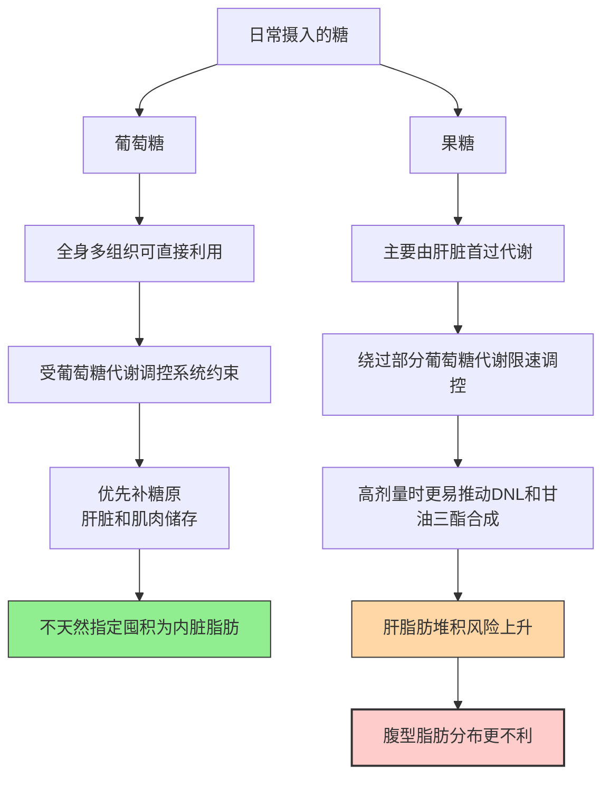
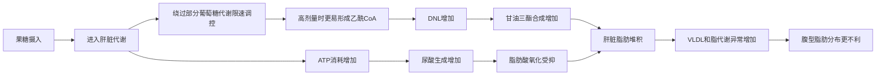
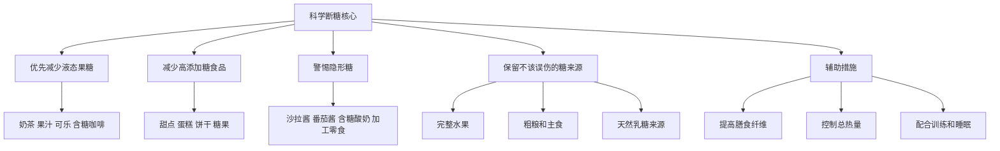

内脏脂肪（Visceral Adipose Tissue, VAT）作为代谢健康的“隐形杀手”，其囤积与饮食中的糖（尤其是果糖）密切相关。很多人疑惑“为什么饿肚子也减不掉硬肚子”“同样是糖，为什么有的糖更容易往肚子上堆”，现代营养学研究通过多篇人体对照试验、短期干预研究和机制综述，已经把果糖与内脏脂肪、脂肪肝之间的关系拆得比较清楚了。

本文基于几组关键的人体研究和机制论文，系统梳理：

1. 果糖和葡萄糖为什么代谢路径不同；
2. 为什么高剂量、液体形式、添加来源的果糖更值得警惕；
3. “断糖”到底该断什么，哪些糖不该误伤；
4. 现有证据到底能支持“断糖”到什么程度。

---

## 一、核心前提：内脏脂肪与果糖的关键关联

在深入研究前，先明确两个核心概念，这是理解后续结论的基础。

### 1. 内脏脂肪的特殊性

内脏脂肪是包裹在腹腔脏器（如肝脏、肠道）周围的脂肪，区别于皮下脂肪（皮肤下可捏起的软脂肪）。它的核心特点不是“更硬”这么简单，而是：

- 与胰岛素抵抗关系更直接；
- 与非酒精性脂肪肝（NAFLD）关系更紧；
- 与高血压、高血脂、代谢综合征、心血管风险更强相关。

也就是说，腹部突出不只是美观问题，很多时候更代表代谢风险上升。减少内脏脂肪，本质上是在改善代谢健康。

### 2. 果糖与葡萄糖的本质区别

我们日常摄入的糖，最常见的就是葡萄糖和果糖。二者都属于单糖，但代谢路径并不一样，这也是“为什么有的糖更容易和内脏脂肪挂钩”的底层逻辑。

- **葡萄糖**：可被全身多组织直接利用，代谢调控更分散，多余部分优先补糖原，不会天然“指定”往内脏脂肪方向走。
- **果糖**：主要由肝脏处理，高剂量时更容易推动 DNL（脂肪从头合成）、甘油三酯升高和肝脂肪堆积，因此和腹型肥胖、脂肪肝、胰岛素抵抗的关系更直接。

很多人减肥时只戒主食，却不动奶茶、果汁、甜饮和高糖零食，这也是“体重可能掉了，但肚子没怎么下去”的常见原因之一。

---

## 二、核心循证研究：4篇关键论文解析

下面这几篇论文，基本能把“果糖为什么更容易走向内脏脂肪和脂肪肝”这条证据链拼出来。它们不全是同一等级证据，但合在一起，方向已经非常清楚。

### 1. 核心王牌研究：果糖 vs 葡萄糖，内脏脂肪差异显著（JCI, 2009）

这篇研究是营养学讨论果糖与脂肪代谢时最经典的人体试验之一，也是很多“断糖”视频最喜欢引用的核心论文。

- **研究设计**：随机对照试验（RCT），招募超重/肥胖受试者，为期10周，采用等热量设计，受试者每日约25%的热量来自糖，分为两组：
  - 果糖组：饮用果糖甜饮料；
  - 葡萄糖组：饮用葡萄糖甜饮料。[^1]

- **核心发现**：
  - 果糖组：内脏脂肪增加更明显，二次转述里常总结为约14%，腹部脂肪也同步增加；
  - 葡萄糖组：没有出现同样程度的内脏脂肪恶化，变化相对更偏皮下脂肪；
  - 额外发现：果糖组 DNL 增加、甘油三酯升高、胰岛素敏感性下降。

- **研究意义**：
  这篇研究真正重要的地方，不是死记“14%”这个数字，而是它首次在人体里通过严格对照证明：

  > **在同等热量、甜饮料形式、持续摄入的条件下，果糖比葡萄糖更容易让脂肪分布朝内脏方向恶化。**

- **证据等级：⭐⭐⭐⭐⭐**

- **限制**：
  - 形式是甜饮料，不是完整水果；
  - 剂量不低；
  - 更适合说明“高果糖液体糖”的风险，不适合外推成“所有果糖都同样危险”。

- **文献信息**：  
  Consuming fructose-sweetened, not glucose-sweetened, beverages increases visceral adiposity and lipids and decreases insulin sensitivity in overweight/obese humans. *Journal of Clinical Investigation (JCI)*, 2009 May;119(5):1322-1334. DOI: 10.1172/JCI37385

### 2. 实操性研究：短期降低果糖/游离糖负担，肝脂肪快速改善（2017）

这项研究常被互联网总结成一句很抓眼球的话：

> 不用节食，只要断果糖，10天内脏脂肪就掉。

这句话不算完全错，但确实有点讲太满了。

- **研究设计**：针对肥胖儿童/青少年的严格短期干预试验，为期9天，在总热量变化不大的前提下，显著降低糖和果糖负担，观察肝脂肪、DNL 和胰岛素动力学变化。[^2]

- **核心发现**：
  - 肝脏脂肪明显下降；
  - DNL 明显下降；
  - 胰岛素动力学改善；
  - 部分代谢指标在很短时间内就出现变化。

  互联网常转述的数字包括：
  - 肝脏脂肪从 7.2% 降到 3.8%；
  - VAT 从 123 cm³ 降到 110 cm³；
  - DNL 下降 62%。

- **研究意义**：
  这项研究最有价值的地方，不是证明“所有糖都有毒”，而是证明：

  > **肝脏脂肪和 DNL 对高糖、尤其高果糖来源的变化，反应非常快。**

  也就是说，很多人刚开始控糖时，最先改善的不是体重秤，而是肝脏和代谢系统。

- **证据等级：⭐⭐⭐⭐**

- **为什么不是五星**：
  - 研究时间短；
  - 人群主要是肥胖儿童/青少年；
  - 更偏短期代谢改善，不等于长期肥胖管理的全部答案。

- **文献信息**：  
  Effects of Dietary Fructose Restriction on Liver Fat, De Novo Lipogenesis, and Insulin Kinetics in Children with Obesity. 2017. DOI: 10.1002/hep.29193. PMCID: PMC5813289

### 3. 机制性综述：为什么果糖更容易走向肝脂肪和腹型肥胖？（AJP-Endo, 2010）

这篇论文的价值不在于提供新的大型人体结局，而在于把“为什么果糖更容易出问题”的机制讲得比较完整。

- **核心机制**：
  - 果糖在肝脏中的处理方式和葡萄糖不同；
  - 高剂量果糖更容易推动 DNL 和甘油三酯合成；
  - 肝脂肪增加后，腹型脂肪分布和胰岛素抵抗更容易一起恶化；
  - 果糖代谢还可能伴随尿酸升高，进一步增加代谢负担。[^3][^5]

- **研究意义**：
  这篇机制综述解释了为什么短视频常说“果糖专囤内脏”。这句话作为口号不够严谨，但背后的方向是对的：

  > **果糖不是一吃就直接变内脏脂肪，但在高剂量、长期、游离糖来源的条件下，它更容易把肝脏推向脂肪合成和腹型肥胖方向。**

- **证据等级：⭐⭐⭐**

- **为什么只是三星**：
  - 它主要是机制综述，不是新的大型人体RCT；
  - 机制非常合理，但机制证据始终不能替代长期人体结局研究。

- **文献信息**：  
  Fructose: a highly lipogenic nutrient implicated in insulin resistance, hepatic steatosis, and the metabolic syndrome. *American Journal of Physiology-Endocrinology and Metabolism (AJP-Endo)*, 2010 Nov;299(5):E685-E694. DOI: 10.1152/ajpendo.00283.2010

### 4. 补充综述：不同来源果糖的风险层级（2025）

这篇补充综述的价值，不在于它提供了一个新的决定性 RCT，而在于它把现有证据整理成了一个更接近日常生活的版本：

- 液态果糖（奶茶、果汁、含糖饮料）问题最大；
- 加工甜点、零食次之；
- 完整水果不应和以上几类放在同一风险等级。

- **研究意义**：
  这类综述最大的现实价值，是把“先断什么糖”说清楚。对普通人来说，最重要的不是背代谢通路，而是先抓住真正高风险来源。

- **证据等级：⭐⭐⭐**

- **原因**：
  - 这是综述整合，不是决定性因果试验；
  - 适合做方向归纳，不适合单独支撑最强结论。

- **文献信息**：  
  Dietary Fructose: A Literature Review of Current Evidence and Implications on Metabolic Health. 2025. PMCID: PMC11663027

---

## 三、研究证据总结：“断糖”逻辑的完整证据链

把上面几篇合起来，关于果糖、内脏脂肪和“断糖”的关系，大致可以整理成三条核心结论：

1. **因果关系较明确**：在高剂量、液体糖、严格对照条件下，果糖比葡萄糖更容易让脂肪分布朝内脏方向恶化（JCI, 2009）；
2. **短期代谢反应很快**：即使总热量没明显下降，只要把高果糖/高游离糖负担压下去，肝脂肪和 DNL 就可能很快改善（2017干预研究）；
3. **优先级清晰**：液态果糖危害最大，优先戒掉含糖饮料、奶茶、果汁，比一上来去砍主食更有价值。

---

## 四、基于循证的“断糖”实操指南

科学“断糖”的重点不是“什么糖都不能碰”，而是**先抓高风险来源**，避免极端、同时兼顾可执行性。

### 1. 明确“该断的糖”：重点先处理这3类

- **液态糖（优先级最高）**：奶茶、果汁、可乐、运动饮料、含糖咖啡饮品；
- **高添加糖食品**：甜点、蛋糕、饼干、糖果、巧克力、糖浆类零食；
- **隐形高糖**：沙拉酱、番茄酱、加工肉制品、调味酸奶、部分“健康零食”。

### 2. 不需要误伤的“糖”

- **完整水果**：虽然含果糖，但同时有纤维、水分、咀嚼负担，和果汁不是一个风险等级；
- **主食中的葡萄糖**：糙米、燕麦、土豆、红薯等，不应和液体糖一刀切；
- **天然乳糖来源**：牛奶、无糖酸奶等，可以正常纳入饮食。

### 3. 辅助建议：让“断糖”真正有效

- **提高膳食纤维**：蔬菜、豆类、全谷物优先，能降低糖暴露带来的代谢冲击；
- **控制总热量**：断糖很重要，但如果总热量长期过剩，腹型肥胖一样会发展；
- **配合训练和睡眠**：内脏脂肪不是单一营养素问题，还和活动量、睡眠、压力有关；
- **代糖可以用，但不是核心**：代糖更适合作为过渡工具，不是无限量通行证。

---

## 五、常见误区澄清（基于研究证据）

### 误区1：“所有糖都要戒”

错误。最需要优先处理的是：

- 添加糖
- 游离糖
- 含糖饮料

完整水果和主食不该和奶茶、果汁、甜饮放在同一危险等级。

### 误区2：“饿肚子就能减内脏脂肪”

不完整。单纯节食不处理糖来源、总热量结构和依从性问题，很多人腹部脂肪改善并不理想。真正更有效的是同时处理：

- 游离糖
- 总热量
- 睡眠
- 运动

### 误区3：“鲜榨果汁比奶茶健康很多”

不一定。鲜榨果汁去掉了膳食纤维，果糖吸收速度会明显加快，很多情况下代谢风险更接近“液体糖”，而不是完整水果。

### 误区4：“果糖只要少吃一点就没事”

也不严谨。问题不只是“吃没吃”，而是：

- 剂量
- 频率
- 形式
- 总热量
- 来源

真正高风险的是**高频、高剂量、液体形式、添加来源**的果糖暴露；日常目标是尽量减少，而不是被单次摄入吓到。

---

## 六、参考文献

[^1]: Consuming fructose-sweetened, not glucose-sweetened, beverages increases visceral adiposity and lipids and decreases insulin sensitivity in overweight/obese humans. *Journal of Clinical Investigation (JCI)*, 2009 May;119(5):1322-1334. DOI: 10.1172/JCI37385

[^2]: Effects of Dietary Fructose Restriction on Liver Fat, De Novo Lipogenesis, and Insulin Kinetics in Children with Obesity. 2017. DOI: 10.1002/hep.29193. PMCID: PMC5813289

[^3]: Fructose: a highly lipogenic nutrient implicated in insulin resistance, hepatic steatosis, and the metabolic syndrome. *American Journal of Physiology-Endocrinology and Metabolism (AJP-Endo)*, 2010 Nov;299(5):E685-E694. DOI: 10.1152/ajpendo.00283.2010

[^4]: Dietary Fructose: A Literature Review of Current Evidence and Implications on Metabolic Health. 2025. PMCID: PMC11663027

[^5]: A causal role for uric acid in fructose-induced metabolic syndrome. *Am J Physiol Renal Physiol*. 2006;290(3):F625-F631.

[^6]: World Health Organization. Guideline: Sugars intake for adults and children. Geneva: WHO; 2015.
